# ERP + SaaS Blueprint — Agent Context File

> **Purpose.** Single distilled reference for building a multi-tenant SaaS ERP for small and
> medium enterprises (SME). Written to be handed to an AI coding agent as context: it defines
> the domain model, the invariants that must never be broken, every business flow as an explicit
> state machine, and the subscription-billing layer that sits above the ERP.
>
> **Status:** design reference, not a description of existing code.
> **Assumed stack:** Java 21 + Spring Boot 3 + PostgreSQL 16 + React/TypeScript. Everything is
> stack-neutral except the DDL dialect (Postgres) — translate freely.
> **Assumed market:** SME, 5–200 employees, Morocco / Francophone first (see §9 for the
> localization pack; if the target market differs, that section is the only one to replace).
>
> **Companion file:** [MARKET-STRATEGY-MOROCCO-2027.md](./MARKET-STRATEGY-MOROCCO-2027.md) —
> demand, competition, feature priorities, pricing, distribution and the stress test. Keep the two
> apart when feeding an AI tool: this file is for *building*, that one is for *deciding what to
> build and for whom*.

---

## Contents

| § | Section | What it answers |
|---|---|---|
| 0 | How an agent should use this file | Reading order and conventions |
| 1 | What an ERP actually is | The mental model, the posting engine, the 10 invariants |
| 2 | Concept glossary | Every term used later |
| 3 | Core domain model | ERD + full Postgres schema |
| 4 | Modules | What exists, what an SME needs, build order |
| 5 | The flows | O2C, P2P, inventory, manufacturing, close, returns, cash, projects, HR, assets |
| 6 | The engines | Pricing, tax, availability, costing, numbering, currency, rounding, permissions |
| 7 | Non-functional architecture | Idempotency, concurrency, events, jobs, imports, API, security, testing |
| 8 | The SaaS layer | Multi-tenancy, subscriptions, billing schema, lifecycle flows, proration, metrics, pricing, collections, data duties |
| 9 | Localization pack | What makes it legal in a country: Morocco worked out, plus the DGI e-invoicing clearance module |
| 10 | Build order | Phases with exit criteria |
| 11 | Agent operating rules | Hard rules and definition of done |
| 12 | Reference tables | Events, error codes, anti-patterns |
| 13 | Open questions | Decisions to settle before coding |

---

## 0. How an agent should use this file

1. **§1–§3 are non-negotiable.** The mental model, the invariants and the core schema define the
   shape of everything else. Do not invent a parallel data model.
2. **§5 is the work queue.** Each flow is a vertical slice: states, transitions, guards, side
   effects, accounting postings. Implement one flow end-to-end before starting the next.
3. **§6 holds the engines.** Pricing, tax, costing, availability and numbering are shared services.
   Implement them once; every flow calls them. Never inline this logic into a controller.
4. **§8 is a separate bounded context.** The SaaS/billing layer must not leak into ERP domain code.
   The ERP knows only `tenant_id` and a set of entitlements it can query.
5. **§11 is the definition of done.** Before claiming a feature complete, walk its checklist.
6. When this file and an existing implementation disagree, **say so explicitly**; do not silently
   follow either one.

**Conventions used throughout**

- `snake_case` tables and columns, plural table names, `id uuid primary key`.
- Money is `numeric(18,6)` internally, rounded to currency precision only at document totals.
- Quantities are `numeric(18,6)`.
- Every business table carries `tenant_id uuid not null` (see §8.1).
- `created_at`, `updated_at`, `created_by`, `updated_by` on every business table.
- States are UPPER_SNAKE text with a check constraint, not a Postgres enum (enums are painful
  to alter later).

---

## 1. What an ERP actually is

### 1.1 The one-paragraph definition

An ERP is a **single shared database of record for a company's resources**, wrapped in
**documents** that describe intended or completed changes to those resources, with an
**accounting ledger** that mirrors every economically relevant change in double entry. The
integration that customers pay for is not the UI — it is that a warehouse receipt, a supplier
invoice and a bank payment all touch the *same* rows, so the stock report, the payables report
and the cash report cannot disagree.

Everything else — modules, dashboards, workflows — is decoration on those three layers.

### 1.2 The three layers

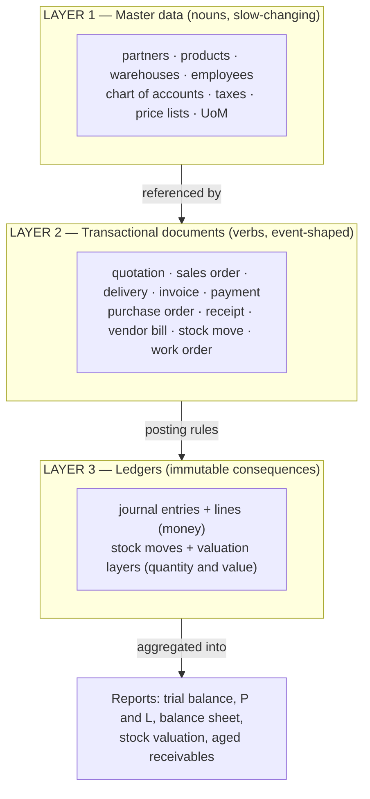

**Layer 1 — master data.** Nouns. Edited by humans, rarely, usually behind permissions. Master
data is *mutable* but must be **snapshotted onto documents**: if a customer's address changes
today, last year's invoice must still print last year's address. This is the single most common
beginner mistake in ERP design.

**Layer 2 — documents.** Verbs. A document has:

- a **header** (partner, dates, currency, warehouse, responsible user, state),
- **lines** (product, quantity, unit price, tax, discount, account),
- a **state machine** (draft, confirmed, done, cancelled),
- a **number** from a per-tenant sequence,
- **links** to source and target documents (a delivery knows its sales order).

**Layer 3 — ledgers.** Append-only consequences. Two ledgers matter:

- **Financial ledger** — journal entries whose lines always sum to zero (debits = credits).
- **Stock ledger** — stock moves (quantity) plus valuation layers (quantity times unit cost).

Ledgers are never edited. Corrections are made by writing a *reversing* entry.

### 1.3 The document-posting engine (how it works internally)

Every ERP, from SAP to Odoo, is at heart the same loop:

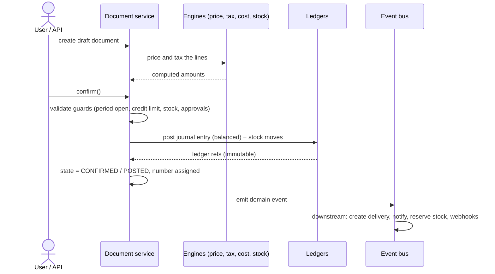

Four rules make this engine trustworthy:

1. **Draft is free, posted is frozen.** In draft, anything can change and nothing exists outside
   the document. On confirm, a number is burned and ledger rows are written. After that the
   document is immutable except for a small allow-list of fields (due date, internal note,
   assignee).
2. **Posting is atomic.** Document state change, ledger writes and sequence consumption happen in
   one database transaction. If any part fails, nothing happened.
3. **Posting is idempotent.** A confirm request carries an idempotency key; replaying it returns
   the first result instead of double-posting. See §7.2.
4. **Every ledger row points back to its source document** via `source_type` / `source_id`.
   Without this, reconciliation is impossible and auditors reject the system.

### 1.4 The golden invariants (never violate these)

| # | Invariant | Enforced by |
|---|---|---|
| I1 | Every journal entry's lines sum to zero, per currency | DB constraint + service check |
| I2 | A posted document is never physically deleted or silently edited | state guard + audit log |
| I3 | Cancelling a posted document creates a **reversal**, never a delete | posting service |
| I4 | Document numbers are gapless per (tenant, sequence, fiscal year) | sequence table with row lock |
| I5 | Stock on hand = SUM of stock move quantities for that product and location | derived, never an editable field |
| I6 | Stock value = SUM of valuation layer values, and equals the stock GL account balance | period-close reconciliation report |
| I7 | Prices, taxes, addresses and names are **snapshotted** onto documents at confirm | posting service |
| I8 | Nothing posts into a closed accounting period | period lock check |
| I9 | Every query is scoped by `tenant_id`; no cross-tenant read is possible | Postgres RLS + app-layer filter |
| I10 | Money is never a float; rounding happens once, at the total | `numeric` types + rounding service |

---

## 2. Concept glossary

| Term | Meaning | Why it matters |
|---|---|---|
| **Master data** | Long-lived reference records (customer, product, account) | Governs everything; needs approval and dedup |
| **Document** | A dated business event with lines and a state | The unit of work of an ERP |
| **Posting** | Turning a document into ledger rows | The moment a document becomes real |
| **Chart of accounts** | Tree of GL accounts (asset, liability, equity, income, expense) | Every posting hits accounts |
| **Journal** | A book grouping entries by kind (sales, purchase, bank, misc) | Legal requirement plus reporting |
| **Double entry** | Every amount written twice: one debit, one credit | Makes errors detectable |
| **Fiscal year / period** | Accounting calendar; periods can be locked | Controls what can still be posted |
| **Three-way match** | PO vs goods receipt vs vendor bill must agree | Core AP control against fraud and error |
| **Two-way match** | PO vs bill only (services, no goods) | Used for non-stock purchases |
| **UoM** | Unit of measure with conversions inside a category | Buy in boxes, stock in units, sell in kg |
| **BOM** | Bill of materials: components for one finished good | Basis of manufacturing and costing |
| **Routing / work center** | Operations and where they happen | Capacity and labour cost |
| **MRP** | Material requirements planning: demand into supply proposals | Turns forecast and orders into POs and WOs |
| **Reorder rule** | min/max per product and warehouse triggering replenishment | The SME-friendly 90% of MRP |
| **Lead time** | Days from order to availability | Drives planning dates |
| **Lot / serial** | Traceability identifiers on stock | Food, pharma, electronics, warranty |
| **Quant** | Current quantity of a product at a location (cache of moves) | Fast availability queries |
| **Reservation** | Quantity earmarked for a document but not yet moved | Prevents overselling |
| **ATP** | Available to promise = on hand minus reserved plus incoming | The number a salesperson needs |
| **Costing method** | FIFO, weighted average (AVCO) or standard | Determines COGS and stock value |
| **Landed cost** | Freight, duty, insurance added to product cost | Otherwise margins lie |
| **COGS** | Cost of goods sold, recognised when goods leave | Matches revenue |
| **Accrual vs cash** | Recognise when earned/incurred vs when paid | Legal default is accrual |
| **AR / AP** | Receivable (customers owe) and payable (we owe) | The two ageing reports SMEs live by |
| **Reconciliation** | Matching invoice to payment, or bank line to book line | Where "paid" comes from |
| **Dunning** | Structured chasing of overdue amounts | Applies to ERP receivables and SaaS billing alike |
| **Credit note (avoir)** | Negative invoice reversing or reducing another | The legal way to correct an invoice |
| **Fiscal position** | Rules swapping taxes and accounts by partner type or country | Exports, exempt customers |
| **Multi-currency** | Documents in FX, books in company currency | Needs a rate table plus FX gain/loss |
| **Analytic accounting** | A second dimension (project, department, site) parallel to the GL | Managerial reporting without touching legal books |
| **Approval workflow** | Rules gating a state transition | Purchase limits, discount limits |
| **Audit trail** | Immutable who-did-what-when | Legal requirement and trust |
| **Tenant** | One customer company inside the SaaS | The isolation boundary |
| **Entitlement** | What a tenant's plan allows (features, limits) | The gate between billing and product |
| **MRR / ARR** | Monthly and annual recurring revenue | The number the business is run on |

---

## 3. Core domain model

### 3.1 Entity map

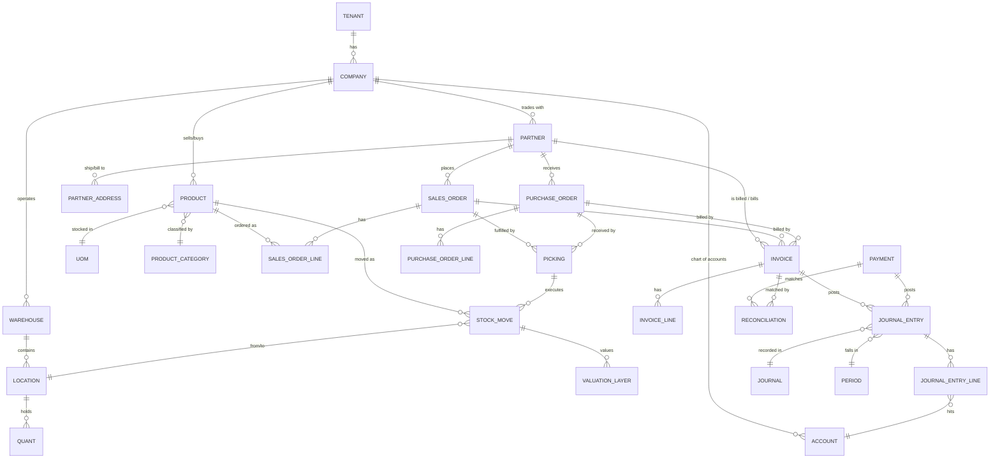

### 3.2 Tenancy, identity, access

```sql
-- One row per paying customer company. Owned by the SaaS layer (§8), read by the ERP.
create table tenants (
  id             uuid primary key default gen_random_uuid(),
  slug           text not null unique,            -- subdomain / URL key
  legal_name     text not null,
  country_code   char(2) not null default 'MA',
  base_currency  char(3) not null default 'MAD',
  locale         text    not null default 'fr-MA',
  timezone       text    not null default 'Africa/Casablanca',
  status         text    not null default 'TRIAL'
                 check (status in ('TRIAL','ACTIVE','PAST_DUE','SUSPENDED','CANCELLED','PURGED')),
  created_at     timestamptz not null default now()
);

-- A tenant may run several legal entities (multi-company). Keep it from day one:
-- retrofitting company_id after launch is a rewrite.
create table companies (
  id            uuid primary key default gen_random_uuid(),
  tenant_id     uuid not null references tenants(id),
  name          text not null,
  legal_id      text,                              -- ICE / SIRET / VAT id
  tax_id        text,                              -- IF (identifiant fiscal)
  currency      char(3) not null,
  address       jsonb  not null default '{}',
  logo_url      text,
  fiscal_year_start_month smallint not null default 1,
  created_at    timestamptz not null default now(),
  unique (tenant_id, name)
);

create table users (
  id             uuid primary key default gen_random_uuid(),
  tenant_id      uuid not null references tenants(id),
  email          citext not null,
  full_name      text not null,
  password_hash  text,                              -- null when SSO-only
  status         text not null default 'INVITED'
                 check (status in ('INVITED','ACTIVE','DISABLED')),
  last_login_at  timestamptz,
  created_at     timestamptz not null default now(),
  unique (tenant_id, email)
);

create table roles (
  id          uuid primary key default gen_random_uuid(),
  tenant_id   uuid not null references tenants(id),
  code        text not null,      -- ADMIN, ACCOUNTANT, SALES, PURCHASER, STOCK, READONLY
  name        text not null,
  permissions jsonb not null default '[]',  -- ["sales.order.confirm","invoice.post", ...]
  unique (tenant_id, code)
);

create table user_roles (
  user_id    uuid not null references users(id),
  role_id    uuid not null references roles(id),
  company_id uuid references companies(id),   -- null = all companies of the tenant
  primary key (user_id, role_id, company_id)
);
```

### 3.3 Partners (customers, suppliers, contacts — one table)

Do **not** create separate `customers` and `suppliers` tables. The same company is often both,
and duplicating it splits the balance. Use one `partners` table with boolean roles.

```sql
create table partners (
  id             uuid primary key default gen_random_uuid(),
  tenant_id      uuid not null references tenants(id),
  company_id     uuid not null references companies(id),
  code           text,                       -- human reference, per tenant
  name           text not null,
  is_customer    boolean not null default false,
  is_supplier    boolean not null default false,
  is_company     boolean not null default true,
  parent_id      uuid references partners(id),   -- contacts belong to a company
  legal_id       text,                        -- ICE
  tax_id         text,                        -- IF / VAT number
  email          citext,
  phone          text,
  website        text,
  currency       char(3),
  payment_term_id uuid references payment_terms(id),
  price_list_id  uuid references price_lists(id),
  fiscal_position_id uuid references fiscal_positions(id),
  credit_limit   numeric(18,2) not null default 0,   -- 0 = no limit
  receivable_account_id uuid references accounts(id),
  payable_account_id    uuid references accounts(id),
  active         boolean not null default true,
  notes          text,
  created_at     timestamptz not null default now(),
  unique (tenant_id, company_id, code)
);

create table partner_addresses (
  id          uuid primary key default gen_random_uuid(),
  tenant_id   uuid not null,
  partner_id  uuid not null references partners(id),
  type        text not null check (type in ('BILLING','SHIPPING','OTHER')),
  line1       text not null, line2 text,
  city        text, region text, postal_code text,
  country_code char(2) not null,
  is_default  boolean not null default false
);

create table payment_terms (
  id        uuid primary key default gen_random_uuid(),
  tenant_id uuid not null,
  name      text not null,               -- "30 days end of month"
  lines     jsonb not null                -- [{"days":30,"eom":true,"percent":100}]
);
```

### 3.4 Products, units of measure, categories

```sql
create table uom_categories (
  id uuid primary key default gen_random_uuid(),
  tenant_id uuid not null, name text not null      -- Unit, Weight, Volume, Time
);

create table uoms (
  id          uuid primary key default gen_random_uuid(),
  tenant_id   uuid not null,
  category_id uuid not null references uom_categories(id),
  name        text not null,                       -- Unit, Box of 12, kg, g, hour
  factor      numeric(18,6) not null,              -- relative to the category reference
  rounding    numeric(18,6) not null default 0.001,
  is_reference boolean not null default false
);
-- Conversion is only legal inside one category. qty_ref = qty * factor.

create table product_categories (
  id uuid primary key default gen_random_uuid(),
  tenant_id uuid not null,
  parent_id uuid references product_categories(id),
  name text not null,
  costing_method text not null default 'AVCO' check (costing_method in ('FIFO','AVCO','STANDARD')),
  valuation      text not null default 'AUTO'  check (valuation in ('MANUAL','AUTO')),
  stock_account_id     uuid references accounts(id),
  stock_input_account_id  uuid references accounts(id),
  stock_output_account_id uuid references accounts(id),
  cogs_account_id      uuid references accounts(id),
  income_account_id    uuid references accounts(id),
  expense_account_id   uuid references accounts(id)
);

create table products (
  id            uuid primary key default gen_random_uuid(),
  tenant_id     uuid not null,
  company_id    uuid not null,
  sku           text not null,
  barcode       text,
  name          text not null,
  description   text,
  type          text not null check (type in ('STOCKABLE','CONSUMABLE','SERVICE')),
  category_id   uuid not null references product_categories(id),
  uom_id        uuid not null references uoms(id),          -- stock UoM
  purchase_uom_id uuid references uoms(id),
  sale_price    numeric(18,6) not null default 0,
  standard_cost numeric(18,6) not null default 0,           -- STANDARD costing, or last cost
  tax_sale_id   uuid references taxes(id),
  tax_purchase_id uuid references taxes(id),
  tracking      text not null default 'NONE' check (tracking in ('NONE','LOT','SERIAL')),
  weight_kg     numeric(18,6),
  volume_m3     numeric(18,6),
  is_sellable   boolean not null default true,
  is_purchasable boolean not null default true,
  active        boolean not null default true,
  attributes    jsonb not null default '{}',                -- size, colour, ...
  created_at    timestamptz not null default now(),
  unique (tenant_id, company_id, sku)
);

-- Variants: only if the market needs them. If yes, model products as templates + variants
-- from day one; bolting variants on later rewrites every stock and pricing query.
create table product_suppliers (
  id uuid primary key default gen_random_uuid(),
  tenant_id uuid not null,
  product_id uuid not null references products(id),
  partner_id uuid not null references partners(id),
  supplier_sku text,
  price numeric(18,6), currency char(3),
  min_qty numeric(18,6) not null default 1,
  lead_time_days int not null default 0,
  priority int not null default 10
);
```

### 3.5 Warehouses, locations, stock

Stock is a **ledger of moves**, plus `quants` as a maintained cache for fast reads.
`quants` are derived: they must always be rebuildable by replaying `stock_moves`.

```sql
create table warehouses (
  id uuid primary key default gen_random_uuid(),
  tenant_id uuid not null, company_id uuid not null,
  code text not null, name text not null,
  address jsonb,
  unique (tenant_id, company_id, code)
);

create table locations (
  id uuid primary key default gen_random_uuid(),
  tenant_id uuid not null,
  warehouse_id uuid references warehouses(id),   -- null for virtual locations
  parent_id uuid references locations(id),
  code text not null,
  name text not null,
  usage text not null check (usage in
        ('INTERNAL','CUSTOMER','SUPPLIER','INVENTORY_LOSS','PRODUCTION','TRANSIT','SCRAP')),
  active boolean not null default true
);
-- Virtual locations are the trick that makes everything one mechanism:
--   receiving  = move from SUPPLIER  -> INTERNAL
--   delivery   = move from INTERNAL  -> CUSTOMER
--   adjustment = move from INVENTORY_LOSS <-> INTERNAL
--   production = move from PRODUCTION <-> INTERNAL
-- One table, one algorithm, every stock operation.

create table lots (
  id uuid primary key default gen_random_uuid(),
  tenant_id uuid not null,
  product_id uuid not null references products(id),
  name text not null,                       -- lot code or serial number
  expiry_date date,
  unique (tenant_id, product_id, name)
);

create table stock_moves (
  id            uuid primary key default gen_random_uuid(),
  tenant_id     uuid not null,
  company_id    uuid not null,
  product_id    uuid not null references products(id),
  lot_id        uuid references lots(id),
  qty           numeric(18,6) not null check (qty > 0),
  uom_id        uuid not null references uoms(id),
  from_location_id uuid not null references locations(id),
  to_location_id   uuid not null references locations(id),
  state         text not null check (state in ('DRAFT','WAITING','ASSIGNED','DONE','CANCELLED')),
  picking_id    uuid references pickings(id),
  source_type   text,                        -- SALES_ORDER, PURCHASE_ORDER, WORK_ORDER, ADJUSTMENT
  source_id     uuid,
  scheduled_at  timestamptz,
  done_at       timestamptz,
  unit_cost     numeric(18,6),               -- set at DONE by the costing engine
  created_at    timestamptz not null default now()
);
create index on stock_moves (tenant_id, product_id, done_at);

-- Cache of "what is where, right now". Rebuildable from stock_moves.
create table quants (
  id uuid primary key default gen_random_uuid(),
  tenant_id uuid not null,
  product_id uuid not null references products(id),
  location_id uuid not null references locations(id),
  lot_id uuid references lots(id),
  qty numeric(18,6) not null default 0,
  reserved_qty numeric(18,6) not null default 0,
  unique (tenant_id, product_id, location_id, lot_id)
);

create table stock_reservations (
  id uuid primary key default gen_random_uuid(),
  tenant_id uuid not null,
  quant_id uuid not null references quants(id),
  stock_move_id uuid not null references stock_moves(id),
  qty numeric(18,6) not null,
  created_at timestamptz not null default now()
);

-- A picking is the paper: one receipt, one delivery note, one internal transfer.
create table pickings (
  id uuid primary key default gen_random_uuid(),
  tenant_id uuid not null, company_id uuid not null,
  number text not null,
  type text not null check (type in ('RECEIPT','DELIVERY','INTERNAL','RETURN_IN','RETURN_OUT')),
  partner_id uuid references partners(id),
  warehouse_id uuid references warehouses(id),
  state text not null check (state in ('DRAFT','WAITING','READY','DONE','CANCELLED')),
  scheduled_at timestamptz,
  done_at timestamptz,
  source_type text, source_id uuid,
  note text,
  unique (tenant_id, number)
);

-- The stock value ledger. One row per DONE move that changes value.
create table valuation_layers (
  id uuid primary key default gen_random_uuid(),
  tenant_id uuid not null, company_id uuid not null,
  product_id uuid not null references products(id),
  stock_move_id uuid not null references stock_moves(id),
  qty numeric(18,6) not null,          -- signed: + on receipt, - on issue
  unit_cost numeric(18,6) not null,
  value numeric(18,6) not null,        -- qty * unit_cost, signed
  remaining_qty numeric(18,6),         -- FIFO only: how much of this layer is unconsumed
  remaining_value numeric(18,6),       -- FIFO only
  journal_entry_id uuid references journal_entries(id),
  created_at timestamptz not null default now()
);
create index on valuation_layers (tenant_id, product_id, created_at);
```

### 3.6 Taxes, price lists, fiscal positions

```sql
create table taxes (
  id uuid primary key default gen_random_uuid(),
  tenant_id uuid not null, company_id uuid not null,
  name text not null,                                  -- "TVA 20%"
  rate numeric(9,6) not null,                          -- 0.200000
  type text not null check (type in ('PERCENT','FIXED')),
  scope text not null check (scope in ('SALE','PURCHASE','BOTH')),
  price_include boolean not null default false,        -- price is TTC
  account_collected_id uuid references accounts(id),   -- TVA collectee (liability)
  account_deductible_id uuid references accounts(id),  -- TVA deductible (asset)
  sequence int not null default 10,                    -- order for compound taxes
  is_compound boolean not null default false,
  active boolean not null default true
);

create table price_lists (
  id uuid primary key default gen_random_uuid(),
  tenant_id uuid not null, company_id uuid not null,
  name text not null, currency char(3) not null,
  valid_from date, valid_to date,
  active boolean not null default true
);

create table price_list_rules (
  id uuid primary key default gen_random_uuid(),
  tenant_id uuid not null,
  price_list_id uuid not null references price_lists(id),
  applies_to text not null check (applies_to in ('ALL','CATEGORY','PRODUCT')),
  product_id uuid references products(id),
  category_id uuid references product_categories(id),
  min_qty numeric(18,6) not null default 0,
  compute text not null check (compute in ('FIXED','PERCENT_OFF','FORMULA')),
  fixed_price numeric(18,6),
  percent_off numeric(9,6),
  base text default 'SALE_PRICE' check (base in ('SALE_PRICE','COST','OTHER_LIST')),
  surcharge numeric(18,6) default 0,
  priority int not null default 10,
  valid_from date, valid_to date
);

-- A fiscal position rewrites taxes and accounts for a class of partner
-- (export = no VAT, exempt customer, foreign supplier with reverse charge).
create table fiscal_positions (
  id uuid primary key default gen_random_uuid(),
  tenant_id uuid not null, company_id uuid not null,
  name text not null,
  country_code char(2),
  tax_map jsonb not null default '[]',      -- [{"from":"<tax_id>","to":"<tax_id or null>"}]
  account_map jsonb not null default '[]'
);
```

### 3.7 Accounting core

```sql
create table accounts (
  id uuid primary key default gen_random_uuid(),
  tenant_id uuid not null, company_id uuid not null,
  code text not null,                       -- '3421' (clients), '7111' (ventes)
  name text not null,
  type text not null check (type in
       ('ASSET','LIABILITY','EQUITY','INCOME','EXPENSE',
        'RECEIVABLE','PAYABLE','BANK','CASH','STOCK','TAX','OFF_BALANCE')),
  parent_id uuid references accounts(id),
  reconcilable boolean not null default false,   -- receivable/payable/bank
  currency char(3),                              -- forces a single currency if set
  active boolean not null default true,
  unique (tenant_id, company_id, code)
);

create table journals (
  id uuid primary key default gen_random_uuid(),
  tenant_id uuid not null, company_id uuid not null,
  code text not null,                            -- VTE, ACH, BQ1, CAI, OD
  name text not null,
  type text not null check (type in ('SALE','PURCHASE','BANK','CASH','MISC','INVENTORY')),
  default_account_id uuid references accounts(id),
  sequence_id uuid references sequences(id),
  currency char(3),
  unique (tenant_id, company_id, code)
);

create table fiscal_years (
  id uuid primary key default gen_random_uuid(),
  tenant_id uuid not null, company_id uuid not null,
  name text not null, date_from date not null, date_to date not null,
  state text not null default 'OPEN' check (state in ('OPEN','CLOSING','CLOSED'))
);

create table periods (
  id uuid primary key default gen_random_uuid(),
  tenant_id uuid not null, company_id uuid not null,
  fiscal_year_id uuid not null references fiscal_years(id),
  name text not null,                            -- "2026-03"
  date_from date not null, date_to date not null,
  state text not null default 'OPEN' check (state in ('OPEN','SOFT_CLOSED','CLOSED')),
  unique (tenant_id, company_id, name)
);

create table journal_entries (
  id uuid primary key default gen_random_uuid(),
  tenant_id uuid not null, company_id uuid not null,
  journal_id uuid not null references journals(id),
  period_id uuid not null references periods(id),
  number text not null,
  entry_date date not null,
  reference text,
  state text not null default 'DRAFT' check (state in ('DRAFT','POSTED','REVERSED')),
  reversal_of_id uuid references journal_entries(id),
  source_type text, source_id uuid,             -- INVOICE, PAYMENT, STOCK_MOVE, PAYROLL...
  posted_at timestamptz, posted_by uuid,
  unique (tenant_id, company_id, number)
);

create table journal_entry_lines (
  id uuid primary key default gen_random_uuid(),
  tenant_id uuid not null,
  entry_id uuid not null references journal_entries(id) on delete cascade,
  account_id uuid not null references accounts(id),
  partner_id uuid references partners(id),      -- required on receivable/payable lines
  label text,
  debit  numeric(18,6) not null default 0 check (debit  >= 0),
  credit numeric(18,6) not null default 0 check (credit >= 0),
  currency char(3),
  amount_currency numeric(18,6),                -- signed amount in FX
  tax_id uuid references taxes(id),
  analytic_account_id uuid references analytic_accounts(id),
  reconciled boolean not null default false,
  check (debit = 0 or credit = 0)               -- never both on one line
);
create index on journal_entry_lines (tenant_id, account_id, partner_id) where reconciled = false;

-- Enforced in the posting service AND as a deferred constraint trigger:
--   SUM(debit) = SUM(credit) per entry, per currency.

create table analytic_accounts (
  id uuid primary key default gen_random_uuid(),
  tenant_id uuid not null, company_id uuid not null,
  code text not null, name text not null,
  type text not null default 'PROJECT'
       check (type in ('PROJECT','DEPARTMENT','SITE','VEHICLE','CAMPAIGN')),
  partner_id uuid references partners(id),
  active boolean not null default true
);

-- Matching invoices with payments, or bank lines with book lines.
create table reconciliations (
  id uuid primary key default gen_random_uuid(),
  tenant_id uuid not null,
  created_at timestamptz not null default now(),
  created_by uuid
);
create table reconciliation_lines (
  reconciliation_id uuid not null references reconciliations(id) on delete cascade,
  journal_entry_line_id uuid not null references journal_entry_lines(id),
  amount numeric(18,6) not null,
  primary key (reconciliation_id, journal_entry_line_id)
);
```

### 3.8 Trade documents (sales, purchase, invoicing, payments)

Sales and purchase orders are structurally the same; keep them as two tables (different
lifecycles and permissions) but share the line-computation code.

```sql
create table sales_orders (
  id uuid primary key default gen_random_uuid(),
  tenant_id uuid not null, company_id uuid not null,
  number text not null,
  partner_id uuid not null references partners(id),
  partner_shipping_id uuid references partner_addresses(id),
  partner_invoice_id  uuid references partner_addresses(id),
  partner_snapshot jsonb not null,             -- name, address, tax ids, frozen at confirm
  price_list_id uuid references price_lists(id),
  fiscal_position_id uuid references fiscal_positions(id),
  currency char(3) not null,
  fx_rate numeric(18,8) not null default 1,
  warehouse_id uuid references warehouses(id),
  salesperson_id uuid references users(id),
  order_date date not null,
  expected_date date,
  payment_term_id uuid references payment_terms(id),
  state text not null default 'DRAFT' check (state in
       ('DRAFT','SENT','CONFIRMED','PARTIALLY_DELIVERED','DELIVERED','INVOICED','DONE','CANCELLED')),
  amount_untaxed numeric(18,2) not null default 0,
  amount_tax     numeric(18,2) not null default 0,
  amount_total   numeric(18,2) not null default 0,
  note text, internal_note text,
  valid_until date,
  created_at timestamptz not null default now(),
  unique (tenant_id, company_id, number)
);

create table sales_order_lines (
  id uuid primary key default gen_random_uuid(),
  tenant_id uuid not null,
  order_id uuid not null references sales_orders(id) on delete cascade,
  sequence int not null default 10,
  product_id uuid references products(id),          -- null for a section/note line
  name text not null,                               -- description snapshot
  qty numeric(18,6) not null,
  uom_id uuid not null references uoms(id),
  unit_price numeric(18,6) not null,
  discount_percent numeric(9,6) not null default 0,
  tax_ids uuid[] not null default '{}',
  tax_snapshot jsonb not null default '[]',         -- [{"id":..,"name":"TVA 20%","rate":0.2}]
  amount_untaxed numeric(18,6) not null default 0,
  amount_tax numeric(18,6) not null default 0,
  amount_total numeric(18,6) not null default 0,
  qty_delivered numeric(18,6) not null default 0,
  qty_invoiced  numeric(18,6) not null default 0,
  analytic_account_id uuid references analytic_accounts(id)
);

create table purchase_orders ( /* same shape; partner is the supplier,
     states DRAFT, RFQ_SENT, CONFIRMED, PARTIALLY_RECEIVED, RECEIVED, BILLED, DONE, CANCELLED */ );
create table purchase_order_lines ( /* same shape; qty_received, qty_billed */ );

-- One invoice table for customer and vendor documents. The `type` decides sign and accounts.
create table invoices (
  id uuid primary key default gen_random_uuid(),
  tenant_id uuid not null, company_id uuid not null,
  type text not null check (type in
       ('CUSTOMER_INVOICE','CUSTOMER_CREDIT_NOTE','VENDOR_BILL','VENDOR_CREDIT_NOTE')),
  number text,                                   -- null while DRAFT; assigned at POST
  partner_id uuid not null references partners(id),
  partner_snapshot jsonb not null,
  journal_id uuid not null references journals(id),
  currency char(3) not null,
  fx_rate numeric(18,8) not null default 1,
  invoice_date date not null,
  due_date date not null,
  payment_term_id uuid references payment_terms(id),
  fiscal_position_id uuid references fiscal_positions(id),
  state text not null default 'DRAFT' check (state in ('DRAFT','POSTED','PAID','CANCELLED')),
  payment_state text not null default 'NOT_PAID'
       check (payment_state in ('NOT_PAID','PARTIAL','PAID','OVERPAID','REVERSED')),
  amount_untaxed numeric(18,2) not null default 0,
  amount_tax numeric(18,2) not null default 0,
  amount_total numeric(18,2) not null default 0,
  amount_residual numeric(18,2) not null default 0,
  journal_entry_id uuid references journal_entries(id),
  reversed_invoice_id uuid references invoices(id),
  source_type text, source_id uuid,              -- SALES_ORDER / PURCHASE_ORDER
  reference text,                                -- supplier invoice number
  note text,
  unique (tenant_id, company_id, number)
);

create table invoice_lines (
  id uuid primary key default gen_random_uuid(),
  tenant_id uuid not null,
  invoice_id uuid not null references invoices(id) on delete cascade,
  sequence int not null default 10,
  product_id uuid references products(id),
  name text not null,
  qty numeric(18,6) not null,
  uom_id uuid references uoms(id),
  unit_price numeric(18,6) not null,
  discount_percent numeric(9,6) not null default 0,
  tax_snapshot jsonb not null default '[]',
  account_id uuid not null references accounts(id),
  analytic_account_id uuid references analytic_accounts(id),
  amount_untaxed numeric(18,6) not null,
  amount_tax numeric(18,6) not null,
  amount_total numeric(18,6) not null,
  source_line_type text, source_line_id uuid     -- back to SO/PO line, for qty_invoiced
);

create table payments (
  id uuid primary key default gen_random_uuid(),
  tenant_id uuid not null, company_id uuid not null,
  number text not null,
  type text not null check (type in ('INBOUND','OUTBOUND')),
  partner_id uuid not null references partners(id),
  journal_id uuid not null references journals(id),      -- a BANK or CASH journal
  method text not null check (method in
       ('CASH','BANK_TRANSFER','CHECK','CARD','EFFET','ONLINE','OTHER')),
  reference text,                                        -- check number, transfer ref
  payment_date date not null,
  currency char(3) not null, fx_rate numeric(18,8) not null default 1,
  amount numeric(18,2) not null check (amount > 0),
  state text not null default 'DRAFT'
       check (state in ('DRAFT','POSTED','RECONCILED','BOUNCED','CANCELLED')),
  journal_entry_id uuid references journal_entries(id),
  unique (tenant_id, company_id, number)
);
```

### 3.9 Cross-cutting tables

```sql
create table sequences (
  id uuid primary key default gen_random_uuid(),
  tenant_id uuid not null, company_id uuid not null,
  code text not null,                      -- SALES_ORDER, CUSTOMER_INVOICE, PICKING_OUT
  prefix text not null default '',         -- 'FAC/'
  padding int not null default 5,
  next_number bigint not null default 1,
  reset_policy text not null default 'YEARLY'
       check (reset_policy in ('NEVER','YEARLY','MONTHLY')),
  current_year int, current_month int,
  unique (tenant_id, company_id, code)
);

create table audit_log (
  id bigserial primary key,
  tenant_id uuid not null,
  at timestamptz not null default now(),
  user_id uuid, impersonated_by uuid,
  entity_type text not null, entity_id uuid not null,
  action text not null,                    -- CREATE, UPDATE, CONFIRM, POST, CANCEL, DELETE
  diff jsonb,                              -- {"field":{"old":..,"new":..}}
  ip inet, user_agent text, request_id text
);
create index on audit_log (tenant_id, entity_type, entity_id, at desc);

create table attachments (
  id uuid primary key default gen_random_uuid(),
  tenant_id uuid not null,
  entity_type text not null, entity_id uuid not null,
  filename text not null, mime_type text not null, size_bytes bigint not null,
  storage_key text not null,               -- S3/minio object key, tenant-prefixed
  checksum text, uploaded_by uuid, created_at timestamptz not null default now()
);

create table activities (                   -- follow-ups, reminders, assigned tasks
  id uuid primary key default gen_random_uuid(),
  tenant_id uuid not null,
  entity_type text not null, entity_id uuid not null,
  type text not null check (type in ('CALL','EMAIL','MEETING','TODO')),
  summary text not null, due_date date,
  assigned_to uuid references users(id),
  state text not null default 'OPEN' check (state in ('OPEN','DONE','CANCELLED'))
);

create table outbox (                       -- transactional outbox for domain events
  id bigserial primary key,
  tenant_id uuid not null,
  event_type text not null, payload jsonb not null,
  created_at timestamptz not null default now(),
  published_at timestamptz,
  attempts int not null default 0, last_error text
);

create table idempotency_keys (
  key text primary key,
  tenant_id uuid not null,
  endpoint text not null,
  request_hash text not null,
  response_status int, response_body jsonb,
  created_at timestamptz not null default now(),
  expires_at timestamptz not null
);
```

---

## 4. Modules: what exists, what an SME actually needs

### 4.1 The standard module map

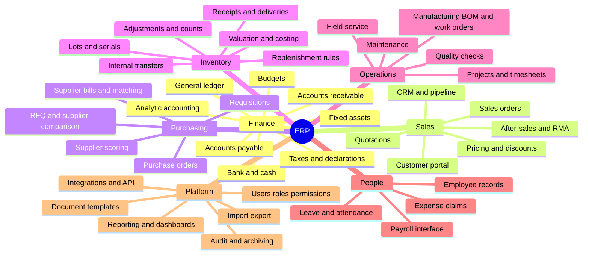

### 4.2 Scope tiers for an SME product

The mistake that kills SME ERP projects is building the enterprise module list. An SME buys an
ERP to **stop using Excel and WhatsApp for stock and invoices**. Ship that, then expand.

| Module | Tier | Rationale |
|---|---|---|
| Partners, products, UoM, users/roles | **V1 core** | Nothing works without master data |
| Quotation to sales order to delivery to invoice | **V1 core** | The revenue loop; first thing demoed |
| Purchase order to receipt to vendor bill | **V1 core** | The other half of stock accuracy |
| Inventory moves, adjustments, on-hand and ATP | **V1 core** | The reason they leave Excel |
| Customer/vendor invoices, payments, reconciliation | **V1 core** | Cash is the reason they buy |
| GL, chart of accounts, journals, trial balance | **V1 core** | Or the accountant rejects the tool |
| VAT report + legal invoice layout | **V1 core** | Non-negotiable, market-specific (§9) |
| Aged receivable/payable, stock valuation, sales dashboard | **V1 core** | The 5 reports actually opened daily |
| Import from Excel (partners, products, opening stock) | **V1 core** | Migration is the #1 onboarding blocker |
| Multi-warehouse, lots/serials, barcode scanning | V1.5 | Only if the first customers need it |
| CRM pipeline, quote templates, e-signature | V1.5 | Sells well, low risk |
| Reorder rules, simple replenishment proposals | V1.5 | High perceived value, cheap to build |
| Manufacturing (BOM, work orders, MO costing) | V2 | Big; only for producers |
| Projects, timesheets, project billing | V2 | For service SMEs |
| HR-lite (employees, leave, expense claims) | V2 | Payroll itself: integrate, do not build |
| Fixed assets and depreciation | V2 | Accountants ask; low volume |
| Budgets, analytic dashboards, forecast | V2 | After the ledger is trusted |
| Payroll calculation, full WMS, MES, EDI | **Do not build** | Regulatory and complexity sinks; integrate instead |

### 4.3 What differentiates an SME ERP from an enterprise ERP

| Dimension | Enterprise ERP | What an SME needs instead |
|---|---|---|
| Configuration | Months of consulting | Working defaults in 30 minutes, wizard-driven |
| Chart of accounts | Custom-built | Preloaded legal template for the country |
| Roles | Dozens, fine-grained | 5 presets: admin, accountant, sales, stock, read-only |
| Approvals | Multi-level matrix | One optional approver above a threshold |
| Reporting | BI suite | 8 fixed reports plus Excel export |
| Deployment | On-premise, per-client | Multi-tenant SaaS, one codebase, one version |
| Extensibility | Custom code per client | Fields, templates, webhooks; no per-client forks |
| Training | Weeks | The UI must be usable without training |
| Price | 5–7 figures | Monthly per user or per company (§8.8) |

**Design consequence:** every feature must have a sane default. If a screen cannot be used
without configuring something first, it is not SME-ready.

### 4.4 Cross-module dependency order (build order for the agent)

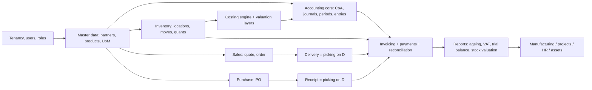

Do not start a module until every arrow feeding it is done. In particular: **never build sales
orders before the invoice and ledger exist** — you will end up with orders that cannot be billed
and a migration to write.

---

## 5. The flows

Each flow below gives: the state machine, the step-by-step with guards, the accounting postings,
and the edge cases that must be handled. Account codes are Moroccan PCG (see §9); substitute the
local chart if the market changes — the *shape* of every posting stays identical.

Notation for postings: `Dr` = debit, `Cr` = credit. Every block balances.

### 5.0 The generic document lifecycle (applies to every document)

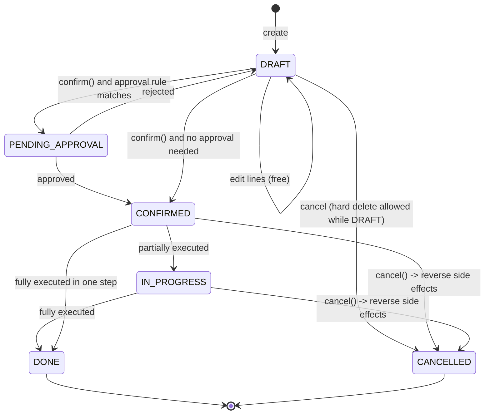

Universal guards on `confirm()`:

1. Tenant is `ACTIVE` or `TRIAL` (not `SUSPENDED`) — see §8.4.
2. User holds the permission for this transition.
3. Document has at least one line with `qty != 0`.
4. Target period is `OPEN` (documents that post to the ledger).
5. Entitlement limits not exceeded (e.g. document quota on the plan).
6. Idempotency key not already consumed.

---

### 5.1 Order to Cash (O2C) — the revenue loop

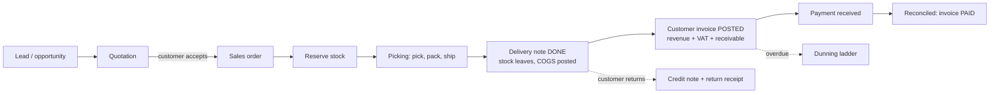

#### State machine

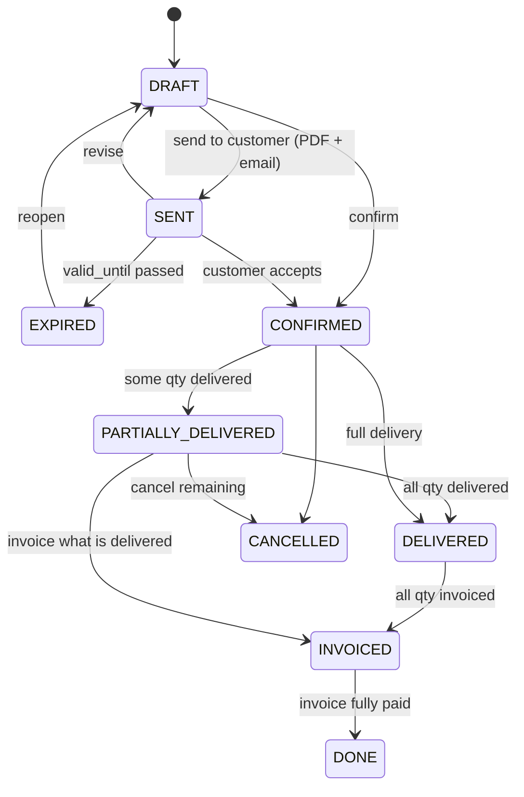

#### Steps, guards and effects

| # | Step | Guards | Effects |
|---|---|---|---|
| 1 | Create quotation | partner exists, is_customer | state DRAFT, no number burned (use a QUOTE sequence, gaps allowed) |
| 2 | Add lines | product active and sellable | pricing engine §6.1 sets `unit_price`; tax engine §6.2 sets taxes; ATP §6.3 shows availability |
| 3 | Send | totals > 0 | render PDF, email, state SENT, log activity, set `valid_until` |
| 4 | Confirm | credit limit OK; discount within user's limit or approved; period open | number from SALES_ORDER sequence; snapshot partner + prices + taxes (I7); create picking (DELIVERY) in state WAITING; create reservations; emit `sales_order.confirmed` |
| 5 | Reserve | stock available at warehouse | `quants.reserved_qty += qty`; picking becomes READY when fully reserved |
| 6 | Deliver | picking READY (or force partial) | stock moves to DONE; costing engine assigns `unit_cost`; valuation layers written; **posting A**; `qty_delivered` updated; backorder created for the remainder |
| 7 | Invoice | `qty_delivered > qty_invoiced` (policy = on delivery) or immediately (policy = on order) | invoice DRAFT from delivered qty; on POST: number burned, **posting B**, `qty_invoiced` updated |
| 8 | Payment | invoice POSTED, amount > 0 | payment POSTED, **posting C** |
| 9 | Reconcile | same partner, same account, residual > 0 | link receivable lines; `payment_state` recomputed; invoice PAID when residual = 0 |
| 10 | Close | all lines delivered and invoiced and paid | state DONE |

#### Postings

**A — Goods leave the warehouse (permanent inventory):**

```
Dr 6114  Variation des stocks de marchandises (COGS)     <cost>
   Cr 3111  Stock de marchandises                            <cost>
```

**B — Customer invoice posted:**

```
Dr 3421  Clients                                   <total TTC>
   Cr 7111  Ventes de marchandises                     <total HT>
   Cr 4455  Etat - TVA facturee                        <VAT>
```

**C — Customer pays:**

```
Dr 5141  Banque                                    <amount>
   Cr 3421  Clients                                    <amount>
```

Then reconcile B's `3421` line with C's `3421` line. `amount_residual` falls to zero and
`payment_state` becomes `PAID`. **Reconciliation, not the payment itself, is what marks an
invoice paid** — this distinction matters when one payment covers five invoices.

> **Costing model choice.** The above is *permanent inventory* (inventaire permanent): stock
> value lives in `3111` and COGS is posted per shipment. The alternative, common in Moroccan and
> French SMEs, is *intermittent inventory* (inventaire intermittent): purchases go straight to
> `6111`, and stock is adjusted once per period by a physical count. Support permanent inventory
> in the product code and offer intermittent as a company-level setting that simply skips
> posting A and posts a single period-end variation entry instead. Decide this before writing
> the costing engine; retrofitting is expensive.

#### Variants and edge cases (all must be handled)

| Case | Handling |
|---|---|
| **Invoice before delivery** (prepaid) | Invoicing policy per product or per order: `ON_ORDER` bills confirmed qty; `ON_DELIVERY` bills delivered qty. Store the policy on the order line, frozen at confirm |
| **Down payment / acompte** | Create an invoice on a special "advance" product posting to a liability account (`4421 Clients - avances et acomptes`). Deduct it on the final invoice as a negative line |
| **Partial delivery + backorder** | Split the picking: DONE for the shipped qty, a new picking WAITING for the rest. Never edit a DONE move |
| **Over-delivery** | Allowed only within a tolerance percent (config). Otherwise block |
| **Price changed after confirm** | Not allowed on a confirmed order. Cancel and re-issue, or add a new line, or issue a credit note after invoicing |
| **Credit limit exceeded** | Block confirm with a clear message; allow an override permission that writes an audit entry |
| **Drop-shipping** | Confirm SO creates a PO to the supplier with the customer as delivery address; goods move SUPPLIER to CUSTOMER directly; no internal stock |
| **Service-only order** | No picking, no stock move, no COGS. Invoice immediately or on milestone |
| **Multi-currency order** | Store `currency` + `fx_rate` at confirm; the ledger stores company currency with `amount_currency` on each line; FX gain/loss posted at reconciliation (§6.7) |
| **Cancel after invoicing** | Not a cancel: issue a credit note (§5.6) and a return picking |
| **Rounding mismatch** | Compute tax per line, round once per tax group at the total. Never sum rounded line taxes (§6.9) |

---

### 5.2 Procure to Pay (P2P) — the spending loop

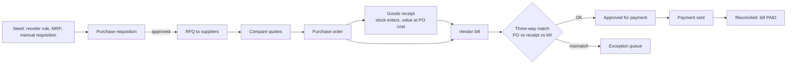

#### State machine (purchase order)

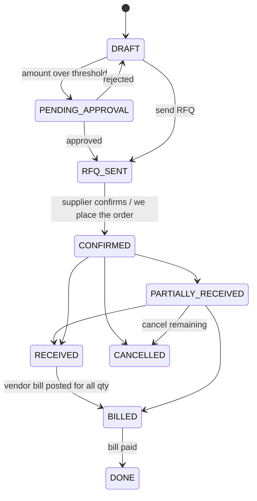

#### Steps, guards, effects

| # | Step | Guards | Effects |
|---|---|---|---|
| 1 | Requisition | requester has permission | internal document, no supplier yet |
| 2 | Approval | amount above threshold routes to approver | audit trail; rejection returns to DRAFT with a reason |
| 3 | RFQ | supplier has email | send PDF; optional supplier portal link |
| 4 | Confirm PO | approved; period open | number burned; create RECEIPT picking WAITING; expected date = today + lead time; emit `purchase_order.confirmed` |
| 5 | Receive goods | picking exists | stock moves DONE (SUPPLIER to INTERNAL); valuation layer at PO price; **posting D**; `qty_received` updated |
| 6 | Vendor bill | supplier reference not already used (duplicate check) | invoice type `VENDOR_BILL`, DRAFT; three-way match runs |
| 7 | Post bill | match OK or override with reason | **posting E**; `qty_billed` updated |
| 8 | Pay | bill POSTED, due date reached (or early-pay discount) | payment OUTBOUND, **posting F** |
| 9 | Reconcile | matches payable lines | bill PAID |

#### Postings

**D — Goods received (permanent inventory, using a goods-received-not-invoiced account):**

```
Dr 3111  Stock de marchandises                     <qty * PO unit cost>
   Cr 4417  Fournisseurs - factures non parvenues      <same>
```

**E — Vendor bill posted:**

```
Dr 4417  Fournisseurs - factures non parvenues     <received value>
Dr 3455  Etat - TVA recuperable                    <VAT>
Dr 6114  Price difference (if bill > receipt value) <delta>       [only if mismatch accepted]
   Cr 4411  Fournisseurs                               <total TTC>
```

For a **non-stock purchase** (services, rent, fuel) there is no receipt and no `4417`:

```
Dr 61xx  Charge account from the product/category   <HT>
Dr 3455  Etat - TVA recuperable                     <VAT>
   Cr 4411  Fournisseurs                                <TTC>
```

**F — Payment sent:**

```
Dr 4411  Fournisseurs                              <amount>
   Cr 5141  Banque                                     <amount>
```

#### Three-way match algorithm

```
for each bill line:
    po_line   = resolve by source_line_id (or fuzzy match on product + PO number)
    received  = SUM(done receipt move qty for that po_line)
    billed    = SUM(previously billed qty for that po_line)
    tolerance_qty    = config, default 0
    tolerance_amount = config, default 1% or 50 MAD, whichever is smaller

    if bill_qty > received - billed + tolerance_qty  -> EXCEPTION: OVER_BILLED_QTY
    if |bill_unit_price - po_unit_price| > tolerance -> EXCEPTION: PRICE_VARIANCE
    if product not on the PO                         -> EXCEPTION: UNEXPECTED_ITEM

exceptions block posting until resolved by:
    accept variance (posts a price-difference line, requires permission + reason)
    amend the PO (if the supplier legitimately repriced)
    request a supplier credit note
```

#### Edge cases

| Case | Handling |
|---|---|
| **Bill arrives before goods** | Post the bill against `4417` anyway; `4417` clears when the receipt posts. Keep an ageing report on `4417` — a large stale balance means broken matching |
| **Partial receipt** | Same split-picking mechanic as delivery; backorder for the rest |
| **Supplier over-ships** | Accept within tolerance or refuse at the dock (return picking) |
| **Landed costs** (freight, customs) | A separate landed-cost document allocates extra cost across receipt lines by value, weight or quantity, writing an additional valuation layer and `Dr 3111 / Cr 4411` |
| **Advance to supplier** | Post to `3411 Fournisseurs - avances et acomptes`, deduct on the final bill |
| **Duplicate invoice** | Unique constraint on (tenant, partner, supplier reference); warn, do not silently block |
| **Foreign supplier** | Fiscal position swaps VAT to reverse charge / import VAT; customs duty enters via landed cost |
| **Bill without PO** | Allowed for small expenses under a threshold; flag as `NO_PO` for the audit report |
| **Return to supplier** | Return picking (INTERNAL to SUPPLIER) then a vendor credit note; reverse valuation at the original layer cost |

---

### 5.3 Inventory flows

Every stock operation is the same primitive: **a move from one location to another**. The usage
of the source and destination locations is what gives it meaning and decides the posting.

| Operation | From usage | To usage | Value effect |
|---|---|---|---|
| Receipt | SUPPLIER | INTERNAL | + stock, credit `4417` |
| Delivery | INTERNAL | CUSTOMER | − stock, debit COGS |
| Internal transfer | INTERNAL | INTERNAL | none (same company) |
| Inter-warehouse with transit | INTERNAL | TRANSIT then INTERNAL | none, but in-transit visible |
| Positive adjustment | INVENTORY_LOSS | INTERNAL | + stock, credit gain account |
| Negative adjustment | INTERNAL | INVENTORY_LOSS | − stock, debit loss account |
| Scrap | INTERNAL | SCRAP | − stock, debit scrap expense |
| Consume in production | INTERNAL | PRODUCTION | − stock, + WIP |
| Produce | PRODUCTION | INTERNAL | + stock at computed cost, − WIP |
| Customer return | CUSTOMER | INTERNAL | + stock at original cost |
| Supplier return | INTERNAL | SUPPLIER | − stock at original layer cost |

#### 5.3.1 Picking execution (receipt, delivery, transfer)

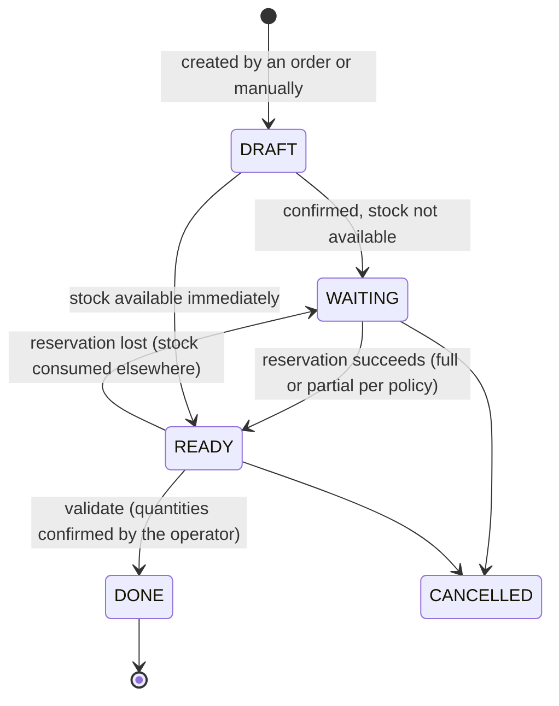

Validation algorithm (`picking.validate()`), in one transaction:

```
1  assert picking.state in (READY, WAITING)   # WAITING allowed only with force flag
2  for each move:
3      qty_done = operator-entered quantity (defaults to reserved qty)
4      if qty_done == 0: skip the move (it goes to the backorder)
5      if product.tracking != NONE: require lot/serial on every move line
6      apply UoM conversion to the stock UoM
7      cost = costing_engine.consume(product, qty_done, from_location)   # §6.4
8      write valuation_layer(s)
9      update quants: from_location -= qty, to_location += qty
10     release reservations
11     move.state = DONE, move.done_at = now
12 if any qty remains undone:
13     create a backorder picking with the remaining quantities
14 post the journal entry for the value change (if both locations differ in valuation)
15 picking.state = DONE; emit picking.done
```

**Never** update `quants` outside this algorithm. Every other write path is a bug that will make
stock drift from the move ledger and break I5.

#### 5.3.2 Inventory adjustment and cycle count

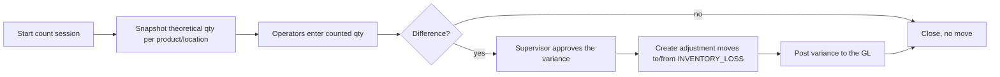

Rules:

- The theoretical quantity is **snapshotted at session start**; if stock moves during the count,
  the difference is recomputed against the snapshot and flagged, not silently overwritten.
- Variance above a threshold (value or percent) requires approval.
- Posting: `Dr 6xxx Loss / Cr 3111 Stock` (shrinkage) or `Dr 3111 / Cr 7xxx Gain` (surplus).
- A count session is a document with its own number and audit trail. Never let a user type a new
  on-hand quantity directly into a product form.

#### 5.3.3 Reservation and availability

- **On hand** = `SUM(quants.qty)` for internal locations of the warehouse.
- **Reserved** = `SUM(quants.reserved_qty)`.
- **Free to use** = on hand − reserved.
- **Incoming** = SUM of qty on non-DONE moves whose destination is internal.
- **Outgoing** = SUM of qty on non-DONE moves whose source is internal.
- **ATP (available to promise)** = free to use + incoming − outgoing, over a date horizon.

Reservation policies (configurable per warehouse): `AT_CONFIRM` (reserve when the order is
confirmed — safest for SMEs), `MANUAL` (a user clicks "check availability"), `AT_SCHEDULED_DATE`
(a nightly job reserves for orders shipping soon).

Removal strategy when picking which quant to consume: `FIFO` (oldest incoming date), `FEFO`
(earliest expiry — mandatory for food and pharma), `LIFO`, `CLOSEST_LOCATION`.

#### 5.3.4 Traceability (lots and serials)

- `tracking = LOT`: many units share a lot number; every move line carries `lot_id`.
- `tracking = SERIAL`: one unit per serial; quantity per move line is forced to 1.
- Upstream trace: from a lot, list every receipt and production that created it.
- Downstream trace: from a lot, list every delivery and customer that consumed it — this is the
  report a recall depends on, and it must run in seconds.
- Expiry: `FEFO` removal strategy plus an alert job for lots expiring within N days.

#### 5.3.5 Replenishment (the SME version of MRP)

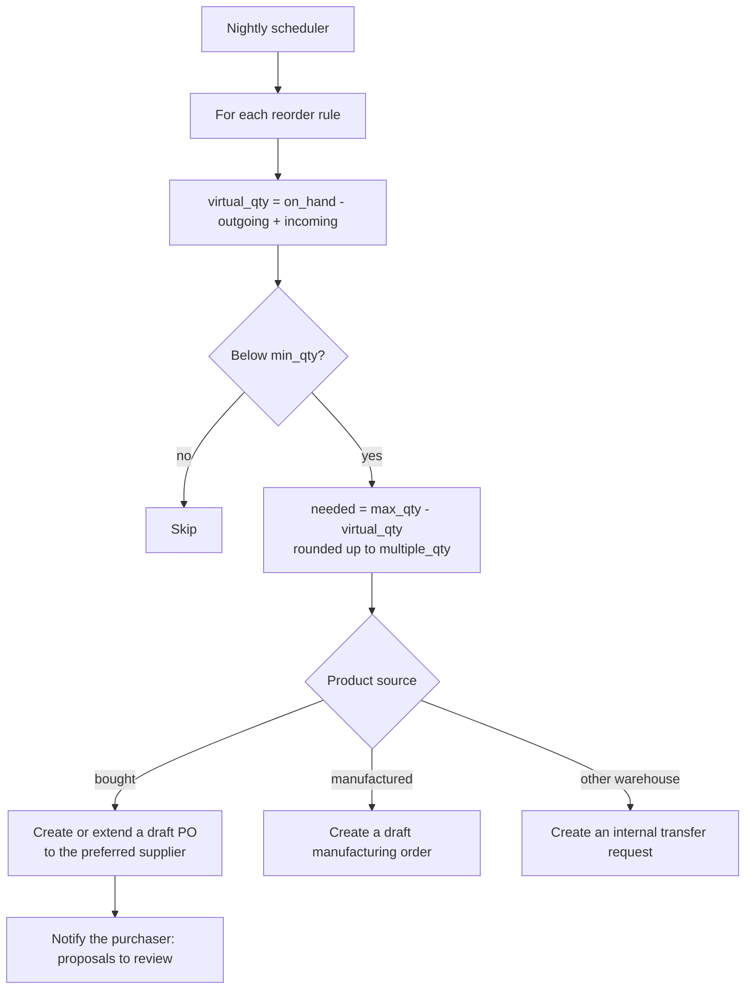

```sql
create table reorder_rules (
  id uuid primary key default gen_random_uuid(),
  tenant_id uuid not null, company_id uuid not null,
  product_id uuid not null references products(id),
  warehouse_id uuid not null references warehouses(id),
  min_qty numeric(18,6) not null,
  max_qty numeric(18,6) not null,
  multiple_qty numeric(18,6) not null default 1,
  lead_time_days int not null default 0,
  active boolean not null default true,
  unique (tenant_id, product_id, warehouse_id)
);
```

Proposals are **drafts a human confirms**. Auto-confirming purchase orders from an algorithm is
how an SME ends up with a warehouse full of the wrong stock.

---

### 5.4 Plan to Produce (manufacturing) — V2, only for producers

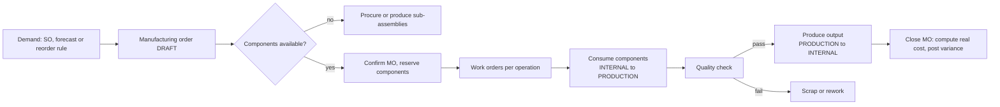

```sql
create table boms (
  id uuid primary key default gen_random_uuid(),
  tenant_id uuid not null, company_id uuid not null,
  product_id uuid not null references products(id),
  code text, qty numeric(18,6) not null default 1,       -- produces this many
  uom_id uuid not null references uoms(id),
  type text not null default 'NORMAL' check (type in ('NORMAL','KIT','SUBCONTRACT')),
  active boolean not null default true, version int not null default 1
);
create table bom_lines (
  id uuid primary key default gen_random_uuid(),
  tenant_id uuid not null,
  bom_id uuid not null references boms(id) on delete cascade,
  product_id uuid not null references products(id),
  qty numeric(18,6) not null,
  uom_id uuid not null references uoms(id),
  scrap_percent numeric(9,6) not null default 0
);
create table work_centers (
  id uuid primary key default gen_random_uuid(),
  tenant_id uuid not null, company_id uuid not null,
  name text not null,
  cost_per_hour numeric(18,6) not null default 0,
  capacity_per_hour numeric(18,6) not null default 1,
  efficiency_percent numeric(9,6) not null default 100
);
create table manufacturing_orders (
  id uuid primary key default gen_random_uuid(),
  tenant_id uuid not null, company_id uuid not null,
  number text not null,
  product_id uuid not null references products(id),
  bom_id uuid references boms(id),
  qty_planned numeric(18,6) not null,
  qty_produced numeric(18,6) not null default 0,
  warehouse_id uuid not null references warehouses(id),
  state text not null default 'DRAFT' check (state in
       ('DRAFT','CONFIRMED','IN_PROGRESS','DONE','CANCELLED')),
  date_planned timestamptz, date_started timestamptz, date_finished timestamptz,
  source_type text, source_id uuid,
  cost_components numeric(18,6) default 0,
  cost_labour numeric(18,6) default 0,
  cost_overhead numeric(18,6) default 0,
  unique (tenant_id, company_id, number)
);
```

**Manufacturing postings** (WIP account `3311`/`3411` depending on the chart; use a dedicated
`WORK_IN_PROGRESS` account):

```
Consume components:   Dr WIP                       <component cost>
                         Cr 3111 Stock                  <component cost>
Register labour:      Dr WIP                       <hours * work_center.cost_per_hour>
                         Cr 7xxx Production immobilisee / labour absorption account
Produce output:       Dr 3121 Stock produits finis <computed unit cost * qty>
                         Cr WIP                        <same>
Close with variance:  Dr/Cr Production variance    <WIP remainder, if standard costing>
```

Unit cost of the finished good = (components consumed + labour + overhead) / quantity produced.
With `STANDARD` costing the output is valued at the standard and the difference posts to a
variance account; with `AVCO`/`FIFO` the output is valued at real cost.

Edge cases: partial production (produce 60 of 100, keep the MO open); component substitution
(record the actual product consumed, not the BOM's); by-products and co-products (extra output
lines with a cost-share percentage); subcontracting (components move to a `SUBCONTRACTOR`
location, the finished good returns and the service is billed by the subcontractor); rework
orders (a new MO consuming the defective item).

---

### 5.5 Record to Report (R2R) — the accounting close

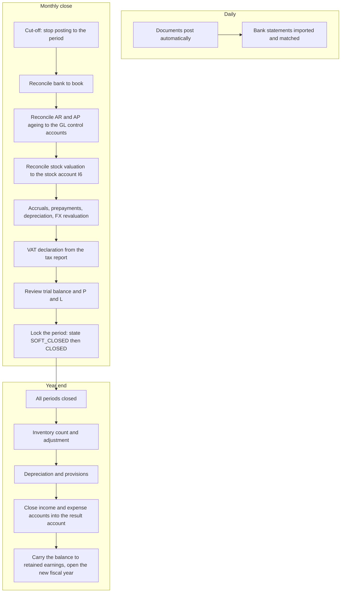

Period states and their meaning:

- `OPEN` — anyone with permission can post.
- `SOFT_CLOSED` — only users with the `accounting.post_closed_period` permission can post
  (accountant adjustments). Regular users are blocked.
- `CLOSED` — nobody can post. Only a reopen by an admin, which is audit-logged.

The close checklist must be a **stored, tickable object**, not a wiki page:

```sql
create table period_close_tasks (
  id uuid primary key default gen_random_uuid(),
  tenant_id uuid not null, period_id uuid not null references periods(id),
  code text not null,        -- BANK_RECONCILED, AR_TIES, STOCK_TIES, VAT_FILED, ...
  label text not null,
  state text not null default 'TODO' check (state in ('TODO','DONE','NA','BLOCKED')),
  checked_by uuid, checked_at timestamptz, note text
);
```

The reports that must exist before the close can be honest: trial balance, general ledger,
account statement per partner, aged receivable, aged payable, VAT report, stock valuation,
bank reconciliation statement, P and L, balance sheet.

---

### 5.6 Returns, credit notes and corrections

**A posted invoice is never edited.** There are exactly three legal corrections:

| Situation | Mechanism | Effect |
|---|---|---|
| Invoice issued entirely by mistake | **Full reversal** credit note, same date or reversal date | Reverses the whole journal entry; both documents stay visible |
| Customer returns part of the goods | **Return picking** + **partial credit note** | Stock comes back at the original layer cost; revenue and VAT reduced |
| Commercial gesture, discount after the fact | **Credit note without stock movement** | Only revenue and VAT reduced |

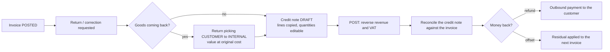

Credit note posting (mirror of B):

```
Dr 7111  Ventes de marchandises            <HT returned>
Dr 4455  Etat - TVA facturee               <VAT returned>
   Cr 3421  Clients                            <TTC returned>
```

Rules: a credit note always references the original invoice (`reversed_invoice_id`); it has its
own sequence (`AV/2026/00001`) and must never reuse the invoice sequence; it cannot exceed the
original amount unless explicitly allowed; the return picking must value the goods at the cost
of the layers originally consumed, not at today's cost — otherwise margin history is corrupted.

---

### 5.7 Cash, bank and reconciliation

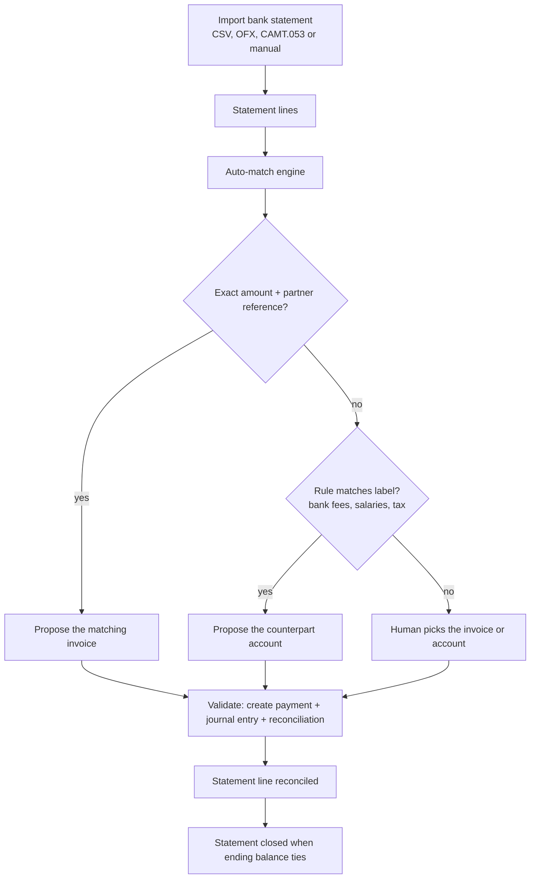

```sql
create table bank_statements (
  id uuid primary key default gen_random_uuid(),
  tenant_id uuid not null, company_id uuid not null,
  journal_id uuid not null references journals(id),
  number text not null, statement_date date not null,
  balance_start numeric(18,2) not null, balance_end numeric(18,2) not null,
  state text not null default 'DRAFT' check (state in ('DRAFT','POSTED','RECONCILED'))
);
create table bank_statement_lines (
  id uuid primary key default gen_random_uuid(),
  tenant_id uuid not null,
  statement_id uuid not null references bank_statements(id) on delete cascade,
  line_date date not null, label text, reference text,
  partner_id uuid references partners(id),
  amount numeric(18,2) not null,                      -- signed
  state text not null default 'UNRECONCILED'
       check (state in ('UNRECONCILED','RECONCILED','IGNORED')),
  payment_id uuid references payments(id),
  reconciliation_id uuid references reconciliations(id)
);
create table reconciliation_rules (
  id uuid primary key default gen_random_uuid(),
  tenant_id uuid not null, company_id uuid not null,
  name text not null, priority int not null default 10,
  match_label_regex text, match_amount_min numeric(18,2), match_amount_max numeric(18,2),
  partner_id uuid references partners(id),
  counterpart_account_id uuid references accounts(id),
  tax_id uuid references taxes(id),
  auto_validate boolean not null default false
);
```

Matching heuristics, in order: exact invoice number in the label; exact residual amount for one
partner; sum of several invoices equal to the amount (partial-sum search, capped at ~8 candidates
to stay fast); partner name fuzzy match plus amount within tolerance; a user rule.

Cash-specific flows: a cash register session (open with a starting float, record receipts, close
with a counted amount, post the difference to a cash-difference account); cheque handling as a
two-step payment (cheque received to `5111 Cheques a encaisser`, then cashed to `5141 Banque`,
with a `BOUNCED` path that reverses the payment and reopens the invoice).

---

### 5.8 Projects and service billing (for service SMEs)

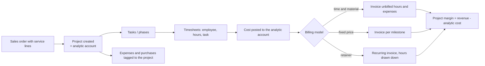

Key rules: hours are costed at the employee's hourly cost, billed at the contract rate; an hour
is billable only once (`timesheet_line.invoiced_by_line_id`); a fixed-price project needs
work-in-progress recognition if it spans periods (post accrued revenue at close, reverse at
invoicing).

### 5.9 Expenses and HR-lite

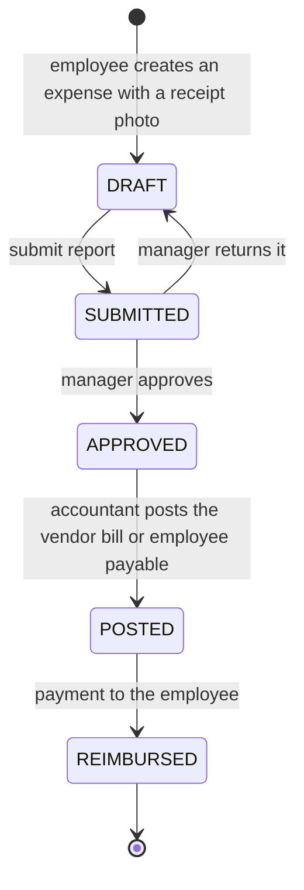

Posting: `Dr 61xx Charge` + `Dr 3455 VAT recoverable` / `Cr 4432 Personnel - remunerations dues`
(reimbursable) or `Cr 5141 Banque` (company card).

Leave and attendance are simple state machines (`REQUESTED`, `APPROVED`, `REFUSED`, `TAKEN`)
with a balance per leave type. **Do not build payroll calculation.** Legal payroll rules
(CNSS, AMO, IR brackets, seniority) change yearly and vary per collective agreement. Provide an
export to the payroll provider and an import of the payroll journal entry:

```
Dr 6171 Remunerations du personnel          <gross>
Dr 617x Charges sociales patronales         <employer contributions>
   Cr 4432 Personnel - remunerations dues       <net>
   Cr 4441 CNSS / organismes sociaux            <contributions>
   Cr 4452 Etat - IR                            <withheld income tax>
```

### 5.10 Fixed assets

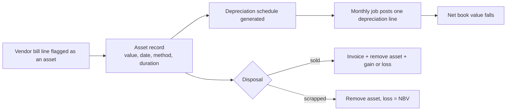

Posting per depreciation period: `Dr 6193 Dotations aux amortissements /
Cr 28xx Amortissements cumules`. Disposal: reverse cumulated depreciation, remove the gross
value, book the gain or loss against the sale price.

### 5.11 Master data lifecycle

```mermaid
stateDiagram-v2
    [*] --> DRAFT: created (possibly by a salesperson mid-quote)
    DRAFT --> PENDING: submitted for validation
    PENDING --> ACTIVE: approved (dedup check passed)
    PENDING --> DRAFT: rejected with a reason
    ACTIVE --> ACTIVE: edit (audit-logged, snapshots protect history)
    ACTIVE --> ARCHIVED: archive (never delete)
    ARCHIVED --> ACTIVE: restore
    DRAFT --> MERGED: duplicate detected, merged into the surviving record
```

Rules: never hard-delete master data that a document references — archive it (`active = false`)
so old documents still resolve. Deduplicate partners on normalised name + legal id + email at
creation time, and offer a merge tool that repoints foreign keys inside one transaction.

### 5.12 Reporting and analytics

Two distinct needs, do not mix them:

1. **Legal and operational reports** — deterministic, computed from the ledger, must match to the
   cent: trial balance, general ledger, journals, VAT report, ageing, stock valuation, invoice
   book. Build these as SQL views or reporting queries directly on the transactional tables, with
   a strict "as of date" parameter.
2. **Dashboards and analytics** — approximate, fast, aggregated: revenue per month, top customers,
   margin per product, stock rotation, sales funnel. These read from materialized views refreshed
   on a schedule or from an events table. Never let a dashboard query block a posting transaction.

```sql
create materialized view mv_sales_monthly as
select tenant_id, company_id, date_trunc('month', invoice_date) as month,
       sum(amount_untaxed) filter (where type = 'CUSTOMER_INVOICE')     as revenue,
       sum(amount_untaxed) filter (where type = 'CUSTOMER_CREDIT_NOTE') as credits,
       count(*) as document_count
from invoices where state in ('POSTED','PAID')
group by 1,2,3;
```

### 5.13 Flow index (quick reference for the agent)

| Code | Flow | Entry point | Terminal state | Ledger touched |
|---|---|---|---|---|
| F-O2C | Order to cash | quotation | invoice PAID | GL + stock |
| F-P2P | Procure to pay | requisition / reorder rule | bill PAID | GL + stock |
| F-INV-RCV | Goods receipt | PO confirmed | picking DONE | stock (+GL) |
| F-INV-DEL | Delivery | SO confirmed | picking DONE | stock + GL (COGS) |
| F-INV-TRF | Internal transfer | manual / replenishment | picking DONE | stock |
| F-INV-ADJ | Adjustment / count | count session | session CLOSED | stock + GL |
| F-INV-SCR | Scrap | manual | move DONE | stock + GL |
| F-INV-LC | Landed cost | receipt done | cost allocated | stock value + GL |
| F-MFG | Plan to produce | MO | MO DONE | stock + GL (WIP) |
| F-RET-C | Customer return + credit note | RMA | credit note reconciled | stock + GL |
| F-RET-S | Supplier return | manual | vendor credit note | stock + GL |
| F-CASH | Bank / cash reconciliation | statement import | statement RECONCILED | GL |
| F-R2R | Period close | cut-off | period CLOSED | GL |
| F-YEC | Year-end close | all periods closed | new year OPEN | GL |
| F-PRJ | Project delivery and billing | project created | project CLOSED | GL + analytic |
| F-EXP | Expense claim | employee submits | reimbursed | GL |
| F-FA | Fixed asset lifecycle | bill line flagged | asset disposed | GL |
| F-MD | Master data lifecycle | create | active / archived | none |
| F-EINV | E-invoicing clearance (§9.2) | invoice validated | CLEARED then POSTED | GL (posting waits for clearance) |
| F-SUB | Subscription lifecycle (SaaS) | signup | cancelled / churned | billing ledger |

---

## 6. The engines

These are shared services. Every flow calls them; none of them may be duplicated inside a
controller or a specific module.

### 6.1 Pricing engine

```
resolve_price(product, qty, partner, date, currency) -> {unit_price, price_list_rule_id, discount}

1  list = partner.price_list_id or company default price list valid at `date`
2  candidate rules = rules of `list` where
       (applies_to = PRODUCT and product matches)
    or (applies_to = CATEGORY and product.category is a descendant of the rule category)
    or (applies_to = ALL)
    and qty >= min_qty
    and date within [valid_from, valid_to]
3  sort by: specificity (PRODUCT > CATEGORY > ALL), then priority asc, then min_qty desc
4  take the first rule
5  compute:
       FIXED       -> fixed_price
       PERCENT_OFF -> base_price * (1 - percent_off)
       FORMULA     -> base * (1 + margin) + surcharge, then round to `rounding`
6  convert currency if the list currency differs from the document currency (rate at `date`)
7  return the price EXCLUDING tax, unless the price list is tax-included; then store the
   tax-included flag on the line so the tax engine reverses it correctly
```

Manual price override is allowed but must be visible (the UI shows the list price struck
through) and may require a permission when the discount exceeds a threshold.

### 6.2 Tax engine

```
compute_line_taxes(line, taxes, fiscal_position) -> {untaxed, tax_details[], total}

1  taxes = fiscal_position.map(taxes)             # export -> exempt, reverse charge...
2  base  = qty * unit_price * (1 - discount_percent)
3  if the price includes tax:
       base = base / (1 + sum of non-compound percent rates)
4  sort taxes by `sequence`
5  running_base = base
6  for each tax:
       amount = tax.type == PERCENT ? running_base * tax.rate : tax.fixed_amount
       if tax.is_compound: running_base += amount
       record {tax_id, base, amount, account_collected/deductible}
7  line.untaxed = base ; line.tax = sum(amounts) ; line.total = base + line.tax
```

Document level: group tax amounts by tax id across lines, round **once per group**, and derive
`amount_tax` from the rounded groups. Store the resulting breakdown in `invoice.tax_snapshot`
so the printed document always matches what was posted, even if the tax rate changes later.

### 6.3 Availability engine

```
availability(product, warehouse, date) ->
    on_hand, reserved, free, incoming, outgoing, atp

free     = SUM(quants.qty - quants.reserved_qty) over internal locations of the warehouse
incoming = SUM(moves.qty) where state != DONE/CANCELLED and to_location internal and scheduled <= date
outgoing = SUM(moves.qty) where state != DONE/CANCELLED and from_location internal and scheduled <= date
atp      = free + incoming - outgoing
```

Reserve with a `select ... for update` on the quant rows (or an advisory lock keyed on
product+location) so two concurrent confirmations cannot reserve the same unit.

### 6.4 Costing engine

Cost of an outgoing unit, by method:

**AVCO (weighted average)** — one running average per product per company:

```
on receipt of qty q at unit cost c:
    new_qty  = old_qty + q
    new_value = old_value + q*c
    avg = new_value / new_qty          (if new_qty > 0)
on issue of qty q:
    unit_cost = avg                    (unchanged by the issue)
    value = -q * avg
```

**FIFO** — consume valuation layers oldest first:

```
remaining = q
for layer in layers where remaining_qty > 0 order by created_at:
    take = min(remaining, layer.remaining_qty)
    cost += take * layer.unit_cost
    layer.remaining_qty  -= take
    layer.remaining_value -= take * layer.unit_cost
    remaining -= take
    if remaining == 0: break
if remaining > 0:                       # negative stock
    cost += remaining * last_known_unit_cost      # and flag it for correction
```

**STANDARD** — always the product's `standard_cost`; every purchase difference posts to a price
variance account. Simple and stable, but requires a periodic standard revision.

Worked example (AVCO):

| Event | Qty | Unit cost | Stock qty | Stock value | Average |
|---|---|---|---|---|---|
| Receipt | +100 | 10.00 | 100 | 1 000.00 | 10.00 |
| Receipt | +50 | 13.00 | 150 | 1 650.00 | 11.00 |
| Delivery | −60 | 11.00 | 90 | 990.00 | 11.00 |
| Receipt | +30 | 12.00 | 120 | 1 350.00 | 11.25 |

The same sequence in FIFO gives a COGS of 60 × 10.00 = 600.00 and a remaining value of
1 050.00 — different profit, same cash. **Never mix methods per product over time**; changing
the costing method requires a revaluation entry.

Negative stock must be allowed (operators receive late) but flagged: value it at the last known
cost and post an automatic correction when the real receipt arrives.

### 6.5 Numbering engine

```
next_number(tenant, company, code, date) -> text

1  select ... from sequences where (tenant, company, code) for update    # row lock
2  if reset_policy = YEARLY and current_year != year(date):
       next_number = 1 ; current_year = year(date)
3  n = next_number ; next_number = n + 1
4  return prefix
       .replace('%Y', year) .replace('%m', month)
       + lpad(n, padding, '0')
```

Rules: numbers are only consumed at POST/CONFIRM, never in draft; the row lock guarantees
gaplessness (I4) at the cost of serialising posting per sequence — acceptable at SME volume,
and it is a legal requirement in most jurisdictions; a document that fails to post must roll
back the sequence increment (same transaction).

### 6.6 Payment-term and due-date engine

```
due_dates(invoice_date, payment_term) -> [{date, percent}]
  for each term line: base = invoice_date + days ; if eom: base = last day of that month
                      then + days_after_eom
  the sum of percents must equal 100
```

Multi-instalment terms create several receivable lines on the same invoice, each individually
reconcilable — this is how "30% now, 70% at 60 days" works.

### 6.7 Currency engine

```sql
create table currency_rates (
  id uuid primary key default gen_random_uuid(),
  tenant_id uuid not null, currency char(3) not null,
  rate_date date not null, rate numeric(18,8) not null,   -- units of company currency per 1 unit
  source text, unique (tenant_id, currency, rate_date)
);
```

- Documents store `currency` + `fx_rate` at confirm; the ledger stores company-currency amounts
  plus `amount_currency` per line.
- When an FX invoice is paid at a different rate, the difference posts to
  `6331 Pertes de change` or `7331 Gains de change` at reconciliation.
- At period close, open FX receivables and payables are revalued at the closing rate
  (unrealised gain/loss), and the entry is reversed on the first day of the next period.

### 6.8 Rounding rules

- Compute with 6 decimals; round only at: line total, tax group total, document total.
- Rounding method per currency (`HALF_UP` for MAD/EUR, and note that some currencies have 0 or 3
  decimals).
- Cash rounding (e.g. to 0.05) is a **separate document line** posting to a rounding account, not
  a silent adjustment of the last line.
- Assert at post time: `sum(line totals) + tax = document total`, else refuse to post.

### 6.9 Permission engine

Permission strings are `module.entity.action`: `sales.order.confirm`, `accounting.entry.post`,
`stock.picking.validate`, `partner.merge`, `settings.tax.edit`. A role holds a list; a user holds
roles, optionally scoped to a company. Checks happen in the service layer, never only in the UI.
Add value-based rules where SMEs actually need them: maximum discount percent, maximum purchase
amount without approval, permission to post into a soft-closed period, permission to override a
credit limit — each override writes an audit entry with a mandatory reason.

---

## 7. Non-functional architecture

### 7.1 Shape of the application

Build a **modular monolith**, not microservices. One deployable, one database, modules separated
by package boundaries with explicit interfaces. An SME ERP has strong transactional coupling
(a delivery must post stock and accounting atomically); distributing that means distributed
transactions, which is a cost with no benefit at this scale.

```
com.<vendor>.erp
  platform/        tenancy, security, audit, sequences, outbox, jobs, files, i18n
  masterdata/      partners, products, uom, categories
  accounting/      accounts, journals, periods, entries, posting service, reports
  inventory/       locations, moves, quants, pickings, costing, valuation
  sales/           quotations, orders, deliveries link, pricing
  purchase/        requisitions, orders, receipts link, matching
  invoicing/       invoices, payments, reconciliation, dunning
  manufacturing/   boms, work centers, manufacturing orders      (V2)
  projects/        projects, tasks, timesheets, billing           (V2)
  billing/         SaaS plans, subscriptions, entitlements, usage (separate context, §8)
  api/             REST controllers, DTOs, validation, error mapping
```

Rule: `billing/` may read nothing from ERP modules; ERP modules may only ask
`entitlements.check(tenant, feature)` and `entitlements.limit(tenant, key)`.

### 7.2 Idempotency

Every state-changing endpoint accepts an `Idempotency-Key` header.

```
on request:
  key = header or (document_id + action + version)
  insert into idempotency_keys (key, tenant, endpoint, request_hash) -- unique violation = replay
  if replay:
      if stored request_hash != current hash -> 409 Conflict (key reused with a different body)
      else return the stored response
  else:
      run the operation in the same transaction, store status + body, commit
```

This protects against the two things that actually happen: a user double-clicking Confirm, and a
mobile client retrying after a timeout.

### 7.3 Concurrency

- **Optimistic locking** (`version` column) on documents: a stale update returns 409 with the
  current version so the client can re-read.
- **Pessimistic row locks** on `sequences` and on `quants` during reservation and validation.
- Order lock acquisition consistently (sequence, then quants, then documents) to avoid deadlocks.
- Long jobs (MRP, reports, imports) never hold a transaction open; they work in batches.

### 7.4 Deletion policy

| Data | Policy |
|---|---|
| Draft document | Hard delete allowed |
| Posted document | Never deleted; cancel creates a reversal |
| Master data referenced anywhere | Archive (`active = false`) |
| Master data never referenced | Hard delete allowed |
| Tenant data on churn | Retained for the grace period, then exported and purged (§8.10) |

### 7.5 Events (transactional outbox)

Domain events are written to `outbox` **inside the business transaction**, then published by a
poller. This guarantees "event exists if and only if the change happened". Consumers: webhooks
to the tenant's own systems, e-mail notifications, dashboard refresh, search indexing, usage
metering for billing.

Canonical event names: `sales_order.confirmed`, `picking.done`, `invoice.posted`,
`invoice.paid`, `payment.registered`, `stock.level.low`, `purchase_order.confirmed`,
`period.closed`, `subscription.created`, `subscription.plan_changed`, `invoice.payment_failed`.

Event payloads carry `tenant_id`, `occurred_at`, `entity_id`, `version` and a minimal body —
consumers re-read the API for detail. Never put sensitive data in a webhook payload.

### 7.6 Background jobs

| Job | Cadence | Purpose |
|---|---|---|
| Reorder rules | nightly | Replenishment proposals |
| Dunning | daily | Overdue AR reminders and SaaS retries |
| Recurring invoices | daily | Contracts and subscriptions |
| FX rates | daily | Fetch and store rates |
| Depreciation | monthly | Post asset depreciation |
| Materialized view refresh | hourly | Dashboards |
| Outbox publisher | seconds | Webhooks and integrations |
| Backup verification | daily | Restore drill on a sample tenant |
| Usage rollup | hourly | SaaS metering (§8.4) |

Jobs must be tenant-aware, resumable, and must record a run history with per-tenant outcome.

### 7.7 Import and export

Import is the number one onboarding blocker. Treat it as a product feature, not a script.

```mermaid
flowchart LR
    UP[Upload XLSX/CSV] --> MAP[Column mapping<br/>saved as a template]
    MAP --> VAL[Row validation<br/>types, references, duplicates]
    VAL --> PRE[Preview: N valid, M errors,<br/>downloadable error file]
    PRE --> RUN[Import in batches, one transaction per batch]
    RUN --> REP[Report: created, updated, skipped, with row numbers]
    REP --> UNDO[Undo the batch within 24h if nothing was posted]
```

Importable from day one: partners, products, opening stock, opening balances (trial balance),
open customer invoices, open supplier bills, price lists. Exports: every list view to XLSX/CSV,
plus a full tenant export (§8.10).

### 7.8 Documents and printing

Invoices, delivery notes, quotations and purchase orders must render as PDFs that carry the
tenant's logo, legal mentions and layout. Use a template engine with per-tenant overrides
(header, footer, colours, legal block) and store the generated PDF as an attachment on the
document at post time — reprinting a 2-year-old invoice must yield **the same bytes**, not a
re-render with today's template.

### 7.9 API surface

REST, versioned (`/api/v1`), JSON, tenant resolved from the auth token (never from a query
parameter). Standard shapes:

```
GET    /api/v1/sales-orders?state=CONFIRMED&partner_id=..&page=1&size=50&sort=-order_date
POST   /api/v1/sales-orders
PATCH  /api/v1/sales-orders/{id}                      (draft only)
POST   /api/v1/sales-orders/{id}/confirm              (Idempotency-Key required)
POST   /api/v1/sales-orders/{id}/cancel
GET    /api/v1/products/{id}/availability?warehouse_id=..
POST   /api/v1/pickings/{id}/validate
POST   /api/v1/invoices/{id}/post
POST   /api/v1/invoices/{id}/register-payment
GET    /api/v1/reports/aged-receivable?as_of=2026-09-30
```

Errors use a single envelope with a machine code the UI can branch on:

```json
{ "error": { "code": "CREDIT_LIMIT_EXCEEDED",
             "message": "Customer over credit limit by 12 400.00 MAD",
             "details": { "limit": 50000, "outstanding": 62400 },
             "trace_id": "..." } }
```

Rate limits are per tenant and per plan (§8.3) so one tenant cannot starve another.

### 7.10 Security baseline

- Passwords: Argon2id. MFA (TOTP) for admin roles, optional for the rest.
- Sessions: short-lived access token + rotating refresh token, revocable per device.
- Every request carries `tenant_id` from the token; the DB session sets
  `set local app.tenant_id = ...` so RLS applies even to a query that forgot its filter (§8.1).
- Field-level encryption for bank details and any national ID stored.
- Audit log for authentication, permission changes, exports, impersonation.
- Support impersonation ("log in as this tenant") must be explicitly consented to, time-boxed,
  banner-visible to the tenant, and fully audited.
- Attachments are served through signed, expiring URLs scoped to the tenant.

### 7.11 Performance and indexing

At SME scale the dangerous queries are ageing reports, stock valuation and dashboards over
several years of documents.

- Index every `(tenant_id, <business key>)` pair; `tenant_id` first, always.
- Partial indexes for hot paths: unreconciled lines, open documents, active products.
- Consider monthly partitioning on `journal_entry_lines` and `stock_moves` once a tenant crosses
  a few million rows — but not before; premature partitioning slows small tenants.
- Precompute `amount_residual` on invoices (maintained at reconciliation) instead of summing
  reconciliations on every list query.
- Cache per tenant: chart of accounts, taxes, UoM, price lists, entitlements. Invalidate on write.

### 7.12 Testing strategy

| Layer | What to test |
|---|---|
| Unit | Pricing rule selection, tax computation incl. compound and price-included, FIFO/AVCO math, due-date computation, rounding |
| Integration | Post an invoice and assert the ledger balances; validate a picking and assert quants and valuation layers; reconcile and assert payment state |
| Property-based | For any random sequence of receipts and issues: stock qty = sum of moves; stock value = sum of layers; ledger balances |
| Flow | Full O2C and P2P end-to-end, including partial delivery, credit note and reconciliation |
| Tenancy | Every endpoint, called with tenant A's token against tenant B's id, returns 404 (not 403 — do not leak existence) |
| Migration | Restore a production-shaped dump, run migrations, re-run the invariant checks |

A permanent **invariant checker** job should run nightly per tenant and report: unbalanced
entries, quants that disagree with moves, valuation that disagrees with the stock account,
invoices whose residual disagrees with their reconciliations, sequence gaps.

---

## 8. The SaaS layer

An ERP product is two businesses in one codebase: the **ERP** (what tenants use) and the
**SaaS platform** (how tenants sign up, are isolated, are billed and are supported). Keep them
strictly separate. The rule of thumb: if the code would still exist for a single on-premise
customer, it is ERP; if it exists only because there are many paying tenants, it is platform.

### 8.1 Multi-tenancy: the isolation decision

| Model | How | Isolation | Cost per tenant | Ops complexity | Fits |
|---|---|---|---|---|---|
| **Pool** — shared schema, `tenant_id` on every row + RLS | one DB, one schema | logical | lowest | low | The default for SME SaaS |
| **Bridge** — schema per tenant, one database | `tenant_1234.invoices` | stronger | medium | medium (N schemas to migrate) | Regulated mid-market |
| **Silo** — database (or stack) per tenant | one DB each | strongest | highest | high | Enterprise deals, data-residency demands |

**Decision: pool by default, with a documented path to silo for a large customer that demands
it.** Pool is the only model where a solo or small team can migrate hundreds of tenants in one
deploy. Make the escape hatch real by never writing code that assumes "all tenants are in this
database": always resolve the datasource through a tenant-context object.

Pool isolation must be defended twice — in the application *and* in the database:

```sql
alter table invoices enable row level security;

create policy tenant_isolation on invoices
  using (tenant_id = current_setting('app.tenant_id')::uuid)
  with check (tenant_id = current_setting('app.tenant_id')::uuid);

-- The application user must NOT be the table owner or hold BYPASSRLS.
-- Set the context at the start of every request/transaction:
--   set local app.tenant_id = '...';
-- A query that forgets its WHERE clause then returns zero rows instead of leaking.
```

Additional isolation duties: object storage keys prefixed by tenant; background jobs carrying
tenant context; caches keyed by tenant; logs and traces tagged with `tenant_id`; per-tenant rate
limits; a "noisy neighbour" guard (statement timeout, max rows per export, job concurrency cap).

```mermaid
flowchart TB
    REQ[HTTP request] --> AUTH[Authenticate: JWT/session]
    AUTH --> RES["Resolve tenant<br/>(token claim, never a query param)"]
    RES --> STAT{Tenant status?}
    STAT -->|SUSPENDED| BLK[402 Payment Required<br/>read-only or blocked]
    STAT -->|ACTIVE / TRIAL| CTX[Open transaction<br/>set local app.tenant_id]
    CTX --> ENT[Load entitlements from cache]
    ENT --> HANDLE[Handler runs; RLS enforces isolation]
    HANDLE --> AUDIT[Audit + outbox inside the same transaction]
```

### 8.2 How subscription SaaS billing actually works

The mental model that avoids 90% of billing bugs:

> A **plan** is what you sell. A **price** is a plan priced in one currency and one interval.
> A **subscription** is a tenant's commitment to one or more prices. A **subscription item** is
> one line of that commitment with a quantity. A **billing period** is a dated window. At the end
> (or start) of each window, the biller turns items into an **invoice**, charges a **payment
> method**, and on failure runs a **dunning** sequence. Everything the tenant is allowed to do is
> derived from **entitlements**, which are computed from the plan — never from the invoice.

```mermaid
flowchart LR
    PLAN[Plan<br/>Starter / Pro / Business] --> PRICE["Price<br/>(currency, interval,<br/>model, amount)"]
    PRICE --> ITEM[Subscription item<br/>quantity]
    ITEM --> SUB[Subscription<br/>status + period]
    SUB --> CYC[Billing cycle job]
    USAGE[Usage records] --> CYC
    CYC --> BINV[Billing invoice]
    BINV --> CHG[Charge payment method]
    CHG -->|success| PAID[Paid, period rolls forward]
    CHG -->|failure| DUN[Dunning: retry ladder]
    DUN -->|recovered| PAID
    DUN -->|exhausted| SUSP[Tenant SUSPENDED then CANCELLED]
    PLAN --> ENT[Entitlements<br/>features + limits]
    ENT --> APP[ERP enforces at runtime]
```

**Pricing models** a plan price can use:

| Model | Charge | Typical use |
|---|---|---|
| **Flat** | fixed amount per period | "Starter: 490 MAD/month" |
| **Per unit (per seat)** | quantity × unit amount | per active user |
| **Tiered (graduated)** | each tier priced separately, cumulative | 1–5 users at 120, 6–20 at 90, 21+ at 70 |
| **Volume** | all units priced at the tier reached | 25 users → all 25 at 70 |
| **Package** | per block of N | per 1 000 documents |
| **Usage / metered** | measured quantity, billed in arrears | e-invoices sent, SMS, storage GB |
| **Hybrid** | platform fee + per seat + metered overage | The realistic SME ERP shape |

**Two clocks that must never be confused:**

- The **billing clock** — when money moves (period start, invoice date, due date, retries).
- The **entitlement clock** — when access changes (upgrade takes effect immediately, downgrade
  usually at period end, suspension after the grace period).

Bugs happen where these two disagree. Model them as separate fields
(`current_period_end`, `access_until`) and never derive one from the other implicitly.

### 8.3 Billing schema

```sql
create table plans (
  id uuid primary key default gen_random_uuid(),
  code text not null unique,                 -- STARTER, PRO, BUSINESS
  name text not null,
  description text,
  trial_days int not null default 14,
  is_public boolean not null default true,   -- false = custom/negotiated
  sort_order int not null default 0,
  features jsonb not null default '{}',      -- {"manufacturing":true,"multi_warehouse":false}
  limits   jsonb not null default '{}',      -- {"users":5,"invoices_per_month":300,"storage_gb":5}
  active boolean not null default true
);

create table prices (
  id uuid primary key default gen_random_uuid(),
  plan_id uuid not null references plans(id),
  currency char(3) not null,
  interval text not null check (interval in ('MONTH','YEAR')),
  interval_count int not null default 1,
  model text not null check (model in ('FLAT','PER_UNIT','TIERED','VOLUME','PACKAGE','METERED')),
  unit_amount numeric(18,6),                 -- for FLAT / PER_UNIT / PACKAGE
  package_size int,
  tiers jsonb,                               -- [{"up_to":5,"unit":120},{"up_to":20,"unit":90},
                                             --  {"up_to":null,"unit":70}]
  metered_key text,                          -- matches usage_records.metric
  tax_behaviour text not null default 'EXCLUSIVE'
       check (tax_behaviour in ('INCLUSIVE','EXCLUSIVE')),
  active boolean not null default true,
  unique (plan_id, currency, interval, interval_count, model, metered_key)
);

create table subscriptions (
  id uuid primary key default gen_random_uuid(),
  tenant_id uuid not null references tenants(id),
  status text not null check (status in
       ('TRIALING','ACTIVE','PAST_DUE','PAUSED','CANCELLED','EXPIRED')),
  collection_method text not null default 'AUTOMATIC'
       check (collection_method in ('AUTOMATIC','SEND_INVOICE')),
  currency char(3) not null,
  started_at timestamptz not null,
  trial_end timestamptz,
  current_period_start timestamptz not null,
  current_period_end   timestamptz not null,
  access_until         timestamptz,          -- entitlement clock, may exceed the billing period
  cancel_at_period_end boolean not null default false,
  cancelled_at timestamptz, cancel_reason text,
  ended_at timestamptz,
  payment_method_id uuid references payment_methods(id),
  billing_anchor_day smallint,               -- 1..28, keeps the cycle stable across months
  coupon_id uuid references coupons(id),
  po_number text,                            -- for tenants who need it on the invoice
  created_at timestamptz not null default now()
);

create table subscription_items (
  id uuid primary key default gen_random_uuid(),
  subscription_id uuid not null references subscriptions(id) on delete cascade,
  price_id uuid not null references prices(id),
  quantity numeric(18,6) not null default 1,
  metadata jsonb not null default '{}',
  added_at timestamptz not null default now(),
  removed_at timestamptz
);

create table usage_records (                 -- metered billing input
  id bigserial primary key,
  tenant_id uuid not null,
  subscription_item_id uuid references subscription_items(id),
  metric text not null,                      -- 'invoices_posted', 'storage_gb', 'sms_sent'
  quantity numeric(18,6) not null,
  action text not null default 'INCREMENT' check (action in ('INCREMENT','SET')),
  occurred_at timestamptz not null,
  idempotency_key text,
  unique (tenant_id, metric, idempotency_key)
);
create index on usage_records (tenant_id, metric, occurred_at);

create table billing_invoices (              -- the SaaS vendor's own invoices to tenants
  id uuid primary key default gen_random_uuid(),
  tenant_id uuid not null references tenants(id),
  subscription_id uuid references subscriptions(id),
  number text unique,                        -- assigned when finalized
  status text not null check (status in
       ('DRAFT','OPEN','PAID','UNCOLLECTIBLE','VOID')),
  currency char(3) not null,
  period_start timestamptz, period_end timestamptz,
  issue_date date, due_date date,
  subtotal numeric(18,2) not null default 0,
  discount_total numeric(18,2) not null default 0,
  tax_total numeric(18,2) not null default 0,
  total numeric(18,2) not null default 0,
  amount_paid numeric(18,2) not null default 0,
  amount_due numeric(18,2) not null default 0,
  attempt_count int not null default 0,
  next_attempt_at timestamptz,
  pdf_key text,
  created_at timestamptz not null default now()
);

create table billing_invoice_lines (
  id uuid primary key default gen_random_uuid(),
  invoice_id uuid not null references billing_invoices(id) on delete cascade,
  description text not null,
  price_id uuid references prices(id),
  quantity numeric(18,6) not null default 1,
  unit_amount numeric(18,6) not null,
  amount numeric(18,2) not null,
  proration boolean not null default false,
  period_start timestamptz, period_end timestamptz,
  tax_rate numeric(9,6) not null default 0,
  tax_amount numeric(18,2) not null default 0
);

create table payment_methods (
  id uuid primary key default gen_random_uuid(),
  tenant_id uuid not null references tenants(id),
  type text not null check (type in ('CARD','BANK_TRANSFER','DIRECT_DEBIT','CASH','OTHER')),
  provider text,                             -- gateway name
  provider_token text,                       -- vault token; NEVER the PAN
  brand text, last4 text, exp_month int, exp_year int,
  holder_name text,
  is_default boolean not null default false,
  status text not null default 'ACTIVE' check (status in ('ACTIVE','EXPIRED','FAILED','REMOVED')),
  created_at timestamptz not null default now()
);

create table payment_attempts (
  id uuid primary key default gen_random_uuid(),
  tenant_id uuid not null,
  invoice_id uuid not null references billing_invoices(id),
  payment_method_id uuid references payment_methods(id),
  amount numeric(18,2) not null, currency char(3) not null,
  status text not null check (status in ('PENDING','SUCCEEDED','FAILED','REFUNDED','DISPUTED')),
  provider_reference text,
  failure_code text, failure_message text,    -- insufficient_funds, expired_card, do_not_honor
  attempted_at timestamptz not null default now()
);

create table coupons (
  id uuid primary key default gen_random_uuid(),
  code text not null unique,
  type text not null check (type in ('PERCENT','AMOUNT')),
  value numeric(18,6) not null,
  duration text not null check (duration in ('ONCE','REPEATING','FOREVER')),
  duration_months int,
  max_redemptions int, times_redeemed int not null default 0,
  valid_from date, valid_to date,
  applies_to_plan_ids uuid[]
);

create table credit_notes (                   -- refunds and goodwill on the SaaS side
  id uuid primary key default gen_random_uuid(),
  tenant_id uuid not null, invoice_id uuid references billing_invoices(id),
  amount numeric(18,2) not null, currency char(3) not null,
  reason text, created_at timestamptz not null default now()
);

create table entitlements (                   -- the resolved, cached view the ERP reads
  tenant_id uuid primary key references tenants(id),
  plan_code text not null,
  features jsonb not null,                    -- {"manufacturing":true,...}
  limits jsonb not null,                      -- {"users":5,"invoices_per_month":300}
  valid_until timestamptz,                    -- entitlement clock
  computed_at timestamptz not null default now()
);

create table usage_counters (                 -- current-period consumption vs limits
  tenant_id uuid not null, metric text not null,
  period_start date not null, period_end date not null,
  used numeric(18,6) not null default 0,
  primary key (tenant_id, metric, period_start)
);
```

**Build or buy?** For a first SME ERP: use a payment provider's hosted checkout and vault for
card data (never touch a PAN), but **own the subscription model above**. Reason: ERP tenants
need invoices in their own currency and legal format, mixed collection methods (card, transfer,
cash at the office), and per-tenant contract terms — things a generic billing SaaS handles badly
in emerging markets. Owning the model also keeps entitlements local, so a gateway outage cannot
lock every tenant out of their ERP.

### 8.4 SaaS lifecycle flows

#### 8.4.1 Subscription state machine

```mermaid
stateDiagram-v2
    [*] --> TRIALING: signup with a trial
    [*] --> ACTIVE: signup with immediate payment
    TRIALING --> ACTIVE: payment method added and first charge succeeds
    TRIALING --> EXPIRED: trial ends with no payment method
    ACTIVE --> PAST_DUE: renewal charge fails
    PAST_DUE --> ACTIVE: retry succeeds or the tenant pays manually
    PAST_DUE --> CANCELLED: dunning ladder exhausted
    ACTIVE --> PAUSED: pause requested (seasonal business)
    PAUSED --> ACTIVE: resume
    ACTIVE --> CANCELLED: cancel now
    ACTIVE --> ACTIVE: cancel_at_period_end = true (still active until the end)
    EXPIRED --> ACTIVE: reactivate within the retention window
    CANCELLED --> ACTIVE: reactivate within the retention window
    CANCELLED --> [*]: data purged after the retention window
```

Mapping to `tenants.status`, which is what the ERP actually checks:

| Subscription status | Tenant status | ERP access |
|---|---|---|
| TRIALING | TRIAL | Full, within trial limits |
| ACTIVE | ACTIVE | Full |
| PAST_DUE (inside grace) | ACTIVE | Full, with a persistent warning banner |
| PAST_DUE (grace exhausted) | SUSPENDED | **Read-only**: login, view, export. No posting |
| PAUSED | SUSPENDED | Read-only |
| CANCELLED / EXPIRED (retention window) | SUSPENDED | Read-only, export enabled |
| After the retention window | PURGED | No access; data deleted |

> **Never delete a late payer's data and never block their export.** Read-only is the correct
> suspension for an ERP: their accounting is legally theirs, and a customer locked out of their
> own invoices becomes a legal problem, not a churn statistic.

#### 8.4.2 Signup and tenant provisioning

```mermaid
sequenceDiagram
    actor V as Visitor
    participant W as Web app
    participant P as Provisioning service
    participant D as Database
    participant M as Mailer

    V->>W: submit company name, email, password, country
    W->>P: create_tenant(...)
    P->>D: insert tenant (status=TRIAL), company, admin user
    P->>D: seed chart of accounts for the country
    P->>D: seed taxes, journals, sequences, UoM, product categories
    P->>D: seed fiscal year + periods for the current year
    P->>D: seed roles (ADMIN, ACCOUNTANT, SALES, STOCK, READONLY)
    P->>D: create subscription (TRIALING, trial_end = now + plan.trial_days)
    P->>D: compute entitlements
    P->>M: send verification email
    P-->>W: tenant ready (target: under 5 seconds)
    W-->>V: redirect to the onboarding checklist
```

Seeding is the moment that decides whether the product feels finished. Seed per country:
chart of accounts, VAT rates, journals (sales, purchase, bank, cash, misc), sequences, units,
payment terms, one warehouse with its locations, and a demo dataset the tenant can wipe in one
click. **The onboarding checklist is a first-class object**, not a UI hint:

```sql
create table onboarding_steps (
  tenant_id uuid not null, code text not null,   -- COMPANY_INFO, LOGO, IMPORT_PARTNERS,
  label text not null,                           -- IMPORT_PRODUCTS, OPENING_STOCK, BANK,
  state text not null default 'TODO'             -- FIRST_INVOICE, INVITE_USER
       check (state in ('TODO','DONE','SKIPPED')),
  completed_at timestamptz,
  primary key (tenant_id, code)
);
```

Activation metric: a tenant that has posted its first real invoice and imported its products is
activated. Track it; it predicts retention better than any other signal.

#### 8.4.3 Trial to paid

```mermaid
flowchart LR
    T0[Day 0: trial starts] --> T1[Day 1: welcome + checklist]
    T1 --> T3[Day 3: nudge on the incomplete step]
    T3 --> T7[Day 7: usage-based tip or a call offer]
    T7 --> T11[Day 11: trial ends in 3 days + plan comparison]
    T11 --> T13[Day 13: last reminder + one-click add payment method]
    T13 --> DEC{Payment method added?}
    DEC -->|yes| CONV[Charge, status ACTIVE, invoice 1 issued]
    DEC -->|no| EXP[Status EXPIRED, tenant read-only,<br/>data kept for the retention window]
    EXP --> WIN[Win-back at day 21 and day 45]
```

Trial design rules: no card required up front (SME conversion drops sharply when a card is
demanded); trial limits should be feature-complete but volume-capped; extend a trial from an
admin console rather than making the tenant re-register (re-registration destroys their data and
your attribution).

#### 8.4.4 Subscribe / checkout

```mermaid
sequenceDiagram
    actor A as Tenant admin
    participant W as Billing UI
    participant B as Billing service
    participant G as Payment gateway

    A->>W: choose plan + interval + seats
    W->>B: preview(plan, interval, seats, coupon)
    B-->>W: line items, proration, tax, total due today
    A->>W: confirm
    W->>G: hosted checkout / tokenize card (SCA / 3-D Secure if required)
    G-->>W: payment method token
    W->>B: subscribe(price_id, quantity, token, idempotency_key)
    B->>B: create subscription + items, compute period
    B->>B: create invoice (finalize, assign number)
    B->>G: charge(amount, token)
    G-->>B: succeeded
    B->>B: invoice PAID, subscription ACTIVE, tenant ACTIVE
    B->>B: recompute entitlements, emit subscription.created
    B-->>A: receipt + PDF invoice
```

Always show a **preview** before charging (line items, proration, tax, exact amount today and
the amount at the next renewal). Most billing complaints are surprise amounts, not wrong ones.

#### 8.4.5 Upgrade, downgrade, seat changes

```mermaid
flowchart TB
    CHG[Change requested] --> DIR{Direction}
    DIR -->|upgrade / add seats| UP["Effective immediately<br/>credit the unused part of the old price<br/>charge the prorated new price"]
    DIR -->|downgrade / remove seats| DOWN{Policy}
    DOWN -->|"end of period (default)"| SCHED["Schedule the change at current_period_end<br/>keep access to the higher plan until then"]
    DOWN -->|immediate| IMM["Apply now, issue a credit to the balance<br/>never refund cash automatically"]
    UP --> INVOICE["Invoice now, or add to the next invoice<br/>if below the minimum charge"]
    SCHED --> PENDING[Store as a scheduled change; show it in the UI]
    IMM --> BAL[Credit balance applied to the next invoice]
    INVOICE --> ENT[Recompute entitlements immediately]
    PENDING --> ENT2[Entitlements change at the period boundary]
    IMM --> ENT
```

Downgrade guards — check **before** accepting, and state the blocker precisely:

```
if new_plan.limits.users < current_active_users        -> block: "deactivate N users first"
if new_plan.limits.warehouses < current_warehouses     -> block
if feature removed and data exists (e.g. manufacturing orders) ->
       allow, but set the feature to read-only rather than hiding the data
if new_plan.limits.invoices_per_month < current usage  -> warn, allow, enforce next period
```

Never delete tenant data because of a downgrade. Hide or freeze; the data belongs to them.

#### 8.4.6 The recurring billing run

```mermaid
flowchart TB
    CRON[Hourly billing job] --> SEL["Select subscriptions where<br/>current_period_end has been reached<br/>and status is ACTIVE or PAST_DUE"]
    SEL --> LOCK[Lock the subscription row]
    LOCK --> DRAFT[Create a DRAFT invoice for the next period]
    DRAFT --> REC[Add recurring items: flat, per-seat, tiered]
    REC --> MET["Add metered items: aggregate usage_records<br/>for the period just ended"]
    MET --> PRO[Add pending proration lines]
    PRO --> DISC[Apply coupon and credit balance]
    DISC --> TAX[Apply tax rules by tenant country]
    TAX --> FIN["Finalize: assign number, status OPEN, render PDF"]
    FIN --> COL{collection_method}
    COL -->|AUTOMATIC| CHARGE[Charge the default payment method]
    COL -->|SEND_INVOICE| SEND[Email the invoice, due in N days]
    CHARGE -->|success| PAID[Status PAID, roll the period forward, receipt]
    CHARGE -->|failure| PD[Subscription PAST_DUE, start dunning]
    SEND --> WAIT[Wait for a bank transfer, reconcile manually or by rule]
    PAID --> ENT[Recompute entitlements, reset usage counters]
```

Invariants for the billing run: **idempotent per (subscription, period)** — a unique constraint
on `(subscription_id, period_start)` for non-void invoices prevents double billing after a crash;
never bill a period twice; never skip a period silently (a gap must raise an alert); a failed
charge does **not** roll the period back — the invoice stays OPEN and dunning owns it.

#### 8.4.7 Dunning (failed payment recovery)

```mermaid
flowchart LR
    F0[Charge fails] --> C{Failure type}
    C -->|"hard: card lost/stolen, do_not_honor"| HARD[Stop retrying, email immediately,<br/>ask for a new payment method]
    C -->|"soft: insufficient funds, timeout"| R1[Retry day 1]
    R1 -->|fail| R2[Retry day 3 + email]
    R2 -->|fail| R3[Retry day 5 + in-app banner]
    R3 -->|fail| R4[Retry day 7 + warn about suspension]
    R4 -->|fail| GRACE[Grace ends day 10:<br/>tenant SUSPENDED = read-only]
    GRACE --> R5[Retry day 14, 21 + call the customer]
    R5 -->|fail| CANC[Day 30: subscription CANCELLED,<br/>retention window starts]
    R1 & R2 & R3 & R4 & R5 -->|success| REC2[Recovered: ACTIVE, banner cleared]
```

Details that decide whether dunning recovers 20% or 60%: retry at a different hour of day and
after payday; update expiring cards proactively (card-updater services, or an email 30 days
before `exp_month`); make the "fix my payment" link one click, logged in, no navigation; and for
SME markets always offer bank transfer as a fallback — many failures are card limits, not
unwillingness to pay.

#### 8.4.8 Cancellation, pause, reactivation, refunds

```mermaid
flowchart TB
    CANCEL[Tenant clicks cancel] --> ASK[Ask the reason: price, missing feature,<br/>too complex, closed the business, switching]
    ASK --> OFFER{Save offer}
    OFFER -->|pause| PAUSE[Pause 1-3 months, read-only, no charge]
    OFFER -->|discount| DISC2[Apply a retention coupon]
    OFFER -->|downgrade| DOWN2[Move to a cheaper plan]
    OFFER -->|no| CONF[Confirm cancellation]
    CONF --> WHEN{When?}
    WHEN -->|end of period, default| EOP[cancel_at_period_end = true<br/>full access until current_period_end]
    WHEN -->|immediate| NOW[Cancel now; no automatic cash refund;<br/>issue a credit note if policy allows]
    EOP --> RET[Retention window starts: read-only + export]
    NOW --> RET
    RET --> REM[Reminders at day 7, 30, 60 before deletion]
    REM --> PURGE[Export archive delivered, then purge]
```

Refund policy must be written down and coded: pro-rata refund on an annual plan cancelled early
(or explicitly none), full refund inside N days of the first charge, and a manual goodwill path
requiring an admin reason. Every refund creates a `credit_notes` row — refunds must be visible
in revenue reporting or MRR will be overstated.

### 8.5 Proration: the maths, once

Definitions: `P` = period `[start, end)`, `now` = the moment of change,
`remaining = (end − now) / (end − start)`, computed in **seconds**, not days, to avoid
timezone and month-length drift.

```
Upgrade mid-period, from price A (paid) to price B:
    credit = amount_A_paid * remaining          # unused part of what they bought
    charge = amount_B      * remaining          # the new plan for the rest of the period
    due_today = charge - credit                 # may be negative -> credit balance, not a refund
    period_end is unchanged (this is what keeps the billing cycle stable)

Seat increase from q1 to q2 mid-period, unit price u:
    due_today = (q2 - q1) * u * remaining

Seat decrease mid-period (policy = immediate):
    credit_balance += (q1 - q2) * u * remaining
```

Worked example. Starter = 490 MAD/month, Pro = 1 190 MAD/month. Period 1–30 September.
Upgrade on 11 September at 00:00, so 20 of 30 days remain, `remaining = 0.6667`.

```
credit    = 490   * 0.6667 =   326.67
charge    = 1 190 * 0.6667 =   793.33
due today =   793.33 - 326.67 = 466.66  (+ VAT)
1 October renewal = 1 190 (full Pro month)
```

Rules that prevent disputes: always show the proration lines on the invoice with their dates;
apply a **minimum charge threshold** (e.g. 50 MAD) below which proration is deferred to the next
invoice rather than charged; never prorate a metered price (usage is already time-bounded);
never prorate downward into a cash refund automatically.

### 8.6 Entitlements: the bridge between billing and product

```
check(tenant, feature)  -> boolean
limit(tenant, key)      -> number or null (null = unlimited)
consume(tenant, metric, n) -> ALLOWED | SOFT_BLOCKED | HARD_BLOCKED
```

Enforcement pattern:

```java
// In the ERP module, never in the billing module.
if (!entitlements.check(tenantId, "manufacturing")) {
    throw new FeatureNotAvailable("manufacturing", currentPlan, upgradeUrl);
}
long limit = entitlements.limit(tenantId, "users");
if (activeUsers + 1 > limit) {
    throw new LimitReached("users", limit);   // the UI turns this into an upgrade prompt
}
```

Three enforcement styles, and when to use which:

| Style | Behaviour | Use for |
|---|---|---|
| **Hard block** | The action is refused | Seats, warehouses, companies — countable structural limits |
| **Soft limit** | Allowed, warned, billed as overage next period | Documents per month, storage, API calls |
| **Feature gate** | The screen is visible but read-only or upsell-marked | Manufacturing, projects, advanced reports |

Never enforce a limit by silently discarding data, and never let an entitlement check block a
tenant's ability to **read or export** what they already created.

### 8.7 SaaS metrics (define them once, compute them from the schema)

| Metric | Formula | Trap |
|---|---|---|
| **MRR** | Σ normalised monthly value of ACTIVE subscriptions | Normalise annual plans as `annual / 12`; exclude one-off charges, taxes and refunds |
| **ARR** | MRR × 12 | Meaningless below ~10 customers; use it externally, run the business on MRR |
| **New MRR** | MRR from tenants that had none last month | |
| **Expansion MRR** | Increase from existing tenants (upgrades, seats, overage) | |
| **Contraction MRR** | Decrease from existing tenants (downgrades, seat removal) | |
| **Churned MRR** | MRR of tenants that reached zero | |
| **Net MRR movement** | New + Expansion − Contraction − Churned | The single chart to watch weekly |
| **Logo churn** | churned tenants / tenants at period start | SME churn of 3–5% monthly is normal; ERP should beat it (high switching cost) |
| **NRR** | (start MRR + expansion − contraction − churn) / start MRR | Above 100% means growth without new sales |
| **ARPA** | MRR / active tenants | Rising ARPA plus flat churn = healthy packaging |
| **LTV** | ARPA × gross margin % / monthly logo churn | Garbage below 12 months of data; state it as a range |
| **CAC** | sales + marketing spend / new customers | Include your own time at a realistic rate |
| **CAC payback** | CAC / (ARPA × gross margin) | The number that decides whether growth is fundable; target under 12 months |
| **Trial conversion** | paying / trials started | Segment by source; blended is misleading |
| **Activation rate** | tenants reaching the activation event / signups | The leading indicator of everything above |
| **Involuntary churn** | churn caused by failed payments | Often 20–40% of total churn; the cheapest to fix (§8.4.7) |

```sql
-- MRR snapshot, normalised to a month, taken daily and stored (never recomputed retroactively:
-- history changes as plans change, and a moving history destroys trust in the chart).
create table mrr_snapshots (
  snapshot_date date not null,
  tenant_id uuid not null,
  plan_code text not null,
  mrr numeric(18,2) not null,
  currency char(3) not null,
  primary key (snapshot_date, tenant_id)
);
```

Movement classification for a tenant between two snapshots: `0 -> x` is NEW, `x -> y > x` is
EXPANSION, `x -> y < x, y > 0` is CONTRACTION, `x -> 0` is CHURN, `0 -> x` after a prior churn
is REACTIVATION. Everything else is unchanged.

### 8.8 Pricing and packaging for an SME ERP

**Choose the value metric first.** It must grow with the customer's success, be predictable, and
be countable without argument. For an SME ERP the realistic candidates:

| Value metric | Pros | Cons |
|---|---|---|
| **Per active user** | Familiar, scales with the company | Encourages account sharing; warehouse staff inflate the count |
| **Per company / flat tier** | Simple to sell and to forecast | Does not grow; leaves money on the table with bigger tenants |
| **Per document volume** | Tracks real usage | Unpredictable bills; SMEs hate variability |
| **Hybrid: tier + included users + overage** | Predictable base, room to grow | More explaining |

**Recommended shape** for this market: three public tiers with an included user count and a
per-extra-user price, features gated by tier, annual paid upfront at ~2 months free.

```
STARTER   490 MAD/month   3 users   sales, purchase, stock, invoicing, VAT report
                                    1 warehouse, 1 company, 300 documents/month
PRO     1 190 MAD/month   7 users   + multi-warehouse, lots/serials, analytic accounting,
                                      recurring invoices, dunning, API, 2 000 documents/month
BUSINESS 2 490 MAD/month  15 users  + manufacturing, projects, multi-company, custom reports,
                                      priority support, unlimited documents
Extra user: 90 / 120 / 150 MAD depending on the tier
Annual: pay 10 months, get 12
Onboarding/migration package: one-off, priced separately — it is services, not SaaS
```

Rules that hold across markets: price the plans so ~70% of prospects land in the middle tier;
never make the cheapest tier unusable (a crippled Starter produces bad reviews, not upgrades);
gate on **capability**, not on quality (never a slower or less reliable tier); grandfather
existing tenants on price changes for at least one renewal and announce changes 30–60 days ahead;
keep an unlisted custom tier for the deals that do not fit.

**Discount discipline:** discounts are coupons with an expiry and a reason code, never a hand-edited
price. Every permanent discount is permanent MRR loss and must be approved as such.

### 8.9 Payments and collections in practice (emerging-market reality)

Card-on-file autopay covers a minority of SMEs in Morocco and similar markets. Design collections
for a mixed reality from day one:

| Method | How it works here | Product implication |
|---|---|---|
| **Card (CMI / gateway)** | Hosted page, 3-D Secure, tokenised for recurring use | Best case; support it, but do not assume it |
| **Bank transfer (virement)** | Tenant pays on receipt of an invoice with the RIB | Needs `collection_method = SEND_INVOICE`, a due date, manual or rule-based reconciliation, and a reminder ladder |
| **Cheque / effet** | Physical, cashed later, can bounce | Model as a two-step payment with a BOUNCED path |
| **Cash at the office** | Common for very small clients | An admin records the payment; the receipt must still be issued |
| **Mobile / wallet** | Growing | Treat as a gateway |

Consequences to build in: allow a subscription to be `SEND_INVOICE` rather than `AUTOMATIC`;
support a **grace period measured in behaviour, not in days** (a tenant who always pays at day
20 should not be suspended at day 10 — track their payment history); issue a legally valid
invoice for every charge, in the tenant's country format (§9), not a generic receipt; support
annual prepayment properly, including deferred-revenue reporting for your own books.

**Your own accounting.** The SaaS vendor's revenue from monthly subscriptions is earned over
time, not at the moment of payment. Annual prepayment posts to a deferred-revenue liability and
releases one twelfth per month. If you sell annual plans and count the cash as revenue, your own
P and L will be wrong in exactly the way an ERP vendor cannot afford to explain.

### 8.10 Tenant data: export, retention, deletion, backup

| Duty | Implementation |
|---|---|
| **Export on demand** | One button producing a ZIP: XLSX per entity + PDFs of posted documents + a JSON dump. Runs as a job, delivered by a signed link that expires |
| **Export on cancellation** | Automatically generated at cancellation and emailed; not something the customer must request |
| **Retention window** | Default 90 days read-only after cancellation, configurable; reminders at 7/30/60 days before purge |
| **Deletion** | Hard delete of tenant rows and object-storage prefix, plus removal from backups after the backup rotation period; issue a written confirmation |
| **Backups** | Daily full + point-in-time recovery; encrypted; **restore-tested monthly on a real tenant into a scratch environment** — an untested backup is not a backup |
| **Per-tenant restore** | Be able to restore ONE tenant without touching the others; this is the operational reason to keep exports and logical dumps, not only physical snapshots |
| **Audit access** | The tenant can see who in their company did what, and when support staff accessed their data |
| **Sub-processors** | List them publicly (hosting, email, payments, error tracking) — required by most data-protection regimes and by any serious buyer |

Data protection (Morocco: loi 09-08 and the CNDP; EU customers: GDPR): declare the processing,
appoint a contact, keep a register of processing activities, sign a data-processing agreement
with tenants, and be able to answer access/rectification/deletion requests inside the legal
delay. For an ERP the personal data at stake is mostly employee and contact records — small in
volume, high in sensitivity.

### 8.11 Operating the platform

Things that must exist before the tenth paying tenant:

- **Admin console** (staff-only): find a tenant, see plan, MRR, usage, last login, invoices,
  failed payments; extend a trial; apply a coupon; re-run a failed billing job; impersonate with
  consent and an audit trail.
- **Per-tenant health**: last document posted, active users this week, error rate, job failures.
  This is the churn early-warning system.
- **Status page and incident policy**: ERP downtime stops invoicing; tenants need to know.
- **Release policy**: one version for everyone, backwards-compatible migrations, feature flags
  per tenant for risky rollouts, and a documented rollback.
- **Support tiers by plan** with a stated response time, and a knowledge base in the tenant's
  language — for SME ERP, support cost per tenant is the real margin risk, and documentation is
  the only thing that scales it down.

---

## 9. Localization pack

Localization is not translation. It is the set of things that make the ERP **legal** in a
country. Model it as a pluggable pack so a second country is a data exercise, not a fork.

```
localization-pack/<country>/
    chart_of_accounts.json      accounts with codes, names, types
    taxes.json                  rates, names, accounts, scopes
    journals.json               default journals and sequences
    payment_terms.json          usual local terms
    invoice_template.html       legal layout + mandatory mentions
    reports/                    VAT return, and any statutory declaration
    fiscal_positions.json       export, exempt, foreign supplier
    validation_rules.json       e.g. "customer must have a tax id above X amount"
    translations/               fr, ar, en
```

### 9.1 Morocco pack (target market — verify every figure below with an accountant and the current Loi de Finances before shipping)

| Item | Content | Confidence |
|---|---|---|
| **Chart of accounts** | Plan Comptable Général Marocain (CGNC), classes 1–8. Codes used in §5: `3111` stock de marchandises, `3421` clients, `3455` État – TVA récupérable, `4411` fournisseurs, `4417` fournisseurs – factures non parvenues, `4455` État – TVA facturée, `5141` banques, `5161` caisses, `6111` achats de marchandises, `6114` variation de stocks, `7111` ventes de marchandises | Structure is stable; **verify exact sub-account codes with the tenant's accountant** — practice varies by firm |
| **VAT (TVA)** | Standard rate plus reduced rates; the rate grid has been under multi-year reform through recent Loi de Finances texts | **Do not hardcode.** Ship rates as seed data with an effective date, and make the tax table editable |
| **Tax identifiers on partners** | ICE (Identifiant Commun de l'Entreprise), IF (identifiant fiscal), RC (registre de commerce), patente / taxe professionnelle, CNSS number | Required on invoices between businesses |
| **Mandatory invoice mentions** | Seller identity + ICE + IF + RC, buyer identity + ICE, sequential invoice number, date, description, quantity, unit price, VAT rate and amount per rate, total HT / TVA / TTC, payment terms | Verify the full list against the CGI before printing |
| **Cash payment rules** | Deductibility of expenses settled in cash is capped, and cash-settled invoices attract a stamp duty (droit de timbre) | **Verify the current thresholds and rate.** If they apply, the ERP must warn at payment time and post the stamp duty automatically |
| **VAT declaration** | Monthly or quarterly depending on turnover; filed electronically on the DGI portal (SIMPL) | The ERP must produce the figures and an export; do not attempt direct filing in V1 |
| **Payroll** | CNSS / AMO contributions, IR withholding, DAMANCOM declarations | **Do not build.** Export to the payroll provider (§5.9) |
| **E-invoicing** | **Mandatory, phased: large companies from 1 Jan 2026, mid-size (roughly 10–200M MAD) from 1 Jul 2026, PME/TPE under 10M MAD and auto-entrepreneurs above 500k MAD from 1 Jan 2027.** Clearance model: structured UBL 2.1 or UN/CEFACT CII, qualified electronic signature (loi 43-20, certificate from an ANRT-approved provider), routed through the DGI platform which validates ICE, VAT and sequential numbering before the invoice is legally valid. 10-year archiving. Penalties reported at 500 MAD per non-compliant invoice, capped at 50,000 MAD/year, with loss of VAT deduction rights from 2027 | **Build-blocking for this market — see §9.2.** Dates and thresholds come from secondary sources and remain tied to the décret d'application; confirm against DGI primary texts before committing |
| **Currency and format** | MAD, 2 decimals, space as thousands separator, comma as decimal separator in French locale | |
| **Languages** | French (primary business language), Arabic (legal and public-sector documents, RTL layout), English (optional) | Build RTL support into the UI from the start; retrofitting it is painful |
| **Fiscal year** | Usually the calendar year, but configurable | `companies.fiscal_year_start_month` already covers this |
| **Data protection** | Loi 09-08, CNDP: declaration of processing, DPA with tenants, rights of access and rectification | See §8.10 |

**Design rule for anything tax-related:** every rate, threshold and legal text is a **dated row
in a table**, never a constant in code. A tax reform must be a data migration plus a new
effective date, applied automatically to documents by their date — and old documents must keep
reprinting with the rates that applied when they were posted (I7).

### 9.2 The e-invoicing clearance module (F-EINV)

Clearance changes invoicing from a local operation into a **distributed transaction with a
government platform that can be slow, degraded, or reject you**. Treat it as such: this module is
mostly queueing, retrying and explaining failures, not XML generation.

#### Architecture: keep the transport swappable

```
InvoiceClearancePort  (interface owned by the invoicing module)
    submit(invoice)        -> submission id
    poll(submission id)    -> CLEARED | REJECTED(reasons) | PENDING
    fetchArchive(id)       -> signed payload

Implementations:
    DirectDgiAdapter        REST API against the national platform
    OperatorAdapter         via an approved dematerialization operator
    SandboxAdapter          test environment
    NullAdapter             countries without clearance
```

Nothing outside the adapter may know the wire format. If accreditation forces you to route through
an approved operator (see the strategy file §11 U1), that is an adapter swap, not a rewrite.

#### Numbering under clearance — the subtle trap

The platform validates **sequential numbering**, so the number must be in the submitted payload.
But a rejected invoice was never legally issued. Therefore:

- Assign the number at **submission**, not at draft.
- On rejection, the corrected invoice is resubmitted **with the same number**. Do not advance the
  sequence.
- Advance the sequence only on `CLEARED`, or on an explicit, reason-logged abandonment that
  records the gap for the auditor.
- The GL posting happens on `CLEARED`. An invoice pending clearance is a commitment, not yet a
  ledger entry — this keeps invariant I1/I4 intact even when the platform is down for a day.

#### State machine (extends invoices from §3.8)

```mermaid
stateDiagram-v2
    [*] --> DRAFT
    DRAFT --> VALIDATING: submit for clearance
    VALIDATING --> QUEUED: local validation passed, number reserved
    VALIDATING --> DRAFT: local validation failed (ICE, VAT, mandatory mentions)
    QUEUED --> SUBMITTED: sent to the platform
    SUBMITTED --> CLEARED: validated
    SUBMITTED --> REJECTED: refused with reasons
    SUBMITTED --> QUEUED: transport error, retry with backoff
    REJECTED --> DRAFT: correct and resubmit with the same number
    CLEARED --> POSTED: journal entry written, PDF and XML archived
    POSTED --> PAID: reconciled
    CLEARED --> CANCELLED: credit note (itself cleared) — never a delete
```

#### Schema

```sql
create table einvoice_submissions (
  id uuid primary key default gen_random_uuid(),
  tenant_id uuid not null, company_id uuid not null,
  invoice_id uuid not null references invoices(id),
  attempt int not null default 1,
  reserved_number text not null,           -- stays stable across attempts
  format text not null default 'UBL21' check (format in ('UBL21','CII')),
  payload_key text not null,               -- stored XML, immutable per attempt
  payload_hash text not null,
  signature_ref text,                      -- qualified signature reference
  state text not null check (state in
       ('QUEUED','SUBMITTED','CLEARED','REJECTED','ABANDONED')),
  provider text not null,                  -- DIRECT_DGI | OPERATOR_<name> | SANDBOX
  provider_submission_id text,
  cleared_at timestamptz,
  clearance_reference text,                -- the platform's own identifier
  reject_codes jsonb,                      -- [{"code":"ICE_INVALID","field":"buyer.ice", ...}]
  next_attempt_at timestamptz,
  idempotency_key text not null unique,
  created_at timestamptz not null default now()
);
create index on einvoice_submissions (tenant_id, state, next_attempt_at);

create table einvoice_certificates (
  id uuid primary key default gen_random_uuid(),
  tenant_id uuid not null, company_id uuid not null,
  provider text not null,                  -- ANRT-approved trust service provider
  subject text not null,
  serial text not null,
  not_before date not null, not_after date not null,
  storage_ref text not null,               -- HSM / vault reference, never the key itself
  state text not null default 'ACTIVE'
       check (state in ('PENDING','ACTIVE','EXPIRING','EXPIRED','REVOKED')),
  unique (tenant_id, company_id, serial)
);
```

#### Flow

```mermaid
flowchart TB
    U[User validates an invoice] --> LOC["Local pre-flight:<br/>ICE, IF, mandatory mentions,<br/>tax coherence, totals"]
    LOC -->|fails| FIX[Return to DRAFT with field-level errors]
    LOC -->|passes| NUM[Reserve the sequence number]
    NUM --> XML[Generate UBL 2.1 / CII + sign]
    XML --> Q[Enqueue submission]
    Q --> SUB[Submit to the platform]
    SUB -->|transport error| BACK["Backoff retry<br/>1m, 5m, 15m, 1h, 6h"]
    BACK --> SUB
    SUB -->|rejected| REJ["Translate reject codes into<br/>plain French/Arabic, show the field"]
    REJ --> FIX
    SUB -->|cleared| POST["Post the journal entry,<br/>archive XML + PDF for 10 years"]
    POST --> SEND[Send by WhatsApp / email]
    POST --> MON[Month-end job: every invoice of the period is CLEARED?]
```

#### Non-negotiables for this module

1. **Never let a user issue a document the platform has not accepted, and never hide a rejection.**
   A silently failed invoice discovered at month-end is the worst failure this product can have.
2. **Every reject code gets a human translation** and points at the field to fix. The platform's
   messages will not be friendly; that translation table is a real asset, built up over time.
3. **Offline-tolerant capture:** the invoice can be created and queued without connectivity;
   only clearance requires the network. Communicate the pending state clearly.
4. **A monitoring job per tenant** verifies that every invoice of a closed period reached
   `CLEARED`, and raises an alert otherwise. This is the operational promise (strategy file §4.3
   Bet A).
5. **Certificate expiry watch:** alert at 60, 30 and 7 days. An expired certificate stops the
   company from invoicing at all.
6. **Store the exact submitted payload per attempt.** In a dispute, what was sent is the evidence.

### 9.3 Adding a second country

The pack above is the whole checklist. The parts of the codebase that may **not** contain
country-specific logic: posting service, costing engine, pricing engine, stock engine, document
state machines. If a country requirement forces a change there, it is a modelling mistake —
express it as a fiscal position, a tax rule, a sequence policy or a report instead.

---

## 10. Build order

Twelve to sixteen weeks of focused work for a usable V1, assuming one developer working with an
AI agent and a real pilot customer. The sequence matters more than the estimates.

### Phase 0 — Foundations (week 1–2)

Tenancy + RLS, users/roles/permissions, audit log, sequences, outbox, idempotency, error
envelope, i18n scaffolding, the localization pack loader, CI with the invariant test suite.
**Exit criteria:** two tenants exist, cannot see each other, and a cross-tenant test proves it.

### Phase 1 — Master data + accounting spine (week 3–5)

Partners, products, UoM, categories, taxes, price lists. Chart of accounts, journals, fiscal
years and periods, journal entries with the balance constraint, the posting service, trial
balance and general ledger reports.
**Exit criteria:** a manual journal entry posts, appears in the trial balance, cannot be edited,
and cannot post into a closed period.

### Phase 2 — Invoicing, clearance and cash (week 6–8)

Customer invoices and credit notes, vendor bills, payments, reconciliation, aged receivable and
payable, VAT report, PDF templates with legal mentions, payment terms and due dates.
**Plus the e-invoicing clearance module (§9.2)** — in the Moroccan market this is not a later
phase, it is what makes the invoice legal, and it must be working before the January 2027
obligation reaches SMEs.
**Exit criteria:** the pilot customer can bill a real client through DGI clearance, a rejection is
shown with a comprehensible reason and can be corrected and resubmitted under the same number, the
payment is recorded, and the accountant accepts the VAT report.

### Phase 3 — Inventory (week 9–11)

Warehouses and locations, stock moves, quants, pickings, adjustments and counts, the costing
engine with valuation layers, stock valuation report, and the reconciliation of stock value to
the GL (I6).
**Exit criteria:** a receipt and a delivery post correct stock and correct value; the invariant
checker is green after a random 500-move simulation.

### Phase 4 — Sales and purchase (week 12–14)

Quotations, sales orders, delivery link, invoicing policies. Purchase orders, receipts,
three-way match. Dashboards for sales and purchasing.
**Exit criteria:** full O2C and P2P run end to end, including a partial delivery and a
credit note.

### Phase 5 — SaaS layer (week 15–16, can run in parallel from week 8)

Signup and provisioning with seeded data, onboarding checklist, plans and prices, subscriptions,
the billing run, dunning, entitlements, the admin console, the export/backup duties.
**Exit criteria:** a stranger can sign up, use a trial, pay, upgrade, fail a payment, recover,
and cancel — with correct invoices at every step.

### Then, driven by real customers only

Multi-warehouse and barcode, lots and serials, CRM pipeline, reorder rules, recurring invoices,
projects and timesheets, manufacturing, fixed assets, budgets, mobile app, e-invoicing connector.

**Rule for the whole roadmap:** do not start a phase until the previous phase's exit criteria
pass on real data from a real pilot customer. An ERP that is 80% built across ten modules is
worth nothing; one that is 100% built across four is a product.

---

## 11. Agent operating rules

### 11.1 Hard rules

1. **Never write to `quants`, `valuation_layers` or `journal_entry_lines` outside their service.**
   Those three tables have exactly one writer each: the stock service, the costing service and
   the posting service.
2. **Never add a column to a document without deciding whether it is snapshotted** (frozen at
   confirm) or live (follows master data). Say which, in the migration comment.
3. **Never introduce a second source of truth for a number.** On-hand quantity, invoice residual
   and MRR are each computed one way, in one place.
4. **Every new table gets `tenant_id`, an RLS policy, and a cross-tenant test.** No exceptions,
   including lookup tables that "obviously" are not tenant-specific — they become tenant-specific
   the moment one customer asks for a custom entry.
5. **Every state transition is a method with guards, not a field assignment.**
   `order.confirm()`, not `order.state = "CONFIRMED"`.
6. **Every money computation has a unit test with a worked example** in the test name.
7. **Every migration is backwards-compatible for one release** (add column, backfill, switch
   reads, then drop) — there is one shared database and no maintenance window.
8. **Never mix billing and ERP concerns.** If an ERP class imports anything from `billing/`
   except the entitlements interface, that is a bug.

### 11.2 Definition of done for a flow

```
[ ] State machine implemented with explicit guards; illegal transitions return a 409 with a code
[ ] Posting rules implemented and balanced; a test asserts SUM(debit) = SUM(credit)
[ ] Sequence assigned only at confirm/post, inside the transaction
[ ] Snapshots written (partner, prices, taxes, addresses)
[ ] Idempotency key honoured on every state-changing endpoint
[ ] Cancellation path implemented as a reversal, with its own test
[ ] Partial execution path implemented (partial delivery, partial payment, partial billing)
[ ] Entitlement check where the flow is plan-gated
[ ] Audit entries written for confirm, post, cancel and every override
[ ] Domain event emitted through the outbox
[ ] Cross-tenant test: tenant A cannot touch tenant B's document (404, not 403)
[ ] Permission test: a user without the permission gets 403
[ ] Closed-period test: posting into a closed period is refused
[ ] List endpoint paginated, filtered, sorted, and indexed for the filter used
[ ] PDF/print output where the flow produces a legal document, archived as an attachment
[ ] Report impact verified: the relevant report changes by exactly the expected amount
[ ] Invariant checker still green on a seeded dataset
```

### 11.3 When the agent is unsure

Ask, do not guess, on: costing method default, permanent vs intermittent inventory, tax rates and
thresholds, invoice legal mentions, the downgrade policy, the refund policy, and the retention
window. These are business and legal decisions, and a wrong default is expensive to unwind.
Everything else — naming, indexing, service decomposition, test structure — decide and proceed.

---

## 12. Reference tables

### 12.1 Domain event catalog

| Event | Emitted when | Typical consumers |
|---|---|---|
| `partner.created` / `partner.merged` | master data change | search index, CRM sync |
| `product.created` / `product.price_changed` | master data change | e-commerce sync, price cache |
| `quotation.sent` | PDF emailed | activity feed, follow-up job |
| `sales_order.confirmed` | order confirmed | picking creation, stock reservation, dashboard |
| `sales_order.cancelled` | order cancelled | reservation release |
| `picking.ready` | reservation complete | warehouse app notification |
| `picking.done` | goods moved | invoicing trigger, costing, tracking email |
| `invoice.posted` | invoice validated | accounting, dunning schedule, webhook |
| `invoice.paid` | residual reaches zero | order closing, receipt email, dashboards |
| `invoice.overdue` | due date passed, unpaid | dunning ladder |
| `payment.registered` | payment posted | reconciliation, cash dashboard |
| `payment.bounced` | cheque returned | invoice reopened, alert |
| `purchase_order.confirmed` | PO sent | receipt creation, supplier email |
| `receipt.done` | goods received | matching, costing, stock alerts |
| `stock.level.low` | below the reorder point | replenishment proposal |
| `inventory.count.closed` | count session closed | variance report |
| `manufacturing_order.done` | production finished | costing, stock |
| `period.closed` | period locked | reporting snapshot |
| `tenant.provisioned` | signup complete | welcome sequence, analytics |
| `subscription.created` / `.plan_changed` / `.cancelled` | billing lifecycle | entitlements, CRM, metrics |
| `billing_invoice.payment_failed` | charge failed | dunning |
| `entitlements.changed` | plan or limits changed | cache invalidation, UI refresh |

### 12.2 Error codes the UI must handle

| Code | Meaning | UI treatment |
|---|---|---|
| `PERIOD_CLOSED` | Target period is locked | Offer a different date, or ask an accountant to reopen |
| `CREDIT_LIMIT_EXCEEDED` | Customer over limit | Show the outstanding amount and an override button if permitted |
| `INSUFFICIENT_STOCK` | Not enough free quantity | Show ATP and the next incoming date; offer a partial delivery |
| `NEGATIVE_STOCK_BLOCKED` | Policy forbids negative stock | Suggest an adjustment or a receipt first |
| `SEQUENCE_LOCKED` | Concurrent posting on the same sequence | Retry automatically once |
| `MATCH_EXCEPTION` | Three-way match failed | Show the variance and the resolution options |
| `TAX_CONFIG_MISSING` | Product or partner has no tax rule | Deep link to the setting |
| `LIMIT_REACHED` | Plan limit hit | Upgrade prompt with the exact limit and current usage |
| `FEATURE_NOT_AVAILABLE` | Plan does not include the feature | Upsell, never a dead end |
| `TENANT_SUSPENDED` | Payment overdue | Read-only banner with a pay-now link |
| `STALE_VERSION` | Optimistic lock conflict | Re-read and show the diff |
| `IDEMPOTENCY_CONFLICT` | Same key, different body | Developer-facing; never shown to an end user |

### 12.3 Anti-patterns (each of these has sunk a real ERP project)

| Anti-pattern | Why it fails | Do instead |
|---|---|---|
| Storing on-hand quantity as an editable field on the product | Drifts from the move history within days; nobody can explain the difference | Derive from moves; cache in `quants` maintained by one writer |
| Editing a posted invoice | Destroys the audit trail and breaks legal numbering | Credit note or reversal |
| Deleting master data | Old documents lose their meaning | Archive |
| Separate `customers` and `suppliers` tables | The same company becomes two balances | One `partners` table with role flags |
| Floats for money | Cents disappear; totals stop matching | `numeric` with explicit rounding |
| Computing tax by summing rounded line taxes | Off-by-one-cent disputes with tax authorities | Round once per tax group |
| Hardcoding tax rates or account codes | Every reform is a release | Dated rows in tables |
| Cross-tenant queries "just for reporting" | One leak ends the business | RLS + per-tenant reporting |
| Building payroll | Rules change yearly per country and per agreement | Integrate |
| Microservices before product-market fit | Distributed transactions with two customers | Modular monolith |
| Per-customer forks or custom columns | Unmaintainable at ten customers | Configuration, custom fields, webhooks |
| Auto-confirming replenishment orders | Wrong stock, real money | Propose drafts a human confirms |
| Charging before showing a preview | Billing disputes and chargebacks | Always preview the amount |
| Deleting data on downgrade or churn | Legal exposure and reputational damage | Read-only, export, then purge on a schedule |
| Counting annual prepayment as revenue | Your own books become wrong | Deferred revenue, released monthly |
| Shipping a module without its reports | Users cannot verify what the system did, so they do not trust it | Every module ships with its report |

---

## 13. Open questions to settle before coding

These change the schema, so answer them first:

1. **Inventory accounting:** permanent (post COGS per shipment) or intermittent (period-end
   variation)? Default recommendation: permanent, with intermittent as a company setting.
2. **Default costing method:** AVCO (simplest to explain, stable) or FIFO (legally preferred in
   some sectors)? Recommendation: AVCO default, FIFO available per product category.
3. **Multi-company:** does V1 need several legal entities per tenant? The `company_id` column
   should exist regardless; the question is whether the UI exposes it.
4. **Variants:** do target customers sell size/colour products? If yes, model
   template + variant now.
5. **Value metric for pricing:** per user, flat tier, or hybrid (§8.8).
6. **Collection methods at launch:** card only, or card + bank transfer + cash? This decides how
   much of §8.9 ships in V1.
7. **Downgrade and refund policy** (§8.4.5, §8.4.8) — write it before coding it.
8. **Retention window** after cancellation, and who signs off on purges.
9. **Languages at launch:** French only, or French + Arabic with RTL? RTL is much cheaper to
   build in than to retrofit.
10. **Pilot customer profile:** trading company (stock-heavy), service company (project-heavy) or
    producer (manufacturing)? The first pilot decides which V1.5 module is built first.
