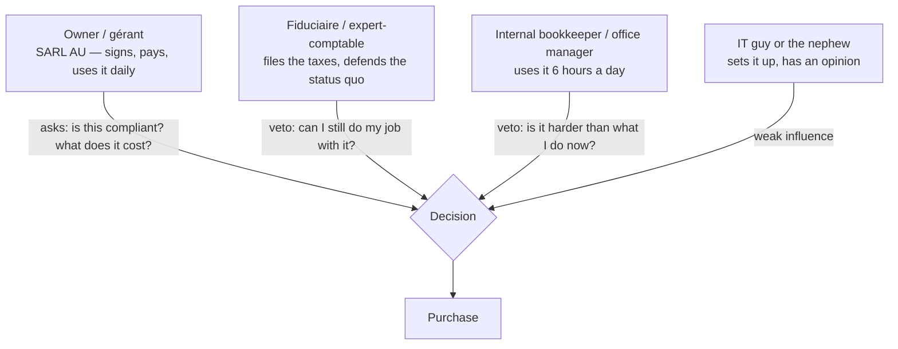
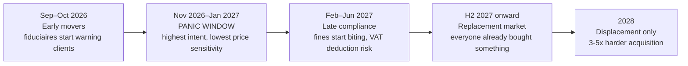
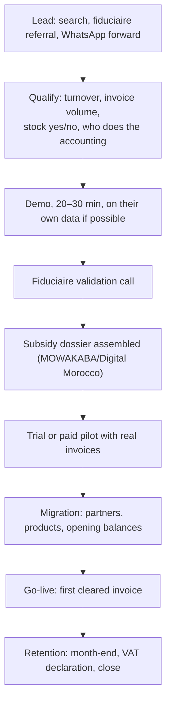
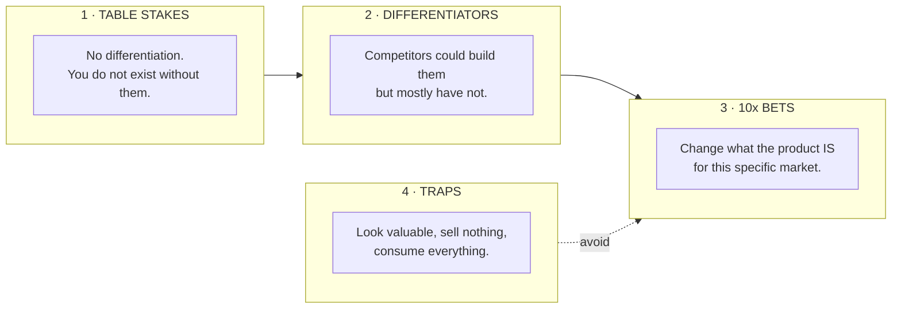
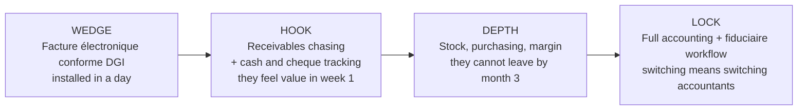
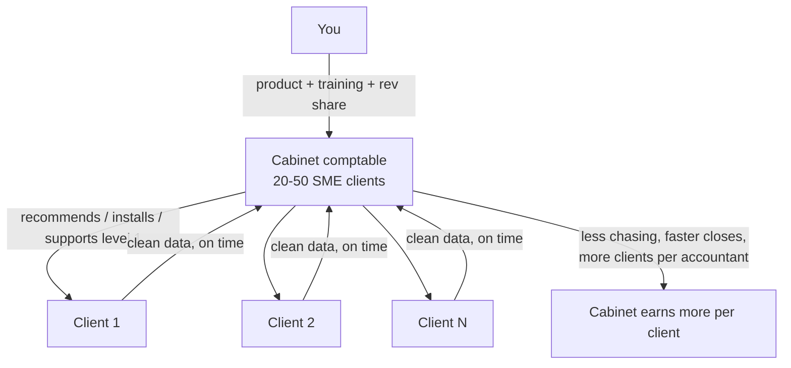
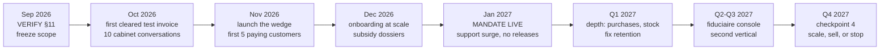

# Morocco SME ERP — Market & Product Strategy

> **Companion file to [ERP-SAAS-BLUEPRINT.md](./ERP-SAAS-BLUEPRINT.md).**
> The blueprint answers *what to build and how it works*. This file answers *why, for whom,
> what wins, and what kills it*. Keep them separate when feeding an AI tool: a coding agent given
> go-to-market analysis makes worse engineering decisions, and a strategy agent given DDL makes
> worse strategy. Feed the whole folder when you want full context.
>
> **Written:** September 2026. **Horizon:** to end of 2028.
> **Reading rule:** every claim below is tagged. `[FACT]` comes from a cited source and is
> checkable. `[JUDGMENT]` is analysis and can be argued with. `[VERIFY]` is decision-critical and
> **not yet confirmed** — treat it as a blocker, not a detail.

---

## Contents

| § | Section |
|---|---|
| 1 | Executive summary — the seven things that decide this business |
| 2 | The market: regulatory clock, subsidies, size, competition, who decides |
| 3 | Demand and sales difficulty, with unit economics |
| 4 | **Features worth building for Morocco 2027** — table stakes, differentiators, 10x bets, traps |
| 5 | The wedge and the product shape that follows |
| 6 | Pricing and packaging for a subsidised market |
| 7 | Distribution: the fiduciaire channel and the alternatives |
| 8 | Stress test: pre-mortem, the bear case, what must be true |
| 9 | The questions coming next, answered |
| 10 | Decision calendar |
| 11 | Open unknowns to verify, with how to verify them |
| 12 | Leading indicators and kill criteria |

---

## 1. Executive summary — the seven things that decide this business

1. **You are not entering an ERP market. You are entering a compliance deadline.** Moroccan
   e-invoicing becomes mandatory for companies under 10M MAD turnover on **1 January 2027**.
   Every business in your target segment must adopt something before then, or face fines and lose
   VAT deduction rights. That is forced demand with a date on it. `[FACT]`

2. **DGI clearance is a gate, not a feature.** Under a clearance model an invoice is not legally
   an invoice until the tax platform validates it. Structured XML (UBL 2.1 or UN/CEFACT CII),
   qualified electronic signature under loi 43-20, certificates from an ANRT-approved trust
   provider. If your product cannot do this, it cannot be used to invoice in Morocco in 2027 —
   regardless of how good the rest is. `[FACT]`

3. **There may be an accreditation regime for software editors and dematerialization operators.**
   Secondary sources say editors and operators must be *referenced/approved*. If true, this is a
   months-long administrative gate that sits in front of your entire revenue plan. **This is the
   single most important thing to verify this month.** `[VERIFY]`

4. **The state will pay 70–90% of your customer's bill.** MOWAKABA (Maroc PME) covers up to 90%
   of digitalisation cost for TPE and 80% for PME; Digital Morocco 2030 covers up to 70% with
   stated priority to Moroccan providers. This inverts the pricing problem: your competitor is
   not a cheaper tool, it is a subsidised one — and being Moroccan is an advantage for once.
   `[FACT]`

5. **The market pays for compliance, not for ERP.** The felt problem is "keep me legal", solvable
   for a couple of hundred dirhams a month. ERP value (stock accuracy, margin visibility, cash
   control) is real but unfelt until later. So: compliance is the wedge, ERP is the retention.
   `[JUDGMENT]`

6. **At this ACV, distribution decides survival, not features.** The fiduciaire / expert-comptable
   controls or vetoes the software choice and carries 20–50 clients. Any plan that sells one
   company at a time has unit economics that do not close. `[JUDGMENT]`

7. **The window closes.** After the January 2027 wave, everyone has bought something and you are
   back to displacing an incumbent — three to five times harder. Roughly **October 2026 to
   February 2027 is the acquisition window that will not come again.** `[JUDGMENT]`

**The strategic fork this creates:** build an ERP that happens to be compliant, or build a
compliance product that grows into an ERP. Same codebase, different sequencing, different first
screen, different pricing page. The market points hard at the second.

---

## 2. The market

### 2.1 The regulatory clock

| Phase | Scope | Date | Status on 5 Sep 2026 |
|---|---|---|---|
| 1 | Large companies subject to IS; sources differ on the threshold (200M MAD in one, 50M MAD in another) plus public-sector suppliers | 1 Jan 2026 | Live `[FACT]` |
| 2 | Mid-size, roughly 10–200M MAD | 1 Jul 2026 | Live, 2 months in `[FACT]` |
| 3 | **PME / TPE under 10M MAD**, plus auto-entrepreneurs above 500k MAD | **1 Jan 2027** | **~117 days out** `[FACT]` |

**Caveats that matter.** The precise calendar and thresholds remain tied to the publication of
the *décret d'application*, described as still in validation. Sources also disagree on phase-1
thresholds, which tells you the secondary reporting is not reliable on numbers. `[VERIFY]`

**Consequences of the phase-2 date already having passed:** mid-size Moroccan companies have been
buying since spring. That market is being served right now by Odoo integrators and point tools.
The sub-10M segment — your segment — is the one that panics in Q4 2026.

**Enforcement teeth:** 500 MAD per non-compliant invoice, capped at 50,000 MAD per year, plus
risk of losing VAT deduction rights from 2027. `[FACT]` The cap matters: for a company issuing
thousands of invoices, the fine is capped and therefore survivable — **the VAT deduction risk is
the real lever in a sales conversation, not the fine.** `[JUDGMENT]`

### 2.2 What the mandate actually requires (and what it means for the product)

| Requirement | Product consequence |
|---|---|
| Structured format: UBL 2.1 or UN/CEFACT CII | An XML mapping layer from your invoice model; not a PDF generator |
| Clearance before the invoice is legally valid | The invoice state machine gains states *before* POSTED; a rejected clearance must be a first-class, explainable state |
| Qualified electronic signature (loi 43-20), certificate from an ANRT-approved provider | Certificate procurement becomes part of onboarding. If it is per-tenant, it is your #1 activation blocker `[VERIFY]` |
| Central platform validates ICE, VAT, sequential numbering | Your numbering must be genuinely gapless and your ICE/IF data genuinely clean — invariant I4 in the blueprint stops being an aesthetic choice |
| Connection modes: REST API for ERPs, web portal for low volume, or via approved operators | You want the API path. The portal path is your competitor for the smallest customers — and it is free |
| 10-year archiving | Immutable PDF/XML storage with retrieval; blueprint §7.8 already assumes this |

**The single most under-appreciated consequence:** clearance turns invoicing from a local
operation into a **distributed transaction with a government system that can be slow, down, or
reject you.** Queuing, retries, idempotency, partial failure and a clear operator-facing error
state are not polish here — they are the core of the feature. Most competitors will get this
wrong and their customers will find out at month-end. `[JUDGMENT]`

### 2.3 Subsidies — the second lever, and most people use it badly

| Programme | Coverage | Notes |
|---|---|---|
| **MOWAKABA** (Maroc PME) | Up to **90% for TPE**, **80% for PME** | Flagship successor to Moussanada; active and open `[FACT]` |
| **Digital Morocco 2030** | Up to **70%** of digital adoption cost (ERP, CRM, site, e-commerce) | **Priority to Moroccan providers** `[FACT]` |
| **TPME Charter** (decree 2-25-342) | Three cumulative subsidies up to ~30% of eligible investment | In effect 2026 `[FACT]` |
| ISTITMAR | Investment support | Broader scope `[FACT]` |

Three implications that change the plan:

1. **Price is much less elastic than it looks.** A 12,000 MAD/year package at 20% net cost to a
   TPE competes differently than at full price. Do not race to the bottom against a 200
   MAD/month invoicing tool if the customer's real outlay on your offer is smaller. `[JUDGMENT]`
2. **Being Moroccan is a stated advantage** in at least one programme. Odoo/Sage integrators can
   still access the schemes, but a locally built, locally supported product is on the right side
   of the policy intent. Use it in positioning. `[JUDGMENT]`
3. **Subsidy paperwork is a service you can own.** Assembling the MOWAKABA dossier is friction the
   customer hates. A vendor who prepares it, in French, with the right attachments, wins deals on
   that alone. Competitors already advertise "Mowakaba + Odoo 90% subventionné", so this is table
   stakes in the channel rather than a secret — but doing it *well* is still rare. `[JUDGMENT]`

### 2.4 Market size and shape

- **~42,900 companies created in the first five months of 2026**, i.e. roughly 100k new
  registrations a year, and 75% of them legal persons. `[FACT]`
- **Geography:** Casablanca-Settat 39.3%, Rabat-Salé-Kénitra 14.3%, Marrakech-Safi 12.8%,
  Tanger-Tétouan-Al Hoceima 10.4% — four regions carry 76.8% of creations. `[FACT]`
- **Sectors of new legal persons:** commerce 27.6%, BTP and real estate 25.2%, other services
  19.6%, transport 7.7%, industry 6.3%. `[FACT]`
- **Legal form:** SARL AU 65.5%, SARL 33.6% — meaning the overwhelming majority are
  owner-managed, single-shareholder companies. `[FACT]`

What to read from this: `[JUDGMENT]`

- The buyer is almost always **the owner**, not a committee. One person decides, and that person
  is not a software buyer by training. Sell to a busy owner, not to a CFO.
- **Commerce (27.6%) is your best first vertical.** Stock-heavy, invoice-heavy, feels the
  mandate immediately, and the ERP value proposition (stock accuracy, margin per product) is
  concrete. BTP at 25.2% is the second-largest but needs project accounting, retentions and
  situation-based billing — a different product.
- **Field presence is cheap if you cover four regions.** Three quarters of the market is
  reachable from Casablanca, Rabat, Marrakech and Tanger. That makes selective in-person
  onboarding affordable in a way it would not be in a dispersed market.
- New registrations are a **greenfield channel**: a company created in November 2026 has no
  incumbent software and a mandate starting in January. Partner with domiciliation and company-
  creation services — they touch the customer before anyone else does.

### 2.5 Competitive map

| Competitor | Strength | Weakness you can attack |
|---|---|---|
| **Odoo + local integrators** | Default recommendation for Moroccan PME; huge module range; packs from ~7,900 MAD one-off; integrators already marketing e-invoicing + MOWAKABA | Implementation-dependent quality; you buy an integrator, not a product; upgrades and customisation debt; the SME often ends up with 10% of the modules and a consultant dependency `[FACT on pricing, JUDGMENT on weakness]` |
| **Sage (50/100)** | Highest brand recognition; 20+ years installed; owns the accountant relationship; 5,000–15,000 MAD/year plus 18–22% maintenance | Legacy UX; desktop-era workflows; per-module pricing; slow to feel modern; migration inertia is its only real moat `[FACT on pricing, JUDGMENT on weakness]` |
| **E-invoicing point tools** (Hisab, Fawatir, efacturation.ma and others) | Cheap, focused, fast to adopt, already ranking on the compliance keywords | They solve one problem. No stock, no purchasing, no real accounting. They will churn customers upward as the business grows — to whoever is ready `[JUDGMENT]` |
| **The DGI portal itself** | Free, official, sufficient for low volume | Manual, one invoice at a time, no business value. It sets the price floor at zero for the very smallest `[FACT]` |
| **Excel + a fiduciaire** | Free, familiar, endorsed | Illegal for invoicing from 2027. This is the mandate's gift to you: it deletes the incumbent `[JUDGMENT]` |
| **SAP / large ERP** | Not your market | 100,000+ MAD; irrelevant below mid-market `[FACT]` |

**The honest read:** you cannot beat Odoo on breadth, Sage on trust, or point tools on price.
You can beat all three on **"works correctly, out of the box, in your language, with clearance
handled, without a consultant"** — which is precisely what a busy SARL AU owner wants and what
none of the three delivers well. `[JUDGMENT]`

### 2.6 Who actually decides



Three practical rules that follow: `[JUDGMENT]`

- **Never sell without the fiduciaire in the room.** A silent accountant kills the deal after the
  demo, not during it. Get them on the call and give them something they want (a clean export, a
  multi-client console, less chasing of missing documents).
- **The internal bookkeeper is the churn risk.** If your product is harder than their current
  routine, they will sabotage adoption quietly. Onboarding must make their week better in the
  first five days.
- **The owner buys peace of mind, not features.** "You will not have a problem with the DGI" beats
  any module list.

---

## 3. Demand and sales difficulty

### 3.1 The demand curve and its expiry



The shape of that curve is the most important business fact you have. `[JUDGMENT]`

- **Before the window** you are selling a nice-to-have and conversion is poor.
- **Inside the window** the prospect has an involuntary deadline. Objections shrink from "why do
  I need this" to "can you have me running by January". Price resistance drops. Cycles compress
  from months to days.
- **After the window** every prospect has an incumbent, a sunk cost and a migration to fear.
  Your acquisition cost multiplies.

**What this means concretely:** whatever is not shippable by roughly **1 November 2026** does not
participate in the only easy customer acquisition you will ever get. Ruthlessly cut anything that
does not serve "compliant, usable, onboarded before January."

### 3.2 The seven structural frictions

| # | Friction | Why it bites here | Countermeasure |
|---|---|---|---|
| 1 | **Low ACV, high touch** | A few thousand MAD/year cannot fund field sales, long demos and three support calls | Self-serve onboarding, productised migration, docs in FR/AR, channel selling |
| 2 | **Cheap substitutes** | Point tools at ~200 MAD/month and a free DGI portal set the floor | Do not compete there. Sell the *business* value above compliance, to businesses that have stock and staff |
| 3 | **The fiduciaire gatekeeper** | They defend what they can audit and already know | Make them the channel, not the obstacle (§7.1) |
| 4 | **Trust deficit** | They are handing an unknown vendor their accounting | Reference customers, visible company, local support number, data hosted where you can name it |
| 5 | **Migration is the real product** | Opening balances, partners, products, open invoices — days of work, and it is not glamorous | Productise it: importers, an assisted "migration day", a paid package that is honestly priced |
| 6 | **Support cost in two languages** | Phone-first culture, low documentation appetite | In-product guidance, WhatsApp support with templated answers, and a support cost budget per plan |
| 7 | **Collections** | Card-on-file autopay is a minority behaviour; you will chase virements | `collection_method = SEND_INVOICE`, behaviour-based grace, annual prepay incentives (blueprint §8.9) |

### 3.3 What the sales cycle actually looks like



Realistic durations outside the panic window, and inside it: `[JUDGMENT]`

| Stage | Normal | Panic window |
|---|---|---|
| Lead to demo | 1–2 weeks | 1–3 days |
| Demo to decision | 3–8 weeks | 3–10 days |
| Decision to go-live | 2–6 weeks | 1–2 weeks |
| **Total** | **6–16 weeks** | **1–4 weeks** |

Biggest drop-off points, in order: the fiduciaire validation call, and the migration. Both are
solvable with product, not with more sales effort — which is exactly why they are worth building
(§4.4).

### 3.4 Unit economics — an illustrative model, not data

Assumptions stated so you can argue with them. All figures MAD. `[JUDGMENT]`

```
Plan mix assumption: 60% Starter, 30% Pro, 10% Business
Blended ACV (annual, list)                     ~ 9 000
Subsidy note: the customer's net cost may be 10-30% of this,
              but YOU are paid the full amount — that is the point of §2.3

Cost to serve, per customer per year:
   hosting + infra                                  ~   300
   support (2 h/month blended at 150/h)             ~ 3 600   <-- the whole business is here
   payment/collection cost + bad debt               ~   400
   ------------------------------------------------------
   total cost to serve                              ~ 4 300
   gross margin                                     ~ 52%     <-- weak for SaaS; must improve

CAC scenarios:
   direct inbound + self-serve                      ~ 1 500 - 3 000
   direct with sales touch + migration              ~ 6 000 - 10 000
   via fiduciaire channel (rev-share 20% year 1)    ~ 1 800 - 2 500

Payback (CAC / annual gross profit ~ 4 700):
   inbound self-serve            ~ 4-8 months     acceptable
   channel                       ~ 5-7 months     acceptable
   direct high-touch             ~ 15-26 months   NOT fundable without capital
```

**Three conclusions that should shape the whole plan:** `[JUDGMENT]`

1. **Support cost, not hosting, is your margin.** Every hour of avoidable support is worth more
   than any infrastructure optimisation. Documentation, in-product guidance and self-healing
   error messages are margin features, not polish.
2. **High-touch direct sales does not work at this price.** Either the product sells itself or
   the channel sells it. If you find yourself doing 90-minute demos for a 490 MAD/month plan,
   the model is broken — raise the price or change the motion.
3. **Annual prepay is not a discount tactic, it is survival.** It fixes collections, halves your
   churn exposure, and matches the subsidy cycle, which is annual anyway.

---

## 4. Features worth building for Morocco 2027

This is the core question. The framework: every candidate feature falls into one of four buckets,
and the mistake most teams make is spending their scarce months in bucket 1 because it is the
easiest to specify.



### 4.1 Table stakes — build these or stop

| Feature | Why it is non-negotiable |
|---|---|
| **DGI-compliant e-invoicing** — UBL 2.1 / CII, qualified signature, clearance API, status tracking, 10-year archive | Legal gate. Without it the product cannot be used for its main purpose in 2027 `[FACT]` |
| **Gapless sequential numbering, per year, per journal** | The platform validates sequential numbering; a gap is a rejected invoice, not a cosmetic issue `[FACT]` |
| **Clean ICE / IF / RC on partners, with validation at entry** | Clearance validates the ICE. Dirty partner data becomes a daily operational failure `[FACT]` |
| **VAT computation and the declaration figures** | The reason an SME buys software at all; the fiduciaire's first question |
| **Customer + supplier invoices, credit notes, payments, reconciliation** | The minimum accounting loop |
| **Stock: receipts, deliveries, on-hand, valuation** | 27.6% of new companies are commerce; without stock you are an invoicing tool |
| **French UI, correct legal invoice layout, PDF archive** | Basic credibility |
| **Excel import for partners, products, opening balances** | Migration blocker; see §3.2 friction 5 |
| **Roles and permissions, audit trail** | The owner will not give the whole system to a temp employee |
| **Export everything, on demand** | Both a trust signal and a legal duty |

None of these win a deal. All of them lose one.

### 4.2 Differentiators — ranked by value-to-effort for this market

| Rank | Feature | Why it matters *here* | Effort |
|---|---|---|---|
| 1 | **Clearance reliability layer** — queue, automatic retry, offline capture, per-invoice DGI status, month-end "everything cleared?" check | Clearance makes invoicing depend on a government system that will be slow or down. Competitors will treat it as a happy-path API call and their customers will discover the truth at month-end | M |
| 2 | **Fiduciaire console** — one login, all client companies, missing-document chasing, shared close checklist, export in their format | Converts the gatekeeper into the distribution channel. It is simultaneously the highest-leverage feature and the go-to-market (§7.1) | M-L |
| 3 | **WhatsApp as a first-class channel** — send invoices, chase overdue payments, receive supplier invoice photos, notify on clearance failure | Moroccan SMEs run their business on WhatsApp. Email-first design is a foreign assumption. This is where the product stops feeling imported | M |
| 4 | **Photo/PDF to draft vendor bill** — capture a supplier invoice, extract lines, propose the three-way match | Paper supplier invoices are the daily reality; data entry is the bookkeeper's biggest time sink. Cheap to build well in 2027 | M |
| 5 | **Cash, cheque and effet lifecycle done properly** — cheque received, deposited, cashed, bounced; traites with échéances; customer credit ledgers | Standard ERPs treat these as edge cases. Here they are the mainstream payment reality. Getting this right is felt on day one | S-M |
| 6 | **Receivables chasing that actually runs** — ageing, automatic reminders on WhatsApp/SMS, promise-to-pay tracking | "Mes clients ne me paient pas" is the number one owner complaint. Directly monetisable value: the product pays for itself in one recovered invoice | S |
| 7 | **Arabic UI with RTL** (and Arabic invoice layouts) | Opens the segment French-only tools cannot serve, especially outside the four big regions. Cheap if built in from the start, painful later | M if early, L if late |
| 8 | **Moroccan bank statement ingestion** — PDF/CSV parsers for the major banks, plus matching rules | No open banking; everyone reconciles by hand. A parser library per bank is unglamorous, hard to copy, and compounding | M, ongoing |
| 9 | **Subsidy dossier assistant** — generate the MOWAKABA / Digital Morocco file with the right attachments | Removes a real blocker between "yes" and "signed", and the competition treats it as a sales PDF rather than a product feature | S |
| 10 | **Compliance health score** — "you are 3 items away from being safe with the DGI", on the home screen | Reframes the product around the emotion that drives the purchase. Also a natural upsell surface | S |
| 11 | **30-minute onboarding** — country-seeded data, demo dataset with one-click wipe, guided checklist, import wizards | Directly attacks the highest drop-off point and the biggest support cost | M |
| 12 | **Offline-tolerant capture** — issue and hold, clear when connectivity returns | Shops and depots with unreliable connections; a hard requirement once invoicing is legally gated on a network call | M |

Effort: S = days, M = weeks, L = months. `[JUDGMENT]` throughout.

### 4.3 The 10x bets — where a major change is genuinely possible

Four candidates. Each one changes what the product *is*, not what it *has*. Pick **one** as the
identity of the product; treat the others as differentiators.

#### Bet A — "Your invoices always clear" (reliability as the product)

Position the product as the one that guarantees compliance operationally, not just technically.
Everything visible is built around that promise: a clearance queue the owner can see, automatic
retries with a plain-language reason for every rejection, a month-end verification that every
invoice of the period cleared, alerts when the DGI platform is degraded, and a monthly
"conformité" report to hand the fiduciaire.

- **Why it can win:** the mandate is new, the platform is new, and rejections will be common and
  incomprehensible. Whoever makes that pain disappear owns the category emotionally.
- **Why it might not:** if the DGI platform turns out to be reliable and rejections rare, the
  promise loses urgency within a year.
- **Requires:** deep queue/retry engineering and honest observability. Blueprint §7.5 and §7.6
  already give you the machinery.

#### Bet B — "The fiduciaire's operating system" (sell to the cabinet, not the company)

Invert the customer. The paying customer is the accounting firm; the SME gets a client app. The
cabinet manages 30 clients from one console: document collection, clearance monitoring, VAT
preparation, close checklists, and per-client health.

- **Why it can win:** it fixes distribution and unit economics at once. One sale equals 30
  activations. The gatekeeper becomes the champion. Churn drops because switching means the
  cabinet switching. `[JUDGMENT]`
- **Why it might not:** cabinets are conservative, slow to buy, and price-sensitive in their own
  way; you would be building two products (cabinet console + SME app) with one team.
- **Requires:** the multi-tenant model in blueprint §8.1 to support a *cross-tenant* console
  role — an explicit, audited exception to isolation. Design it deliberately or it becomes a
  security incident.

#### Bet C — "The WhatsApp-native ERP"

The primary interface for the owner is not the web app. Invoices go out on WhatsApp, payment
reminders go out on WhatsApp, supplier invoices come in as photos on WhatsApp, and the owner asks
questions in French or darija and gets answers from their own data. The web app remains for the
bookkeeper.

- **Why it can win:** it matches how the market actually communicates, and it is the one axis on
  which Odoo and Sage are structurally unable to follow quickly. It also collapses the training
  problem — nobody needs to learn WhatsApp. `[JUDGMENT]`
- **Why it might not:** platform dependency and policy risk on a channel you do not control;
  messaging costs; and the temptation to build a chat gimmick instead of a workflow.
- **Requires:** a disciplined scope. Two or three flows done perfectly (send invoice, chase
  payment, capture supplier bill) beat twenty done shallowly.

#### Bet D — "Zero data entry" (capture-first accounting)

The product's identity is that the SME never types a document. Supplier invoices are photographed,
bank statements are dropped in as PDFs, sales are captured from the till or a WhatsApp message,
and the system proposes everything else — draft bills, matches, reconciliations — for one-click
approval.

- **Why it can win:** data entry is the actual daily cost of running an ERP in an SME, and it is
  why so many implementations die after three months. Removing it removes the reason people quit.
- **Why it might not:** extraction quality on poor-quality Moroccan supplier invoices, handwriting
  and thermal-printer receipts is genuinely hard; a 90% solution creates *more* work than none
  because every document must still be checked.
- **Requires:** a strict confidence-threshold design — auto-post above it, human review below it,
  and never a silent wrong number. And measurement: track correction rate per document type from
  day one, or you will not know it is failing.

**My recommendation** `[JUDGMENT]`: make **Bet A the promise** and **Bet B the business model**.
A is achievable with the team you have, is directly tied to the deadline that is creating demand,
and is defensible through operational quality. B fixes the distribution problem that otherwise
caps you. Take C's three flows as differentiators, not as an identity, and treat D as a 2028
capability once you have documents flowing and can measure extraction quality on real data.

### 4.4 Anti-features — what looks valuable and is not (yet)

| Tempting | Why it is a trap now |
|---|---|
| **Manufacturing / MRP** | Only 6.3% of new companies are industry, and they buy differently and later. Months of work for a small, slow segment `[FACT on 6.3%]` |
| **Payroll calculation** | Yearly-changing legal rules, CNSS/AMO/IR, per-agreement variation, and catastrophic failure mode. Integrate; never build |
| **Full e-commerce / marketplace sync** | Sounds modern; almost no demand in the segment paying you in 2027 |
| **Advanced BI / custom report builder** | SMEs open eight reports. Build those eight perfectly |
| **Deep configurability and workflow designers** | Enterprise thinking. Every configuration option is a support ticket and a migration constraint |
| **A mobile app before the web app is right** | Two products, one team. Make the web responsive, add WhatsApp, revisit in 2028 |
| **Multi-currency, consolidation, IFRS** | Almost irrelevant below 10M MAD turnover |
| **Blockchain / NFT / "AI everything" marketing** | Buyers here are pragmatic; unearned claims damage the trust you are trying to build |
| **A generic AI chatbot bolted on** | Ungrounded answers on financial data are worse than no answers. Only ship AI where it is grounded in the tenant's own rows and where a wrong answer is visibly correctable |

### 4.5 Feature priority by segment

| Segment | Share of new companies | What they need first | What they do not care about |
|---|---|---|---|
| **Commerce** | 27.6% `[FACT]` | Stock, margin per product, cash and cheque handling, receivables chasing, barcode later | Projects, manufacturing |
| **BTP / real estate** | 25.2% `[FACT]` | Project cost tracking, situation/progress billing, retentions (retenue de garantie), subcontractor management, purchase control | Stock valuation subtleties, POS |
| **Services** | 19.6% `[FACT]` | Quotes, recurring invoicing, timesheets, simple project margin | Stock entirely |
| **Transport** | 7.7% `[FACT]` | Vehicle/trip cost tracking, fuel, per-client billing, analytic accounting | Manufacturing, complex stock |
| **Industry** | 6.3% `[FACT]` | BOM, work orders, real cost per unit | Everything else, later |

**Read:** a stock-and-cash product serves commerce (27.6%) and much of transport and services.
BTP is the biggest single adjacent opportunity but is a different product with different
vocabulary — a deliberate second vertical, not a feature branch. `[JUDGMENT]`

---

## 5. The wedge and the product shape it implies

### 5.1 Compliance-first, ERP-deep



The same codebase as the blueprint; a different order of arrival and a different first screen.
What changes concretely: `[JUDGMENT]`

- **The landing page and the signup flow** are about the mandate, the deadline and the subsidy —
  not about "modules".
- **The first screen after signup** is not a dashboard of empty widgets. It is a compliance
  checklist: company ICE, certificate, first test invoice cleared. Three items, visible progress.
- **The first value moment** is a cleared invoice, ideally within 30 minutes of signup. Everything
  in onboarding is subordinate to reaching it.
- **Stock and purchasing are present but not required.** A tenant who only invoices must never be
  blocked by an empty warehouse or an unconfigured chart of accounts. The blueprint's seeding
  (§8.4.2) is what makes this possible.

### 5.2 The 30-minute promise

Write it down as a product requirement and measure it:

```
T+0    signup: company name, ICE, sector, phone
T+2    tenant seeded: CoA, taxes, journals, sequences, warehouse, roles, demo data
T+5    company info + logo confirmed
T+10   certificate path started (guided, with the ANRT-approved provider options)
T+15   first customer created (or imported from Excel/photo of an old invoice)
T+20   first invoice drafted
T+25   first invoice cleared by DGI (test then real)
T+30   invoice sent by WhatsApp/email, PDF archived
```

Every step that cannot fit is a step to redesign, not a step to document. Track the funnel:
signup → seeded → first customer → first draft → **first cleared invoice** (the activation event).
Activation rate is the single number that predicts whether this business works. `[JUDGMENT]`

### 5.3 What "ERP" earns you later

The compliance wedge gets you the account. The ERP depth is what stops the point tools from
taking it back when they add clearance too — which they will, within a year. Retention comes from
the data that is expensive to move: stock history, supplier prices, customer balances, the
accountant's habits. Plan the expansion path deliberately:

| Month in customer lifetime | What you activate | Why then |
|---|---|---|
| 0–1 | Invoicing + clearance + PDF/WhatsApp sending | The reason they bought |
| 1–2 | Receivables ageing + automatic chasing | First felt money value |
| 2–3 | Purchases and supplier bills | Needed for a correct VAT declaration |
| 3–4 | Stock and margin | The "I did not know that" moment |
| 4–6 | Full accounting + fiduciaire console | Switching cost becomes structural |
| 6–12 | Sector depth (BTP situations, transport analytics) | Expansion revenue |

---

## 6. Pricing and packaging for a subsidised market

The blueprint (§8.8) gives the generic structure. Three market-specific corrections: `[JUDGMENT]`

**1. Price against the subsidy, not against the point tools.** If MOWAKABA covers up to 90% for a
TPE and 80% for a PME `[FACT]`, then a 12,000 MAD/year package can cost the customer 1,200–2,400
MAD net. Presenting the net figure alongside the list price is the single highest-leverage change
you can make to the pricing page. Sell annual, because the subsidy cycle is annual.

**2. Make the compliance tier real, not crippled.** A cheap entry plan that cannot clear invoices
reliably produces bad reviews at exactly the wrong moment. Gate on *breadth* (stock, purchasing,
multi-user, accounting depth), never on compliance quality or reliability.

**3. Charge for migration honestly, and separately.** Migration is services. Hiding it inside the
subscription destroys the margin computed in §3.4. A named, fixed-price "reprise de données"
package is easier to subsidise, easier to sell, and easier to staff.

Illustrative shape (revise with real willingness-to-pay data):

```
ESSENTIEL   ~ 4 800 MAD/an    2 users    e-invoicing + clearance, customers, VAT,
                                         receivables chasing, WhatsApp sending
GESTION     ~12 000 MAD/an    5 users    + purchases, stock, margin, bank reconciliation,
                                           supplier bill capture
COMPLET     ~24 000 MAD/an   12 users    + full accounting, fiduciaire console, multi-site,
                                           sector modules, priority support
Extra user               ~ 900-1 500 MAD/an depending on tier
Reprise de données       ~ 3 000-8 000 MAD one-off, subsidisable
Cabinet (fiduciaire)     per-client pricing with volume tiers, see §7.1
```

Rules to hold: annual prepay is the default and monthly carries a premium; never discount the
list price — discount through a coupon with a reason code so MRR reporting stays honest
(blueprint §8.8); grandfather early customers through at least one renewal, and say so in the
sales conversation — it converts.

---

## 7. Distribution

### 7.1 The fiduciaire channel

This is the highest-leverage decision in the whole plan. `[JUDGMENT]`



**What the cabinet actually wants** — and none of it is "a better ERP":

1. Clients who deliver documents on time and complete.
2. Fewer hours per client per month (their business is billed by the file, not by the hour).
3. Data they can trust without re-keying, exportable into whatever they already use.
4. No responsibility for software failures in front of their client.
5. Not to look ignorant about a mandate their clients are asking them about.

**What you build for them:** the multi-client console (§4.3 Bet B), a document-collection flow
with automatic chasing, a per-client compliance status board, a shared period-close checklist, and
an export in their tool's format. **What you offer them:** revenue share or a discounted per-client
rate, free licences for the cabinet's own books, co-branded onboarding, and training sessions that
also serve as their marketing to their own clients.

**How to start:** ten cabinets, chosen in Casablanca and Rabat, worked personally. Not a partner
programme page — ten relationships. If three of them each activate five clients, you have your
first fifteen customers with a CAC that works and a reference story that sells the next thirty.

**The risk to manage:** channel conflict and dependency. Cap any single cabinet's share of your
customer base, keep direct signup open, and make sure the end customer's contract and data
relationship is with you, not with the cabinet.

### 7.2 Direct and inbound

The compliance keywords are already contested — the competitors ranking for them are Odoo
integrators and point tools publishing mandate guides `[FACT, observed in search results]`. You
will not outrank them quickly on generic terms. What is winnable: `[JUDGMENT]`

- **Long-tail operational questions** the guides do not answer: what to do when an invoice is
  rejected, how to number invoices after switching software mid-year, how to handle a credit note
  under clearance, how to file the VAT declaration from the cleared data. This content attracts
  people with the problem *now*, which is a far better lead than someone reading a mandate summary.
- **A free compliance checker** — paste or upload an invoice, get told what would fail clearance.
  Cheap, useful, shareable, and it collects exactly the leads you want.
- **WhatsApp-first capture.** A number, not a form. Forwardable between business owners, which is
  how referrals actually travel in this market.

### 7.3 Partnerships worth exploring

| Partner | Why they want it | Caution |
|---|---|---|
| **Company-creation and domiciliation services** | They touch brand-new SARL AUs with no incumbent software and a January mandate | Low volume per partner; needs many |
| **Approved dematerialization operators** | You may need one anyway (§11); they need software to feed them | Could become your gatekeeper; negotiate carefully |
| **Banks and payment providers** | SME digitalisation is strategic for them; distribution reach is enormous | Slow, bureaucratic, and they will want exclusivity. Do not build the company on this |
| **Sector federations and associations** | Credibility plus batch access to a vertical | Long sales cycles, political |
| **Hardware/POS resellers** | Already installed in commerce; the segment you want first | Margin expectations |

---

## 8. Stress test

### 8.1 Pre-mortem — it is December 2027 and this failed. Why?

Ranked by probability times severity. `[JUDGMENT]` throughout.

| # | Failure mode | Prob. | Severity | Early warning sign | Mitigation |
|---|---|---|---|---|---|
| 1 | **You miss the window.** Compliance is not shippable until spring 2027; the easy acquisition year is gone | High | High | Scope still growing in October; stock module "almost done" for three weeks | Freeze scope now to: clearance + invoicing + receivables. Everything else is post-January |
| 2 | **The custom-work trap.** Early customers ask for bespoke features; you become an agency with a product on the side | Very high | High | Your calendar has more client calls than build time; the word "juste" precedes every request | Written policy: no forks, no per-client columns. Charge for configuration or decline. Blueprint §7.1 exists for this reason |
| 3 | **Support load crushes the team.** Phone-first customers, two languages, one person | High | High | Support minutes per customer rising month over month | In-product guidance, WhatsApp templates, level-1 support pushed to the channel, support tier priced into plans |
| 4 | **Accreditation gate.** Editors/operators must be approved and the process is long or closed | Medium | **Fatal** | No public list, no published procedure, existing operators are all large firms | Verify this month (§11). Fallback: route clearance through an already-approved operator and be the ERP on top |
| 5 | **Certificate friction kills activation.** Every tenant needs a qualified certificate with cost, paperwork and delay | Med-high | High | Activation funnel stalls at the certificate step in the first ten signups | Partner with an ANRT-approved provider, embed the request flow, absorb the cost into the annual price |
| 6 | **The fiduciaire channel says no.** Cabinets defend their existing tools and processes | Medium | High | Ten conversations produce polite interest and zero client introductions | Test with ten cabinets *before* building the console. Keep a direct-sales fallback |
| 7 | **Odoo integrators own the deadline.** They are already publishing mandate guides and subsidy dossiers | High | Medium-High | You keep losing deals you never heard about | Go where an integrator cannot make money: the smallest tier, self-serve, no-consultant onboarding |
| 8 | **Commoditisation to zero.** Point tools plus the free DGI portal make invoicing worthless as a paid product | High | Medium | Prospects say "I only need the invoice part" and churn at month 3 | Never sell only the invoice part. Activate receivables and stock in the first 60 days (§5.3) |
| 9 | **A trust incident.** Lost data, or a clearance bug that produces non-compliant invoices at scale | Medium | **Fatal reputationally** | Invariant checker not running; no tested restore | Blueprint §7.12 invariant job, monthly restore drills, staged rollout, honest incident communication |
| 10 | **The date slips.** Phase 3 moves to mid-2027 and demand disperses | Medium | Medium | Décret d'application still unpublished in November | Keep burn near zero; the receivables and subsidy value propositions work without the deadline |
| 11 | **Collections.** SMEs pay you the way they pay everyone else: late | High | Medium | Days-sales-outstanding on your own invoices climbing past 45 | Annual prepay default, `SEND_INVOICE` with a real dunning ladder, behaviour-based suspension |
| 12 | **Founder capacity.** One person cannot build, sell, support and comply simultaneously | High | High | Nothing shipped for two weeks because of support and sales | Decide explicitly each month whether you are building or selling; do not pretend to do both in the same week |
| 13 | **Regulatory scope change.** B2C added, format revision, platform API v2 | Medium | Medium | Consultation notices, format version bumps | Adapter layer between your invoice model and the wire format; version the mapping (blueprint §9.2) |
| 14 | **AI commoditises ERP construction.** By 2028 building this is cheap for everyone | Medium | Medium | Competitors appear faster than they used to | The moat was never the code. It is accreditation, bank parsers, cabinet relationships, customer data and trust |

### 8.2 The strongest case *against* doing this at all

Stated as strongly as I can, because you should read it before committing: `[JUDGMENT]`

> You are one developer entering a market where Odoo has an entrenched integrator ecosystem, Sage
> owns twenty years of accountant relationships, at least a dozen funded point tools already rank
> for the compliance keywords, and the state itself offers a free portal that satisfies the legal
> minimum. Your average contract is worth a few thousand dirhams a year — too little to fund the
> support that SME accounting demands, and support is the cost that actually scales. The single
> feature that makes the product legal may require an accreditation you have not confirmed you can
> obtain, on a timeline you do not control. The deadline creating your demand is four months away
> and the product is not finished. And if you succeed, your reward is running an accounting system
> for hundreds of small companies, which means being on call for their month-end forever.
>
> The rational alternatives: build the e-invoicing connector for the thousands of *existing* Odoo
> and Sage installations instead of a whole ERP — smaller, faster, sells into an installed base
> with budget. Or pick one vertical (BTP situations, transport) and own it completely. Or simply
> sell your time as an implementation consultant during the mandate rush at several times the
> effective hourly rate, with zero capital risk.

**What survives that attack:** `[JUDGMENT]`

- The connector idea is genuinely good and is *not exclusive* with the ERP — it is a faster path
  to revenue and to reference customers, and it teaches you the clearance domain at someone else's
  expense. Consider it as phase zero rather than as an alternative.
- The "reward is being on call forever" point is real and is the reason §4.4 rejects payroll and
  manufacturing: every module you add multiplies support surface. Narrow product, deep quality.
- The support-cost argument is the strongest one. It is answerable only by product design, not by
  effort. If in six months your support minutes per customer are not falling, the bear case is
  winning.

### 8.3 What must be true for this to work

Treat these as falsifiable assumptions, not as beliefs. Each one has a test and a date.

| # | Assumption | Test | By when |
|---|---|---|---|
| A1 | You can legally connect to the DGI platform as a software editor (directly or via an operator) | Written confirmation of the procedure, or a signed arrangement with an approved operator | **October 2026** |
| A2 | A tenant can obtain a qualified certificate in days, not months, at a tolerable cost | Take one real company through the full process yourself | **October 2026** |
| A3 | An SME will pay ~5,000–12,000 MAD/year for this | Five signed paid pilots, not five verbal yeses | **November 2026** |
| A4 | Fiduciaires will introduce clients | Three cabinets each introduce two clients | **December 2026** |
| A5 | Onboarding can reach a cleared invoice in under an hour without you on the call | Ten self-serve activations observed | **December 2026** |
| A6 | Support stays under ~2 hours per customer per month | Measure from customer one | Continuous |
| A7 | The January 2027 obligation for under-10M holds | Watch the décret d'application | **November 2026** |

If A1 fails, the plan changes shape entirely (partner or pivot to the connector). If A3 or A4
fail, the business model changes but the product survives. If A5 or A6 fail, you have a services
business pretending to be a SaaS — decide deliberately whether that is acceptable.

### 8.4 Kill criteria and checkpoints

Write these down now, while you are unattached to the outcome:

```
Checkpoint 1 — 31 October 2026
    A1 answered. A compliant test invoice cleared end to end (sandbox or production).
    If not: stop building the ERP; ship the connector or partner. Do not proceed on hope.

Checkpoint 2 — 15 December 2026
    5 paying customers, or 3 cabinets with signed intent.
    If not: the wedge is wrong. Re-test the positioning before spending the window.

Checkpoint 3 — 31 March 2027
    25 paying customers, activation over 60%, support under 2 h/customer/month,
    monthly churn under 4%.
    If not: fix retention before adding a single feature.

Checkpoint 4 — 30 September 2027
    Enough recurring revenue to cover costs plus one salary, or a decision to
    stop, sell the codebase, or convert to a services model. Set the number now.
```

---

## 9. The questions coming next, answered

**Q1. Should I build the whole ERP, or just an e-invoicing connector for existing systems?**
Do both, in that order: connector first as phase zero. It reaches revenue faster, sells into an
installed base with budget, teaches you clearance in production, and produces reference customers
who will later migrate. The ERP is the long game; the connector is how you fund and de-risk it.

**Q2. Should I just become an Odoo integrator?**
It pays better per hour immediately and it caps out. If your goal is a product business, being an
integrator makes you a competitor's distribution channel. Consider it as deliberate, time-boxed
funding — not as the plan.

**Q3. Vertical or horizontal?**
Horizontal product, vertical *marketing*. Build the general engine (blueprint §3–§7), but sell to
commerce first with commerce vocabulary, commerce demo data and commerce case studies. Add BTP as
a deliberate second vertical once the first is repeatable.

**Q4. What if accreditation is required and I cannot get it quickly?**
Route clearance through an already-approved dematerialization operator and position yourself as
the ERP on top. You lose some margin and gain a dependency, but you keep the customer relationship
and the product. Design the clearance layer behind an interface from day one so the transport can
be swapped (blueprint §9.2).

**Q5. Who buys the qualified certificate — me or the tenant?**
Almost certainly the tenant, since the signature is theirs legally. `[VERIFY]` Your job is to make
the procurement invisible: guided flow, pre-filled forms, a partner provider, and the cost quoted
inside your annual price so it does not feel like a second purchase.

**Q6. Where should I host, and does data have to stay in Morocco?**
Assume a serious buyer or a public-sector-adjacent client will ask. Hosting in Morocco is a
credibility asset in this market and simplifies loi 09-08 conversations; it may cost more and
offer fewer managed services. `[VERIFY]` whether any binding residency requirement applies to
invoice archives. Either way: name your hosting location publicly and list your sub-processors.

**Q7. What if the DGI ships a good free invoicing tool?**
It is a real risk and it caps the bottom of the market. It does not touch stock, purchasing,
receivables, margin or accounting. This is exactly why the wedge must convert into depth within 60
days (§5.3). A customer who only ever uses you to issue invoices is a customer you will lose.

**Q8. Free trial or paid pilot?**
Paid pilot in the panic window — urgency is high and a paid customer tells you the truth. Free
trial afterwards, when you are selling a nice-to-have and need volume. Never a free trial that
requires you to be on the call; that is unpaid consulting.

**Q9. How many customers make this sustainable?**
Against the illustrative model in §3.4 (blended ACV ~9,000, gross profit ~4,700 per customer):
roughly 40–50 customers cover a modest solo cost base, ~120 supports a first hire, ~300 makes it a
real company. Those are the only three numbers to track against.

**Q10. When do I hire, and who?**
First hire is **support/onboarding**, not a developer — because support is your margin (§3.4) and
your time is the constraint. Hire when support exceeds roughly one full day per week, which will
happen around 40–60 customers.

**Q11. Should I raise money?**
Not before checkpoint 2. With a deadline-driven market, revenue is available faster than capital,
and capital raised on a compliance wave prices in a growth rate that ends when the wave does.
Raise later, on retention and channel evidence, if at all.

**Q12. Should I build on Odoo Community instead of from scratch?**
Honest answer: it would be faster to a feature-complete ERP and slower to a *differentiated* one.
You inherit their data model, their upgrade cycle and their ecosystem's expectations, and your
10x bets (§4.3) become fights against the framework. Building your own is the right call **only
because** the wedge is narrow — compliance plus invoicing plus receivables is a few months of
work, not an ERP. If you find yourself rebuilding all of Odoo, the decision was wrong.

**Q13. French only, or Arabic at launch?**
French at launch, but with RTL and the translation layer built in from the first screen. Retrofitting
RTL after the UI exists is expensive and demoralising. Ship Arabic when you target beyond the four
main regions.

**Q14. How do I handle phone support without dying?**
Published hours, WhatsApp as the primary channel with templated answers, in-product guidance for
the top twenty questions, and a paid priority tier for those who want a phone number. Measure
minutes per customer monthly; treat a rise as a product bug, not a staffing problem.

**Q15. A large client wants customisation and will pay well. Do I take it?**
Take the money only if the feature is on your roadmap anyway and you keep ownership; deliver it as
configuration for everyone, never as a fork. If it requires a fork, quote it as a separate services
project with an explicit end date, or decline. Failure mode #2 in §8.1 is how most product
companies at your stage die.

**Q16. What stops a competitor copying the WhatsApp integration in a month?**
Nothing. Features are copyable; the compound assets are not: accreditation status, bank statement
parsers refined against real files, cabinet relationships, customer data and switching cost, and
the operational reputation for invoices that always clear. Ship features to win deals; build the
compound assets to keep them.

**Q17. What is the moat in three years?**
In order of durability: (1) the accountant channel and the habits built into it, (2) accumulated
customer data and switching cost, (3) the localisation depth that is boring to replicate — bank
parsers, declaration formats, sector templates, (4) brand and references in a trust-driven market.
Not the feature list.

**Q18. Do I sell to the SME or to the fiduciaire?**
Sell *through* the fiduciaire, contract *with* the SME. The end-customer relationship and data must
be yours, or you have built a channel's product.

**Q19. What legal and contractual work do I need before customer one?**
Company entity and invoicing capability of your own, CGU/CGV, a data-processing agreement for
tenants, a stated SLA you can actually meet, a privacy notice aligned with loi 09-08 and CNDP
obligations, and professional insurance if you can get it. Accounting software failures produce
legal exposure; do not sell before this exists.

**Q20. What if I miss January 2027?**
It is a setback, not the end. The mandate keeps producing demand through 2027 as enforcement
tightens and late adopters get hit with rejected invoices and VAT deduction risk. But acquisition
costs rise sharply because prospects will already have bought something. Missing the window means
switching from "sell to the unserved" to "displace an incumbent" — a different, harder motion that
you should plan for explicitly rather than discover.

**Q21. What are the realistic outcomes?**
Three: a sustainable owner-operated software business of 150–400 customers (most likely, and a
genuinely good outcome); an acquisition by a larger regional player or an accounting-software
vendor wanting the compliance layer and the customer base (plausible, 2028+); or a services
business with a product attached (the default if failure modes #2 and #3 win). Choose deliberately
which one you are building toward, because they demand different decisions today.

---

## 10. Decision calendar



| Month | Must happen | Must **not** happen |
|---|---|---|
| **Sep 2026** | Answer A1 and A2 (§8.3). Freeze V1 scope to clearance + invoicing + receivables. Start ten cabinet conversations | Starting the stock module. Adding "just one more" feature |
| **Oct 2026** | One real invoice cleared end to end. Pricing page with subsidy framing. First paid pilot signed | Rebuilding the UI. Negotiating a big custom deal |
| **Nov 2026** | Public launch of the wedge. Five paying customers. Migration package productised | Promising January delivery to more customers than you can onboard |
| **Dec 2026** | Onboarding without you on every call. Subsidy dossiers submitted for customers | Shipping risky changes into the holiday period |
| **Jan 2027** | Support surge handled. Zero regressions. Daily clearance monitoring | Any non-critical release. This month is about not breaking |
| **Q1 2027** | Purchases and stock activated for existing customers. Retention work | Chasing new verticals before retention is proven |
| **Q2–Q3 2027** | Fiduciaire console. Second vertical if the first is repeatable | Hiring developers before hiring support |
| **Q4 2027** | Checkpoint 4 decision, honestly | Drifting past the decision because it is uncomfortable |

---

## 11. Open unknowns — verify these before committing further

Ordered by how much they change the plan. Each has a concrete way to resolve it; none of them can
be resolved by more reading of consultancy blog posts, which is where the current information
comes from and why the confidence is low.

| # | Unknown | Why it is decision-critical | How to resolve |
|---|---|---|---|
| U1 | **Is there an accreditation/référencement regime for software editors, and what does it require?** | If yes, it is a gate in front of all revenue and possibly a months-long process | Contact the DGI directly; request the published procedure. Ask two existing operators how they were approved. Ask a fiduciaire who has been through phase 1 or 2 |
| U2 | **Exact technical spec, sandbox availability and API documentation for the national platform** | Determines whether you can build and test now or are blocked | Request developer access. Speak to a company already live under phase 1 or 2 and ask what they integrated against |
| U3 | **Qualified certificate: who holds it, cost, delay, which ANRT-approved providers** | Directly gates activation (failure mode #5) | Take one real company through the process end to end. Price it. Time it |
| U4 | **Is the 1 January 2027 date for under-10M confirmed by the décret d'application?** | Sets the whole calendar | Monitor the Bulletin Officiel and DGI communications monthly. Ask your fiduciaire contacts, who will hear first |
| U5 | **Exact phase-1 turnover threshold (sources say 200M and 50M)** | Signals how reliable the secondary reporting is; also affects who is already obliged | Primary source only: DGI / CGI article 145-IX and the implementing text |
| U6 | **Whether invoice archives must be hosted in Morocco** | Hosting architecture and cost | DGI archiving rules plus CNDP guidance on transfers |
| U7 | **MOWAKABA eligibility rules for a SaaS subscription** (versus a one-off licence) | If subscriptions are not eligible but licences are, your pricing model must adapt | Maroc PME directly; a cabinet that has filed dossiers recently |
| U8 | **B2C timing** | Would multiply the addressable market and change the product (POS, receipts) | DGI communications |
| U9 | **Real willingness to pay in your segment** | Everything in §6 is an assumption until tested | Twenty structured conversations, then five paid pilots. Quote a price and watch the reaction, do not ask what they would pay |
| U10 | **Whether fiduciaires will actually channel clients** | The core of the CAC model | Ten cabinets, concrete asks, count introductions — not expressions of interest |

**Discipline on sources:** everything in §2.1–§2.3 comes from consultancies, vendors and press,
and vendors have an incentive to overstate urgency. Before you commit money or months, confirm the
dates, thresholds and obligations against DGI primary texts. Treat this file's `[FACT]` tags as
"reported by multiple secondary sources", not as "verified law".

---

## 12. What "working" looks like — the metrics that matter

| Metric | Target | Why this one |
|---|---|---|
| **Activation rate** (signup → first cleared invoice) | > 60% | The single best predictor of everything downstream |
| **Time to first cleared invoice** | < 60 min median | Directly attacks support cost and drop-off |
| **Clearance success rate** | > 99% first attempt, 100% after retry | This is the promise (Bet A). Publish it internally weekly |
| **Support minutes per customer per month** | < 120 and falling | Your gross margin lives here (§3.4) |
| **Depth activation** (customers using purchases or stock by day 60) | > 50% | Predicts whether they can be taken by a point tool |
| **Monthly logo churn** | < 3% | Below the SMB norm, because switching an ERP is painful |
| **Net MRR movement** | positive every month | The one chart to look at weekly (blueprint §8.7) |
| **CAC payback** | < 9 months | Decides whether growth is self-funding |
| **Cabinet-sourced share of new customers** | > 40% by mid-2027 | Confirms the channel thesis or kills it |
| **Days sales outstanding on your own invoices** | < 30 | Your own collections discipline (§3.2 friction 7) |

Review monthly, and treat two consecutive months of the wrong direction on activation, support
minutes or churn as a product problem requiring a stop-and-fix — not a sales problem requiring
more effort.

---

## Sources

Regulatory and market facts in this file come from the following secondary sources, gathered in
September 2026. They agree on direction and disagree on some numbers; see U5.

- [Sage Maroc — Facturation électronique au Maroc en 2026](https://www.sage.com/fr-ma/blog/facturation-electronique-maroc-2026/)
- [Upsilon Consulting — Facturation électronique Maroc 2026 : guide complet](https://www.upsilon-consulting.com/facturation-electronique-maroc-2026/)
- [EDICOM — Electronic Invoicing in Morocco](https://edicomgroup.com/blog/morocco-electronic-invoicing)
- [VATCalc — Morocco e-invoicing pre-clearance model 2026](https://www.vatcalc.com/morocco/morocco-e-invoicing-2026/)
- [Comarch — Morocco Confirms 2026 Mandate for Electronic Invoicing](https://www.comarch.com/trade-and-services/data-management/legal-regulation-changes/morocco-confirms-2026-mandate-for-electronic-invoicing/)
- [Hisab — E-Invoicing in Morocco 2026: the complete DGI guide](https://hisab.ma/fr/docs/mandate-2026)
- [Oasis Techno Cloud — Sage vs Odoo Maroc 2026](https://oasistechnocloud.com/blog/sage-vs-odoo-maroc/)
- [Oasis Techno Cloud — Combien coûte Odoo au Maroc en 2026](https://oasistechnocloud.com/blog/combien-coute-odoo-maroc/)
- [Oasis Techno Cloud — Mowakaba 2026 : subvention 90% PME](https://oasistechnocloud.com/blog/subvention-digitalisation-pme-maroc-mowakaba/)
- [ABMATECH — Digital Morocco 2030 : subventions et financement TPME](https://www.abmatech.com/digital-morocco-2030-financement/)
- [Experio — Subventions MOWAKABA & PACTE TPME 2026](https://experio.ma/subventions-mowakaba-pacte-tpme-digitalisation-comptable/)
- [deadLine.ma — Meilleurs logiciels ERP au Maroc 2026](https://deadline.ma/conseils/systemes-erp-crm/meilleurs-erp-maroc)
- [Médias24 — Créations d'entreprises, premier trimestre 2026](https://medias24.com/2026/05/25/creations-dentreprises-plus-de-25-500-unites-recensees-au-premier-trimestre-1685835)
- [LesEco.ma — Près de 35.000 entreprises créées en quatre mois (OMPIC)](https://leseco.ma/maroc/maroc-pres-de-35-000-entreprises-creees-en-quatre-mois.html)
- [La Quotidienne — OMPIC : plus de 42.900 entreprises créées à fin mai 2026](https://laquotidienne.ma/article/economie/ompic-maroc-creation-entreprises)
