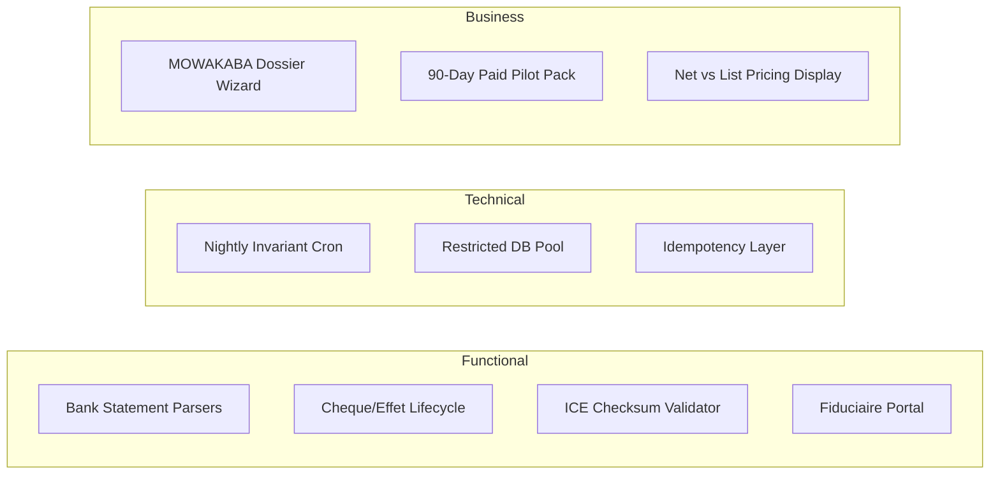
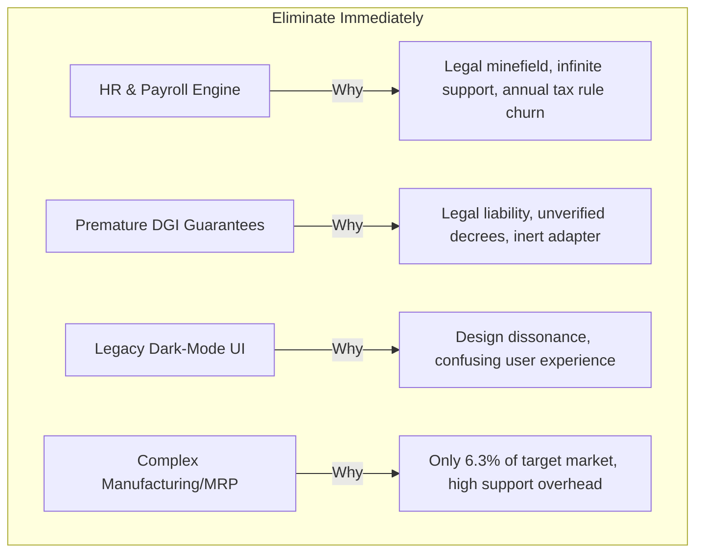

# NexaERP — Comprehensive Strategic Audit & Technical Deep Dive

**Document Reference:** Synthesis of `ERP-SAAS-BLUEPRINT.md`, `MARKET-STRATEGY-MOROCCO-2027.md`, `NEXAERP-GAP-ANALYSIS.md`, `report-source.md`, and `NexaERP_Morocco_Market_and_Production_Readiness_Report.docx`.  
**Date:** September 7, 2026  
**Audience:** Founder & Technical Leadership  

---

## 1. Executive Summary & Synthesis of the Five Reference Documents

### 1.1 The Five Files and Their Strategic Interlock

```mermaid
graph TD
    A[ERP-SAAS-BLUEPRINT.md<br/><b>The Technical Engine</b><br/>Invariants, State Machines, Ledgers] --> E[The Codebase<br/><b>NexaERP v0.2</b>]
    B[MARKET-STRATEGY-MOROCCO-2027.md<br/><b>The Commercial Thesis</b><br/>Subsidies, ICP, Fiduciaire Wedge] --> E
    C[NEXAERP-GAP-ANALYSIS.md<br/><b>The Engineering Audit</b><br/>D1-D22 Defects, Hardening, Tests] --> E
    D[report-source.md / .docx<br/><b>The Reality Check (Sep 2026)</b><br/>Primary vs Secondary Law, Launch Gates] --> E
```

1. **`ERP-SAAS-BLUEPRINT.md` (The "How"):** Establishes that an ERP is not a collection of UI screens, but an append-only accounting ledger mirroring business events. It dictates the 10 Golden Invariants (zero-sum journal entries, immutable documents, gapless sequence numbering, derived stock levels, decimal-only money, strict multi-tenant RLS).
2. **`MARKET-STRATEGY-MOROCCO-2027.md` (The "Why & For Whom"):** Formulates the commercial hypothesis: a forced regulatory compliance deadline (DGI e-invoicing for under-10M MAD SMEs), state subsidies paying up to 90% of the software bill (MOWAKABA / Digital Morocco 2030), distribution through accounting firms (*fiduciaires*), and a focused beachhead in B2B commerce.
3. **`NEXAERP-GAP-ANALYSIS.md` (The "Progress Log"):** Compares the MVP commit (`774b85d`) to the foundation rebuild (`88918a4`). It demonstrates how 22 structural defects were corrected—migrating 55 `Float` fields to 114 `Decimal(18,6)` columns, adding line items to trade documents, enforcing atomic sequence consumption, and creating a 55-test suite. Overall project grade jumped from **4/10** to **8.7/10**.
4. **`report-source.md` & `NexaERP_Morocco_Market_and_Production_Readiness_Report.docx` (The "Cold Shower"):** Authored on September 7, 2026. Delivers an authoritative reality check: **the asserted 1 January 2027 SME mandate deadline, the DGI clearance technical contract, the accreditation regime, and the certificate model are NOT verified by primary official texts (bulletins officiels/décrets).** The codebase's live DGI adapter (`DirectDgiAdapter`) is an inert stub. Marketing compliance today represents a serious legal and claims risk.

---

## 2. Dev Phase Evaluation: Are You Doing Well?

### 2.1 The Objective Verdict

> [!IMPORTANT]
> **Summary Verdict:** **Architecturally, you are in the top 5% of early-stage SaaS ERP projects. Commercially and operationally, you are in the pre-pilot validation stage (Phase 1.5–2 out of 5).** 
> 
> You have laid an extraordinarily clean and rigorous foundation. However, you are currently at risk of confusing "architectural elegance" with "production readiness" and "regulatory speculation" with "market certainty."

### 2.2 Scorecard by Dimension

| Dimension | Grade | Reality Check & Evidence |
|---|:---:|---|
| **Domain Architecture** | **9/10** | Moving from `Float` to `Decimal(18,6)`, creating line items (`InvoiceLine`, `SalesOrderLine`, etc.), and enforcing atomic ledger postings are immense technical victories. |
| **Visual Design & Positioning** | **8.5/10** | The new paper-inspired aesthetic (`Bricolage Grotesque`, `IBM Plex Sans`, MAD currency) looks bespoke, trustworthy, and distinctly Moroccan. It completely avoids generic Silicon Valley SaaS clichés. |
| **Compliance Readiness** | **3.5/10** | `DirectDgiAdapter` deliberately throws errors because the public DGI API specification is unpublished. The sandbox adapter works, but you cannot legally submit a single real invoice to the Moroccan state. |
| **Production Security** | **5/10** | Postgres RLS migrations and database triggers exist, but connecting to cloud Postgres as the database owner silently bypasses RLS in production. |
| **Sales & Onboarding UX** | **4/10** | Signup and login pages still run on legacy dark themes, Supabase email verification creates a silent wall, and password recovery is non-functional. |
| **Business Model Clarity** | **6/10** | The MOWAKABA subsidy and fiduciaire channel are brilliant concepts, but they remain unvalidated by paying pilot contracts. |

---

## 3. What You Should ADD to the Platform



### 3.1 Functional Additions (Moroccan SME Realities)

1. **Moroccan Bank Statement Parsers (CSV / PDF / OFX):**
   - Moroccan SMEs do not have Open Banking APIs. They download PDFs and CSVs from Attijariwafa Bank, Banque Populaire, BMCE/BOA, and CIH.
   - **Action:** Build dedicated, robust parsers for these top 4 banks to ingest statement lines into a staging table for one-click manual or rule-based reconciliation.
2. **Complete Commercial Paper Lifecycle (Chèques & Effets de Commerce):**
   - Moroccan B2B runs on cheques and promissory notes (*traites*).
   - **Action:** Add state tracking for paper payments: `En Portefeuille` $\rightarrow$ `Remis à l'encaissement` $\rightarrow$ `Encaissé` or `Impayé / Bounced`. An unpaid cheque must automatically trigger journal reversals and reopen the customer receivable.
3. **Moroccan Tax Engine & ICE Real-Time Pre-flight:**
   - Add the 15-digit ICE algorithmic checksum verification at customer/supplier creation.
   - Support the standard Moroccan VAT rate groups (20%, 14%, 10%, 7%, and exonerations with legal basis notation).
   - Support *Retenue à la Source* (RAS TVA under CGI Article 73-II) for large corporate and public supplier payments.
4. **The Fiduciaire Console (Cabinet Mode):**
   - A multi-tenant portal allowing an accountant to switch between 10–30 SME clients without separate logins.
   - Dedicated export bundles (Grand Livre, Balance Générale, Journal des Ventes/Achats) formatted for Sage 100 and Excel.

### 3.2 Security & Operational Additions

1. **Separated Restricted Application Database Role (`nexaerp_app`):**
   - Provision a dedicated PostgreSQL user that is NOT the database owner and has `NOBYPASSRLS`.
   - Ensure all app connections execute `SET LOCAL app.current_tenant_id = '...'` to enforce multi-tenant isolation at the engine level.
2. **CNDP (Loi 09-08) Compliance Infrastructure:**
   - Add a consent log, user data processing register, and automated tenant data export/erasure tools for compliance with Morocco's National Commission for the Protection of Personal Data (CNDP).
3. **Nightly Invariant Audit Cron Job:**
   - Schedule the existing `invariant-checker.ts` (checks unbalanced ledger entries, stock drift, valuation mismatches, sequence gaps) to run nightly and alert the engineering team via webhook.

### 3.3 Business & Commercial Additions

1. **MOWAKABA / Digital Morocco 2030 Dossier Assistant:**
   - Build a tool that pre-fills the administrative application for Maroc PME subsidies, including technical quotations, company registration details, and project scopes.
2. **Structured 90-Day Paid Pilot Contracts:**
   - Offer an onboarding package: 5,000–8,000 MAD for setup, data migration, and 3 months of access, with an explicit legal disclaimer regarding DGI clearance timelines.

---

## 4. What You Should REMOVE / PRUNE from the Platform



1. **Remove / Shelve the HR & Payroll Calculation Engine:**
   - `src/modules/hr/utils/payroll-calculator.ts` contains hardcoded tax brackets for CNSS, AMO, and IGR.
   - *Why:* Moroccan payroll is extraordinarily complex (seniority bonuses, family deductions, transport allowances, exemptions, CIMR, evolving finance bills). If your calculations are off by 10 MAD, the user faces labor inspection penalties. **Integrate with specialized payroll software or limit the module to an employee master directory.**
2. **Remove Unverified DGI Regulatory Claims:**
   - Remove "100% Conforme DGI" and the "1 Janvier 2027 Countdown" from the marketing copy and UI badges.
   - Replace with truthful, value-driven positioning: *"Prêt pour la facturation structurée et le contrôle fiscal au Maroc."*
3. **Remove Scaffolding & Dark-Mode Remains:**
   - The login and signup screens still use dark-mode styles (`bg-[#050505]`, neon glows) from the previous template. Unify them under the paper design system.
   - Prune deprecated `fi/` facades in favor of the canonical `finance/` module.
4. **Avoid Manufacturing (BOM/MRP) and Complex Multi-Currency:**
   - Only 6.3% of new Moroccan businesses are industrial. Manufacturing requires work centers, routings, scrap factors, and machine scheduling—adding immense complexity for a tiny, conservative market segment.

---

## 5. Comprehensive Improvements Across the Four Pillars

### Pillar 1: Development & Engineering

```
┌─────────────────────────────────────────────────────────────┐
│                      DEVELOPMENT ROADMAP                    │
├──────────────────────────────┬──────────────────────────────┤
│ IMMEDIATE (Next 14 Days)     │ MEDIUM TERM (30–60 Days)     │
├──────────────────────────────┼──────────────────────────────┤
│ • Unify Auth/Signup to Paper │ • Self-serve Excel importer  │
│ • Fix Vitest DB connection   │ • Idempotency middleware     │
│ • Resolve Next.js warnings   │ • Automated nightly audits   │
└──────────────────────────────┴──────────────────────────────┘
```

1. **Fix Vitest Isolation & Database Connection:**
   - Modify the test harness to use a local or isolated database with the `nexaerp_app` role so that all 55 integration tests pass cleanly without RLS owner bypasses.
2. **Build a Self-Service Data Migration Engine:**
   - Customer acquisition drops off when moving historical data. Build an Excel/CSV import wizard that validates columns, flags errors with row numbers, and previews data before committing.
3. **Implement Mutation Idempotency:**
   - Enforce an `Idempotency-Key` header on all financial posting routes (`postInvoice`, `recordPayment`, `confirmOrder`) to prevent duplicate transactions caused by network retries.

### Pillar 2: Security & Regulatory Compliance

1. **PostgreSQL Connection Hardening:**
   - Never expose superuser or database owner credentials to the Next.js runtime in production. The app must connect under a role where `ALTER TABLE ... ENABLE ROW LEVEL SECURITY` cannot be bypassed.
2. **Qualified Certificate & Secret Management:**
   - If the DGI requires electronic seals or qualified signatures under Law 43-20, store private keys in hardware security modules (HSMs) or cloud KMS enclaves—never in plaintext database columns.
3. **Immutable Audit Log Expansion:**
   - Record every administrative override (e.g., posting to a soft-closed accounting period or modifying credit limits) with timestamp, user ID, IP address, and justification.

### Pillar 3: Business & Go-to-Market Strategy

```
┌──────────────────────────────────────────────────────────────┐
│                    COMMERCIAL FUNNEL (MOROCCO)               │
├──────────────────────────────────────────────────────────────┤
│ 1. The Wedge:  Invoice control + receivables chasing        │
│ 2. The Hook:   Cheque/cash tracking + VAT visibility         │
│ 3. The Depth:  Stock valuation + purchase margins            │
│ 4. The Lock:   Fiduciaire collaboration + Sage/Excel exports │
└──────────────────────────────────────────────────────────────┘
```

1. **Execute the Fiduciaire Distribution Wedge:**
   - Accounting firms manage 20–50 SME clients each. Offer accountants free access, co-branded client portals, and streamlined exports. If an accountant approves the tool, the SME signs immediately.
2. **Subsidized Packaging (MOWAKABA Alignment):**
   - Present pricing as: **"12 000 MAD/an (soit 1 200 MAD après prise en charge Maroc PME jusqu'à 90%)"**.
   - Charge for data migration separately as a subsidized professional service (3,000–6,000 MAD).
3. **In-Person High-Touch Pilots in Casablanca & Rabat:**
   - Target owner-managed distributors and wholesalers in Ain Sebaa, Sidi Maarouf, and Agdal. Validate the workflow directly with business owners before scaling automated marketing.

### Pillar 4: Functional & Accounting Core

1. **Full Quote-to-Cash Traceability:**
   - Complete document lineage: `Devis` $\rightarrow$ `Bon de Commande` $\rightarrow$ `Bon de Livraison` $\rightarrow$ `Facture` $\rightarrow$ `Paiement / Avoir`.
   - Enforce that a delivery note decrements physical stock, an invoice debits receivables and credits revenue, and payments allocate to specific invoice lines.
2. **Real Cash & Overdue Receivables Management:**
   - Build automated WhatsApp and email reminders for invoices nearing or past their due date (*relances automatiques*).
   - "Mes clients ne me paient pas" is the single greatest pain point for Moroccan business owners. Solving collection speeds up payback faster than any accounting report.

---

## 6. Actionable Next Steps (Prioritized Sequence)

| Priority | Task | Target Date | Owner |
|:---:|---|:---:|:---:|
| **P0** | **Refactor `/login` and `/signup`** to match the new paper design system and fix the Supabase email redirect. | Days 1–3 | Fullstack |
| **P0** | **Tone down DGI claims** on the public landing page to prevent regulatory/claims liability. | Day 4 | Founder |
| **P1** | **Configure `nexaerp_app` restricted database role** and verify that all 55 integration tests pass with RLS active. | Days 5–8 | Backend |
| **P1** | **Build Excel/CSV import wizards** for customers, products, and open balances. | Days 9–15 | Fullstack |
| **P2** | **Sign 3–5 paid pilot customers** (Casablanca B2B commerce) with dedicated data migration support. | Month 1 | Founder |
| **P2** | **Conduct a formal DGI / Operator regulatory inquiry** to establish the true legal API contract. | Month 1–2 | Founder |
